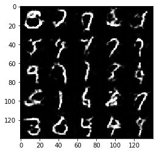
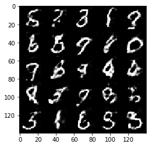
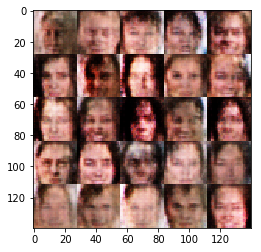
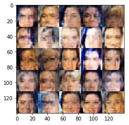
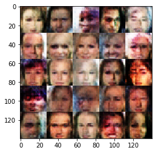

# Face Generation
In this project, you'll use generative adversarial networks to generate new images of faces.
### Get the Data
You'll be using two datasets in this project:
- MNIST
- CelebA

Since the celebA dataset is complex and you're doing GANs in a project for the first time, we want you to test your neural network on MNIST before CelebA.  Running the GANs on MNIST will allow you to see how well your model trains sooner.

If you're using [FloydHub](https://www.floydhub.com/), set `data_dir` to "/input" and use the [FloydHub data ID](http://docs.floydhub.com/home/using_datasets/) "R5KrjnANiKVhLWAkpXhNBe".


```python
data_dir = './data'

# FloydHub - Use with data ID "R5KrjnANiKVhLWAkpXhNBe"
#data_dir = '/input'


"""
DON'T MODIFY ANYTHING IN THIS CELL
"""
import helper

helper.download_extract('mnist', data_dir)
helper.download_extract('celeba', data_dir)
```

    Found mnist Data
    Found celeba Data
    

## Explore the Data
### MNIST
As you're aware, the [MNIST](http://yann.lecun.com/exdb/mnist/) dataset contains images of handwritten digits. You can view the first number of examples by changing `show_n_images`. 


```python
show_n_images = 25

"""
DON'T MODIFY ANYTHING IN THIS CELL
"""
%matplotlib inline
import os
from glob import glob
from matplotlib import pyplot

mnist_images = helper.get_batch(glob(os.path.join(data_dir, 'mnist/*.jpg'))[:show_n_images], 28, 28, 'L')
pyplot.imshow(helper.images_square_grid(mnist_images, 'L'), cmap='gray')
```


    <matplotlib.image.AxesImage at 0x82c2c18>


### CelebA
The [CelebFaces Attributes Dataset (CelebA)](http://mmlab.ie.cuhk.edu.hk/projects/CelebA.html) dataset contains over 200,000 celebrity images with annotations.  Since you're going to be generating faces, you won't need the annotations.  You can view the first number of examples by changing `show_n_images`.


```python
show_n_images = 25

"""
DON'T MODIFY ANYTHING IN THIS CELL
"""
mnist_images = helper.get_batch(glob(os.path.join(data_dir, 'img_align_celeba/*.jpg'))[:show_n_images], 28, 28, 'RGB')
pyplot.imshow(helper.images_square_grid(mnist_images, 'RGB'))
```


    <matplotlib.image.AxesImage at 0x83b6278>


## Preprocess the Data
Since the project's main focus is on building the GANs, we'll preprocess the data for you.  The values of the MNIST and CelebA dataset will be in the range of -0.5 to 0.5 of 28x28 dimensional images.  The CelebA images will be cropped to remove parts of the image that don't include a face, then resized down to 28x28.

The MNIST images are black and white images with a single [color channel](https://en.wikipedia.org/wiki/Channel_(digital_image%29) while the CelebA images have [3 color channels (RGB color channel)](https://en.wikipedia.org/wiki/Channel_(digital_image%29#RGB_Images).
## Build the Neural Network
You'll build the components necessary to build a GANs by implementing the following functions below:
- `model_inputs`
- `discriminator`
- `generator`
- `model_loss`
- `model_opt`
- `train`

### Check the Version of TensorFlow and Access to GPU
This will check to make sure you have the correct version of TensorFlow and access to a GPU


```python
"""
DON'T MODIFY ANYTHING IN THIS CELL
"""
from distutils.version import LooseVersion
import warnings
import tensorflow as tf

# Check TensorFlow Version
assert LooseVersion(tf.__version__) >= LooseVersion('1.0'), 'Please use TensorFlow version 1.0 or newer.  You are using {}'.format(tf.__version__)
print('TensorFlow Version: {}'.format(tf.__version__))

# Check for a GPU
if not tf.test.gpu_device_name():
    warnings.warn('No GPU found. Please use a GPU to train your neural network.')
else:
    print('Default GPU Device: {}'.format(tf.test.gpu_device_name()))
```

    TensorFlow Version: 1.1.0
    

    C:\Users\Pitto\Anaconda3\envs\tensorflow1_1\lib\site-packages\ipykernel_launcher.py:14: UserWarning: No GPU found. Please use a GPU to train your neural network.
      
    

### Input
Implement the `model_inputs` function to create TF Placeholders for the Neural Network. It should create the following placeholders:
- Real input images placeholder with rank 4 using `image_width`, `image_height`, and `image_channels`.
- Z input placeholder with rank 2 using `z_dim`.
- Learning rate placeholder with rank 0.

Return the placeholders in the following the tuple (tensor of real input images, tensor of z data)


```python
import problem_unittests as tests

def model_inputs(image_width, image_height, image_channels, z_dim):
    """
    Create the model inputs
    :param image_width: The input image width
    :param image_height: The input image height
    :param image_channels: The number of image channels
    :param z_dim: The dimension of Z
    :return: Tuple of (tensor of real input images, tensor of z data, learning rate)
    """
    input_real = tf.placeholder(tf.float32, shape=(None, image_height, image_width, image_channels))
    input_z = tf.placeholder(tf.float32, shape=(None, z_dim))
    learning_rate = tf.placeholder(tf.float32, shape=())

    return input_real, input_z, learning_rate

"""
DON'T MODIFY ANYTHING IN THIS CELL THAT IS BELOW THIS LINE
"""
tests.test_model_inputs(model_inputs)
```

    Tests Passed
    

### Discriminator
Implement `discriminator` to create a discriminator neural network that discriminates on `images`.  This function should be able to reuse the variables in the neural network.  Use [`tf.variable_scope`](https://www.tensorflow.org/api_docs/python/tf/variable_scope) with a scope name of "discriminator" to allow the variables to be reused.  The function should return a tuple of (tensor output of the discriminator, tensor logits of the discriminator).


```python
def discriminator(images, reuse=False):
    """
    Create the discriminator network
    :param images: Tensor of input image(s)
    :param reuse: Boolean if the weights should be reused
    :return: Tuple of (tensor output of the discriminator, tensor logits of the discriminator)
    """
    with tf.variable_scope('discriminator', reuse=reuse):
        alpha = 0.2
        x1 = tf.layers.conv2d(images, 128, 5, strides=2, padding='same',kernel_initializer =tf.random_normal_initializer(stddev=0.05))
        relu1 = tf.maximum(alpha * x1, x1)
        x2 = tf.layers.conv2d(relu1, 256, 5, strides=2, padding='same',kernel_initializer =tf.random_normal_initializer(stddev=0.05))
        bn2 = tf.layers.batch_normalization(x2, training=True)
        relu2 = tf.maximum(alpha * bn2, bn2)
        x3 = tf.layers.conv2d(relu2, 512, 5, strides=2, padding='same',kernel_initializer =tf.random_normal_initializer(stddev=0.05))
        bn3 = tf.layers.batch_normalization(x3, training=True)
        relu3 = tf.maximum(alpha * bn3, bn3)
        flat = tf.reshape(relu3, (-1, 4*4*256))
        logits = tf.layers.dense(flat, 1)
        out = tf.sigmoid(logits)
        return out, logits


"""
DON'T MODIFY ANYTHING IN THIS CELL THAT IS BELOW THIS LINE
"""
tests.test_discriminator(discriminator, tf)
```

    Tests Passed
    

### Generator
Implement `generator` to generate an image using `z`. This function should be able to reuse the variables in the neural network.  Use [`tf.variable_scope`](https://www.tensorflow.org/api_docs/python/tf/variable_scope) with a scope name of "generator" to allow the variables to be reused. The function should return the generated 28 x 28 x `out_channel_dim` images.


```python
def generator(z, out_channel_dim, is_train=True):
    """
    Create the generator network
    :param z: Input z
    :param out_channel_dim: The number of channels in the output image
    :param is_train: Boolean if generator is being used for training
    :return: The tensor output of the generator
    """
    with tf.variable_scope('generator', reuse= not is_train):
        alpha = 0.2
        strt = 7
        st_filt = 512 
        x1 = tf.layers.dense(z, strt*strt*st_filt)
        x1 = tf.reshape(x1, (-1, strt, strt, st_filt))
        x1 = tf.layers.batch_normalization(x1, training=is_train)
        x1 = tf.maximum(alpha * x1, x1)
        x2 = tf.layers.conv2d_transpose(x1, 256, 5, strides=2, padding='same',kernel_initializer =tf.random_normal_initializer(stddev=0.05))
        x2 = tf.layers.batch_normalization(x2, training=is_train)
        x2 = tf.maximum(alpha * x2, x2)        
        x3 = tf.layers.conv2d_transpose(x2, 128, 5, strides=2, padding='same',kernel_initializer =tf.random_normal_initializer(stddev=0.05))
        x3 = tf.layers.batch_normalization(x3, training=is_train)
        x3 = tf.maximum(alpha * x3, x3)
        logits = tf.layers.conv2d_transpose(x3, out_channel_dim, 3, strides=1, padding='same',kernel_initializer =tf.random_normal_initializer(stddev=0.05))
        out = tf.tanh(logits)
        return out


"""
DON'T MODIFY ANYTHING IN THIS CELL THAT IS BELOW THIS LINE
"""
tests.test_generator(generator, tf)
```

    Tests Passed
    

### Loss
Implement `model_loss` to build the GANs for training and calculate the loss.  The function should return a tuple of (discriminator loss, generator loss).  Use the following functions you implemented:
- `discriminator(images, reuse=False)`
- `generator(z, out_channel_dim, is_train=True)`


```python
def model_loss(input_real, input_z, out_channel_dim):
    """
    Get the loss for the discriminator and generator
    :param input_real: Images from the real dataset
    :param input_z: Z input
    :param out_channel_dim: The number of channels in the output image
    :return: A tuple of (discriminator loss, generator loss)
    """
    d_out_real,d_logits_real = discriminator(input_real, False)
    g_model = generator(input_z, out_channel_dim)
    d_out_fake,d_logits_fake = discriminator(g_model, True)
    smooth = 0.1
    d_loss_real = tf.reduce_mean(
                      tf.nn.sigmoid_cross_entropy_with_logits(logits=d_logits_real, 
                                                              labels=tf.ones_like(d_logits_real)*(1-smooth)))
    d_loss_fake = tf.reduce_mean(
                      tf.nn.sigmoid_cross_entropy_with_logits(logits=d_logits_fake, 
                                                              labels=tf.zeros_like(d_logits_real)))
    d_loss = d_loss_real + d_loss_fake
    g_loss = tf.reduce_mean(
                 tf.nn.sigmoid_cross_entropy_with_logits(logits=d_logits_fake,
                                                         labels=tf.ones_like(d_logits_fake)))    
    return d_loss, g_loss


"""
DON'T MODIFY ANYTHING IN THIS CELL THAT IS BELOW THIS LINE
"""
tests.test_model_loss(model_loss)
```

    Tests Passed
    

### Optimization
Implement `model_opt` to create the optimization operations for the GANs. Use [`tf.trainable_variables`](https://www.tensorflow.org/api_docs/python/tf/trainable_variables) to get all the trainable variables.  Filter the variables with names that are in the discriminator and generator scope names.  The function should return a tuple of (discriminator training operation, generator training operation).


```python
def model_opt(d_loss, g_loss, learning_rate, beta1):
    """
    Get optimization operations
    :param d_loss: Discriminator loss Tensor
    :param g_loss: Generator loss Tensor
    :param learning_rate: Learning Rate Placeholder
    :param beta1: The exponential decay rate for the 1st moment in the optimizer
    :return: A tuple of (discriminator training operation, generator training operation)
    """
    t_vars = tf.trainable_variables()
    g_vars = [var for var in t_vars if var.name.startswith('generator')]
    d_vars = [var for var in t_vars if var.name.startswith('discriminator')]
    d_train_opt = tf.train.AdamOptimizer(learning_rate,beta1).minimize(d_loss, var_list=d_vars)
    g_train_opt = tf.train.AdamOptimizer(learning_rate,beta1).minimize(g_loss, var_list=g_vars)
    return d_train_opt, g_train_opt


"""
DON'T MODIFY ANYTHING IN THIS CELL THAT IS BELOW THIS LINE
"""
tests.test_model_opt(model_opt, tf)
```

    Tests Passed
    

## Neural Network Training
### Show Output
Use this function to show the current output of the generator during training. It will help you determine how well the GANs is training.


```python
"""
DON'T MODIFY ANYTHING IN THIS CELL
"""
import numpy as np

def show_generator_output(sess, n_images, input_z, out_channel_dim, image_mode):
    """
    Show example output for the generator
    :param sess: TensorFlow session
    :param n_images: Number of Images to display
    :param input_z: Input Z Tensor
    :param out_channel_dim: The number of channels in the output image
    :param image_mode: The mode to use for images ("RGB" or "L")
    """
    cmap = None if image_mode == 'RGB' else 'gray'
    z_dim = input_z.get_shape().as_list()[-1]
    example_z = np.random.uniform(-1, 1, size=[n_images, z_dim])

    samples = sess.run(
        generator(input_z, out_channel_dim, False),
        feed_dict={input_z: example_z})

    images_grid = helper.images_square_grid(samples, image_mode)
    pyplot.imshow(images_grid, cmap=cmap)
    pyplot.show()
```

### Train
Implement `train` to build and train the GANs.  Use the following functions you implemented:
- `model_inputs(image_width, image_height, image_channels, z_dim)`
- `model_loss(input_real, input_z, out_channel_dim)`
- `model_opt(d_loss, g_loss, learning_rate, beta1)`

Use the `show_generator_output` to show `generator` output while you train. Running `show_generator_output` for every batch will drastically increase training time and increase the size of the notebook.  It's recommended to print the `generator` output every 100 batches.


```python
def train(epoch_count, batch_size, z_dim, learning_rate, beta1, get_batches, data_shape, data_image_mode):
    """
    Train the GAN
    :param epoch_count: Number of epochs
    :param batch_size: Batch Size
    :param z_dim: Z dimension
    :param learning_rate: Learning Rate
    :param beta1: The exponential decay rate for the 1st moment in the optimizer
    :param get_batches: Function to get batches
    :param data_shape: Shape of the data
    :param data_image_mode: The image mode to use for images ("RGB" or "L")
    """
    b,x,y,c=data_shape
    input_real, input_z, _ = model_inputs(x, y, c, z_dim)
    d_loss, g_loss = model_loss(input_real, input_z, c)
    d_train_opt , g_train_opt = model_opt(d_loss, g_loss, learning_rate, beta1)
    with tf.Session() as sess:
        sess.run(tf.global_variables_initializer())
        for epoch_i in range(epoch_count):
            ii = 0
            for batch_images in get_batches(batch_size):
                ii = ii+1
                batch_images = batch_images*2
                batch_z = np.random.uniform(-1, 1, size=(batch_size, z_dim))
                _ = sess.run(d_train_opt, feed_dict={input_real: batch_images, input_z: batch_z})
                _ = sess.run(g_train_opt, feed_dict={input_z: batch_z})
                if ii % 10 == 0 : 
                    train_loss_d = sess.run(d_loss, {input_z: batch_z, input_real: batch_images})
                    train_loss_g = g_loss.eval({input_z: batch_z})
                    print("Epoch {}/{}...".format(epoch_i+1, epoch_count),
                          "Discriminator Loss: {:.4f}...".format(train_loss_d),
                          "Generator Loss: {:.4f}".format(train_loss_g))    
                if ii % 100 == 0 : 
                    show_generator_output(sess, 25, input_z, c, data_image_mode)
                
                
```

### MNIST
Test your GANs architecture on MNIST.  After 2 epochs, the GANs should be able to generate images that look like handwritten digits.  Make sure the loss of the generator is lower than the loss of the discriminator or close to 0.


```python
batch_size = 64
z_dim = 128
learning_rate = 0.0005
beta1 = 0.5


"""
DON'T MODIFY ANYTHING IN THIS CELL THAT IS BELOW THIS LINE
"""
epochs = 2

mnist_dataset = helper.Dataset('mnist', glob(os.path.join(data_dir, 'mnist/*.jpg')))
with tf.Graph().as_default():
    train(epochs, batch_size, z_dim, learning_rate, beta1, mnist_dataset.get_batches,
          mnist_dataset.shape, mnist_dataset.image_mode)
```

    Epoch 1/2... Discriminator Loss: 1.2985... Generator Loss: 1.5057
    Epoch 1/2... Discriminator Loss: 1.7466... Generator Loss: 0.5970
    Epoch 1/2... Discriminator Loss: 1.8753... Generator Loss: 0.5857
    Epoch 1/2... Discriminator Loss: 1.5969... Generator Loss: 1.5583
    Epoch 1/2... Discriminator Loss: 1.6550... Generator Loss: 0.4378
    Epoch 1/2... Discriminator Loss: 1.2870... Generator Loss: 0.8103
    Epoch 1/2... Discriminator Loss: 1.9824... Generator Loss: 0.2665
    Epoch 1/2... Discriminator Loss: 1.4156... Generator Loss: 1.3136
    Epoch 1/2... Discriminator Loss: 1.3774... Generator Loss: 0.7124
    Epoch 1/2... Discriminator Loss: 1.0936... Generator Loss: 1.0287
    


    Epoch 1/2... Discriminator Loss: 1.7179... Generator Loss: 0.3809
    Epoch 1/2... Discriminator Loss: 1.4342... Generator Loss: 0.6355
    Epoch 1/2... Discriminator Loss: 1.3072... Generator Loss: 0.6453
    Epoch 1/2... Discriminator Loss: 1.4669... Generator Loss: 0.5913
    Epoch 1/2... Discriminator Loss: 1.4327... Generator Loss: 0.5173
    Epoch 1/2... Discriminator Loss: 1.2100... Generator Loss: 0.9088
    Epoch 1/2... Discriminator Loss: 1.1890... Generator Loss: 1.7682
    Epoch 1/2... Discriminator Loss: 1.2196... Generator Loss: 1.2414
    Epoch 1/2... Discriminator Loss: 1.1414... Generator Loss: 0.7965
    Epoch 1/2... Discriminator Loss: 0.9674... Generator Loss: 1.3186
    


    Epoch 1/2... Discriminator Loss: 1.0333... Generator Loss: 1.5017
    Epoch 1/2... Discriminator Loss: 1.2411... Generator Loss: 0.7111
    Epoch 1/2... Discriminator Loss: 1.6126... Generator Loss: 0.4202
    Epoch 1/2... Discriminator Loss: 1.3087... Generator Loss: 0.6981
    Epoch 1/2... Discriminator Loss: 1.0350... Generator Loss: 0.8836
    Epoch 1/2... Discriminator Loss: 1.1268... Generator Loss: 0.8510
    Epoch 1/2... Discriminator Loss: 1.3379... Generator Loss: 1.5800
    Epoch 1/2... Discriminator Loss: 1.2826... Generator Loss: 0.7178
    Epoch 1/2... Discriminator Loss: 1.5085... Generator Loss: 1.0172
    Epoch 1/2... Discriminator Loss: 1.2211... Generator Loss: 0.7918
    


    Epoch 1/2... Discriminator Loss: 1.3009... Generator Loss: 0.7295
    Epoch 1/2... Discriminator Loss: 1.2815... Generator Loss: 0.7650
    Epoch 1/2... Discriminator Loss: 1.1827... Generator Loss: 0.8673
    Epoch 1/2... Discriminator Loss: 1.2104... Generator Loss: 0.8759
    Epoch 1/2... Discriminator Loss: 0.9991... Generator Loss: 1.3145
    Epoch 1/2... Discriminator Loss: 1.3181... Generator Loss: 1.3564
    Epoch 1/2... Discriminator Loss: 1.2171... Generator Loss: 0.8494
    Epoch 1/2... Discriminator Loss: 1.3710... Generator Loss: 0.5781
    Epoch 1/2... Discriminator Loss: 1.2243... Generator Loss: 0.8025
    Epoch 1/2... Discriminator Loss: 1.3650... Generator Loss: 0.6115
    


    Epoch 1/2... Discriminator Loss: 1.0859... Generator Loss: 1.0032
    Epoch 1/2... Discriminator Loss: 1.1999... Generator Loss: 0.8609
    Epoch 1/2... Discriminator Loss: 1.1945... Generator Loss: 0.8744
    Epoch 1/2... Discriminator Loss: 1.1040... Generator Loss: 0.8397
    Epoch 1/2... Discriminator Loss: 1.1528... Generator Loss: 1.0623
    Epoch 1/2... Discriminator Loss: 1.1077... Generator Loss: 1.0579
    Epoch 1/2... Discriminator Loss: 1.1480... Generator Loss: 0.7521
    Epoch 1/2... Discriminator Loss: 1.1687... Generator Loss: 0.7880
    Epoch 1/2... Discriminator Loss: 1.1762... Generator Loss: 1.2799
    Epoch 1/2... Discriminator Loss: 1.1134... Generator Loss: 1.0279
    


    Epoch 1/2... Discriminator Loss: 1.2109... Generator Loss: 0.9674
    Epoch 1/2... Discriminator Loss: 1.5585... Generator Loss: 0.4163
    Epoch 1/2... Discriminator Loss: 1.2002... Generator Loss: 1.2109
    Epoch 1/2... Discriminator Loss: 1.1921... Generator Loss: 1.2745
    Epoch 1/2... Discriminator Loss: 1.2813... Generator Loss: 0.6224
    Epoch 1/2... Discriminator Loss: 1.2072... Generator Loss: 1.0541
    Epoch 1/2... Discriminator Loss: 1.3143... Generator Loss: 0.6541
    Epoch 1/2... Discriminator Loss: 1.0525... Generator Loss: 1.1431
    Epoch 1/2... Discriminator Loss: 1.5011... Generator Loss: 0.4434
    Epoch 1/2... Discriminator Loss: 1.0972... Generator Loss: 1.3777
    


    Epoch 1/2... Discriminator Loss: 1.3685... Generator Loss: 0.5757
    Epoch 1/2... Discriminator Loss: 1.0670... Generator Loss: 1.3047
    Epoch 1/2... Discriminator Loss: 1.1552... Generator Loss: 0.7944
    Epoch 1/2... Discriminator Loss: 0.9980... Generator Loss: 1.1173
    Epoch 1/2... Discriminator Loss: 1.7361... Generator Loss: 0.3390
    Epoch 1/2... Discriminator Loss: 1.1768... Generator Loss: 0.8252
    Epoch 1/2... Discriminator Loss: 1.2179... Generator Loss: 0.8086
    Epoch 1/2... Discriminator Loss: 1.5618... Generator Loss: 0.4635
    Epoch 1/2... Discriminator Loss: 1.1140... Generator Loss: 0.8525
    Epoch 1/2... Discriminator Loss: 1.2736... Generator Loss: 1.6161
    


    Epoch 1/2... Discriminator Loss: 1.1598... Generator Loss: 1.0468
    Epoch 1/2... Discriminator Loss: 1.1561... Generator Loss: 0.9765
    Epoch 1/2... Discriminator Loss: 1.4140... Generator Loss: 2.2531
    Epoch 1/2... Discriminator Loss: 1.0663... Generator Loss: 1.0715
    Epoch 1/2... Discriminator Loss: 1.2176... Generator Loss: 0.6646
    Epoch 1/2... Discriminator Loss: 0.8832... Generator Loss: 1.2989
    Epoch 1/2... Discriminator Loss: 1.3316... Generator Loss: 2.2254
    Epoch 1/2... Discriminator Loss: 1.3922... Generator Loss: 0.5611
    Epoch 1/2... Discriminator Loss: 1.0976... Generator Loss: 0.9574
    Epoch 1/2... Discriminator Loss: 1.1532... Generator Loss: 0.8160
    


    Epoch 1/2... Discriminator Loss: 1.0901... Generator Loss: 0.9449
    Epoch 1/2... Discriminator Loss: 1.0955... Generator Loss: 1.7893
    Epoch 1/2... Discriminator Loss: 1.7212... Generator Loss: 0.3450
    Epoch 1/2... Discriminator Loss: 0.9089... Generator Loss: 1.4846
    Epoch 1/2... Discriminator Loss: 0.9784... Generator Loss: 1.5462
    Epoch 1/2... Discriminator Loss: 2.3273... Generator Loss: 0.2272
    Epoch 1/2... Discriminator Loss: 1.1487... Generator Loss: 0.9804
    Epoch 1/2... Discriminator Loss: 1.1215... Generator Loss: 1.3233
    Epoch 1/2... Discriminator Loss: 1.2863... Generator Loss: 1.4415
    Epoch 1/2... Discriminator Loss: 1.0861... Generator Loss: 0.8842
    


    Epoch 1/2... Discriminator Loss: 1.0687... Generator Loss: 0.8417
    Epoch 1/2... Discriminator Loss: 1.9942... Generator Loss: 0.2528
    Epoch 1/2... Discriminator Loss: 1.1073... Generator Loss: 0.8416
    Epoch 2/2... Discriminator Loss: 1.0550... Generator Loss: 1.1771
    Epoch 2/2... Discriminator Loss: 1.3619... Generator Loss: 0.5217
    Epoch 2/2... Discriminator Loss: 1.2257... Generator Loss: 0.7756
    Epoch 2/2... Discriminator Loss: 1.1662... Generator Loss: 1.7358
    Epoch 2/2... Discriminator Loss: 1.0977... Generator Loss: 0.9921
    Epoch 2/2... Discriminator Loss: 1.6347... Generator Loss: 0.3945
    Epoch 2/2... Discriminator Loss: 1.1478... Generator Loss: 0.7494
    Epoch 2/2... Discriminator Loss: 1.1230... Generator Loss: 0.8582
    Epoch 2/2... Discriminator Loss: 1.0735... Generator Loss: 0.9287
    Epoch 2/2... Discriminator Loss: 1.5564... Generator Loss: 0.4193
    


    Epoch 2/2... Discriminator Loss: 1.0823... Generator Loss: 0.8634
    Epoch 2/2... Discriminator Loss: 1.2284... Generator Loss: 0.7119
    Epoch 2/2... Discriminator Loss: 0.8481... Generator Loss: 1.3651
    Epoch 2/2... Discriminator Loss: 0.9612... Generator Loss: 1.1353
    Epoch 2/2... Discriminator Loss: 1.0801... Generator Loss: 1.1795
    Epoch 2/2... Discriminator Loss: 1.0073... Generator Loss: 0.9501
    Epoch 2/2... Discriminator Loss: 1.2069... Generator Loss: 1.4732
    Epoch 2/2... Discriminator Loss: 1.1868... Generator Loss: 1.1919
    Epoch 2/2... Discriminator Loss: 1.2524... Generator Loss: 2.0530
    Epoch 2/2... Discriminator Loss: 1.1069... Generator Loss: 1.6643
    


    Epoch 2/2... Discriminator Loss: 1.0917... Generator Loss: 1.0241
    Epoch 2/2... Discriminator Loss: 1.1825... Generator Loss: 0.7715
    Epoch 2/2... Discriminator Loss: 2.9758... Generator Loss: 0.1430
    Epoch 2/2... Discriminator Loss: 1.3244... Generator Loss: 0.7645
    Epoch 2/2... Discriminator Loss: 1.1196... Generator Loss: 0.7618
    Epoch 2/2... Discriminator Loss: 1.1030... Generator Loss: 1.2307
    Epoch 2/2... Discriminator Loss: 0.9578... Generator Loss: 1.0451
    Epoch 2/2... Discriminator Loss: 1.1197... Generator Loss: 1.2128
    Epoch 2/2... Discriminator Loss: 1.1007... Generator Loss: 1.3240
    Epoch 2/2... Discriminator Loss: 1.0687... Generator Loss: 1.7389
    


    Epoch 2/2... Discriminator Loss: 1.1045... Generator Loss: 0.8399
    Epoch 2/2... Discriminator Loss: 1.9871... Generator Loss: 0.2713
    Epoch 2/2... Discriminator Loss: 1.0808... Generator Loss: 0.8627
    Epoch 2/2... Discriminator Loss: 1.1052... Generator Loss: 0.8878
    Epoch 2/2... Discriminator Loss: 1.1580... Generator Loss: 1.8640
    Epoch 2/2... Discriminator Loss: 0.9137... Generator Loss: 1.1372
    Epoch 2/2... Discriminator Loss: 1.1691... Generator Loss: 0.7687
    Epoch 2/2... Discriminator Loss: 0.8290... Generator Loss: 1.4708
    Epoch 2/2... Discriminator Loss: 1.1946... Generator Loss: 0.8116
    Epoch 2/2... Discriminator Loss: 0.9813... Generator Loss: 1.0153
    





    Epoch 2/2... Discriminator Loss: 1.3651... Generator Loss: 2.1886
    Epoch 2/2... Discriminator Loss: 1.1203... Generator Loss: 0.8545
    Epoch 2/2... Discriminator Loss: 1.0294... Generator Loss: 1.1119
    Epoch 2/2... Discriminator Loss: 1.0821... Generator Loss: 0.7839
    Epoch 2/2... Discriminator Loss: 0.9610... Generator Loss: 1.1968
    Epoch 2/2... Discriminator Loss: 1.2887... Generator Loss: 0.6178
    Epoch 2/2... Discriminator Loss: 1.2330... Generator Loss: 2.2756
    Epoch 2/2... Discriminator Loss: 1.0911... Generator Loss: 1.0738
    Epoch 2/2... Discriminator Loss: 1.1157... Generator Loss: 1.1727
    Epoch 2/2... Discriminator Loss: 1.0381... Generator Loss: 0.9027
    


    Epoch 2/2... Discriminator Loss: 1.1522... Generator Loss: 1.7995
    Epoch 2/2... Discriminator Loss: 0.8755... Generator Loss: 1.5134
    Epoch 2/2... Discriminator Loss: 1.5919... Generator Loss: 2.1532
    Epoch 2/2... Discriminator Loss: 1.0864... Generator Loss: 0.8900
    Epoch 2/2... Discriminator Loss: 0.9361... Generator Loss: 1.4109
    Epoch 2/2... Discriminator Loss: 1.0960... Generator Loss: 0.8294
    Epoch 2/2... Discriminator Loss: 1.0872... Generator Loss: 0.8992
    Epoch 2/2... Discriminator Loss: 1.1763... Generator Loss: 0.6858
    Epoch 2/2... Discriminator Loss: 1.0262... Generator Loss: 0.9089
    Epoch 2/2... Discriminator Loss: 0.9695... Generator Loss: 1.1246
    


    Epoch 2/2... Discriminator Loss: 0.9667... Generator Loss: 1.2838
    Epoch 2/2... Discriminator Loss: 0.9744... Generator Loss: 1.1409
    Epoch 2/2... Discriminator Loss: 1.1029... Generator Loss: 0.7848
    Epoch 2/2... Discriminator Loss: 0.9778... Generator Loss: 1.9121
    Epoch 2/2... Discriminator Loss: 0.9908... Generator Loss: 0.9461
    Epoch 2/2... Discriminator Loss: 1.0123... Generator Loss: 1.0080
    Epoch 2/2... Discriminator Loss: 1.8582... Generator Loss: 0.4157
    Epoch 2/2... Discriminator Loss: 1.3181... Generator Loss: 0.6067
    Epoch 2/2... Discriminator Loss: 1.1107... Generator Loss: 0.7869
    Epoch 2/2... Discriminator Loss: 1.2406... Generator Loss: 0.6643
    


    Epoch 2/2... Discriminator Loss: 1.0082... Generator Loss: 1.0720
    Epoch 2/2... Discriminator Loss: 1.2646... Generator Loss: 0.6703
    Epoch 2/2... Discriminator Loss: 1.2012... Generator Loss: 1.0781
    Epoch 2/2... Discriminator Loss: 0.8848... Generator Loss: 1.1787
    Epoch 2/2... Discriminator Loss: 0.8113... Generator Loss: 1.3134
    Epoch 2/2... Discriminator Loss: 1.0418... Generator Loss: 1.2471
    Epoch 2/2... Discriminator Loss: 0.9504... Generator Loss: 1.6034
    Epoch 2/2... Discriminator Loss: 1.2090... Generator Loss: 0.7637
    Epoch 2/2... Discriminator Loss: 1.3234... Generator Loss: 0.7109
    Epoch 2/2... Discriminator Loss: 1.0776... Generator Loss: 0.8496
    


    Epoch 2/2... Discriminator Loss: 0.9594... Generator Loss: 1.1061
    Epoch 2/2... Discriminator Loss: 0.6697... Generator Loss: 1.4500
    Epoch 2/2... Discriminator Loss: 1.1167... Generator Loss: 2.3554
    Epoch 2/2... Discriminator Loss: 0.6676... Generator Loss: 1.8808
    Epoch 2/2... Discriminator Loss: 1.8315... Generator Loss: 0.3759
    Epoch 2/2... Discriminator Loss: 1.0570... Generator Loss: 1.1952
    Epoch 2/2... Discriminator Loss: 1.1955... Generator Loss: 1.0366
    Epoch 2/2... Discriminator Loss: 0.9682... Generator Loss: 1.0469
    Epoch 2/2... Discriminator Loss: 0.9691... Generator Loss: 1.0267
    Epoch 2/2... Discriminator Loss: 1.1507... Generator Loss: 0.9101
    





    Epoch 2/2... Discriminator Loss: 1.2206... Generator Loss: 0.7045
    Epoch 2/2... Discriminator Loss: 1.0784... Generator Loss: 0.8202
    Epoch 2/2... Discriminator Loss: 1.1016... Generator Loss: 0.9410
    

### CelebA
Run your GANs on CelebA.  It will take around 20 minutes on the average GPU to run one epoch.  You can run the whole epoch or stop when it starts to generate realistic faces.


```python
batch_size = 64
z_dim = 100
learning_rate = 0.0005
beta1 = 0.5


"""
DON'T MODIFY ANYTHING IN THIS CELL THAT IS BELOW THIS LINE
"""
epochs = 1

celeba_dataset = helper.Dataset('celeba', glob(os.path.join(data_dir, 'img_align_celeba/*.jpg')))
with tf.Graph().as_default():
    train(epochs, batch_size, z_dim, learning_rate, beta1, celeba_dataset.get_batches,
          celeba_dataset.shape, celeba_dataset.image_mode)
```

    Epoch 1/1... Discriminator Loss: 0.8673... Generator Loss: 1.3426
    Epoch 1/1... Discriminator Loss: 0.6351... Generator Loss: 2.0407
    Epoch 1/1... Discriminator Loss: 0.6444... Generator Loss: 1.8200
    Epoch 1/1... Discriminator Loss: 0.5399... Generator Loss: 2.6012
    Epoch 1/1... Discriminator Loss: 1.0659... Generator Loss: 3.2950
    Epoch 1/1... Discriminator Loss: 0.6903... Generator Loss: 2.3495
    Epoch 1/1... Discriminator Loss: 0.5226... Generator Loss: 2.5611
    Epoch 1/1... Discriminator Loss: 0.5781... Generator Loss: 2.3949
    Epoch 1/1... Discriminator Loss: 1.8496... Generator Loss: 7.7842
    Epoch 1/1... Discriminator Loss: 0.5011... Generator Loss: 3.5749
    


    Epoch 1/1... Discriminator Loss: 1.2416... Generator Loss: 0.6522
    Epoch 1/1... Discriminator Loss: 0.7059... Generator Loss: 1.5642
    Epoch 1/1... Discriminator Loss: 0.8886... Generator Loss: 4.6578
    Epoch 1/1... Discriminator Loss: 2.3600... Generator Loss: 0.2774
    Epoch 1/1... Discriminator Loss: 0.7434... Generator Loss: 1.3887
    Epoch 1/1... Discriminator Loss: 1.4727... Generator Loss: 0.4941
    Epoch 1/1... Discriminator Loss: 1.8165... Generator Loss: 0.4144
    Epoch 1/1... Discriminator Loss: 0.6252... Generator Loss: 1.7222
    Epoch 1/1... Discriminator Loss: 1.0021... Generator Loss: 1.1826
    Epoch 1/1... Discriminator Loss: 1.6541... Generator Loss: 0.4690
    


    Epoch 1/1... Discriminator Loss: 0.8655... Generator Loss: 1.0872
    Epoch 1/1... Discriminator Loss: 0.4300... Generator Loss: 5.2587
    Epoch 1/1... Discriminator Loss: 1.2146... Generator Loss: 0.6605
    Epoch 1/1... Discriminator Loss: 0.4947... Generator Loss: 2.3012
    Epoch 1/1... Discriminator Loss: 1.6486... Generator Loss: 0.3997
    Epoch 1/1... Discriminator Loss: 1.7439... Generator Loss: 2.2793
    Epoch 1/1... Discriminator Loss: 2.3243... Generator Loss: 0.1919
    Epoch 1/1... Discriminator Loss: 0.9637... Generator Loss: 0.9282
    Epoch 1/1... Discriminator Loss: 0.3850... Generator Loss: 4.2090
    Epoch 1/1... Discriminator Loss: 2.2889... Generator Loss: 3.7000
    


    Epoch 1/1... Discriminator Loss: 1.3553... Generator Loss: 4.4486
    Epoch 1/1... Discriminator Loss: 1.1592... Generator Loss: 0.7264
    Epoch 1/1... Discriminator Loss: 1.0284... Generator Loss: 1.4030
    Epoch 1/1... Discriminator Loss: 1.0455... Generator Loss: 0.8965
    Epoch 1/1... Discriminator Loss: 0.7255... Generator Loss: 1.6812
    Epoch 1/1... Discriminator Loss: 1.0734... Generator Loss: 0.9296
    Epoch 1/1... Discriminator Loss: 0.9205... Generator Loss: 3.1719
    Epoch 1/1... Discriminator Loss: 1.3719... Generator Loss: 5.2625
    Epoch 1/1... Discriminator Loss: 0.5386... Generator Loss: 2.1935
    Epoch 1/1... Discriminator Loss: 0.5569... Generator Loss: 2.9752
    


    Epoch 1/1... Discriminator Loss: 1.0597... Generator Loss: 1.4774
    Epoch 1/1... Discriminator Loss: 0.6347... Generator Loss: 1.7630
    Epoch 1/1... Discriminator Loss: 0.5380... Generator Loss: 3.9242
    Epoch 1/1... Discriminator Loss: 0.8224... Generator Loss: 1.3744
    Epoch 1/1... Discriminator Loss: 1.1042... Generator Loss: 0.7213
    Epoch 1/1... Discriminator Loss: 0.6222... Generator Loss: 1.8136
    Epoch 1/1... Discriminator Loss: 0.9890... Generator Loss: 1.0419
    Epoch 1/1... Discriminator Loss: 1.0250... Generator Loss: 2.9241
    Epoch 1/1... Discriminator Loss: 1.0732... Generator Loss: 0.8099
    Epoch 1/1... Discriminator Loss: 0.8066... Generator Loss: 3.2762
    


    Epoch 1/1... Discriminator Loss: 0.7128... Generator Loss: 1.5236
    Epoch 1/1... Discriminator Loss: 0.6242... Generator Loss: 2.6320
    Epoch 1/1... Discriminator Loss: 0.6612... Generator Loss: 1.4678
    Epoch 1/1... Discriminator Loss: 0.5215... Generator Loss: 2.0376
    Epoch 1/1... Discriminator Loss: 0.8880... Generator Loss: 4.9370
    Epoch 1/1... Discriminator Loss: 0.5611... Generator Loss: 1.8217
    Epoch 1/1... Discriminator Loss: 0.8324... Generator Loss: 1.8589
    Epoch 1/1... Discriminator Loss: 0.4239... Generator Loss: 4.6269
    Epoch 1/1... Discriminator Loss: 0.4652... Generator Loss: 2.4348
    Epoch 1/1... Discriminator Loss: 0.6202... Generator Loss: 5.2271
    


    Epoch 1/1... Discriminator Loss: 0.5545... Generator Loss: 3.6430
    Epoch 1/1... Discriminator Loss: 0.5118... Generator Loss: 4.1658
    Epoch 1/1... Discriminator Loss: 0.4672... Generator Loss: 4.1567
    Epoch 1/1... Discriminator Loss: 1.7689... Generator Loss: 4.8049
    Epoch 1/1... Discriminator Loss: 0.8807... Generator Loss: 1.0447
    Epoch 1/1... Discriminator Loss: 0.5946... Generator Loss: 1.7411
    Epoch 1/1... Discriminator Loss: 0.6179... Generator Loss: 4.3327
    Epoch 1/1... Discriminator Loss: 0.3960... Generator Loss: 3.3210
    Epoch 1/1... Discriminator Loss: 1.4100... Generator Loss: 4.6205
    Epoch 1/1... Discriminator Loss: 0.4850... Generator Loss: 3.4632
    


    Epoch 1/1... Discriminator Loss: 0.8077... Generator Loss: 4.3007
    Epoch 1/1... Discriminator Loss: 1.3914... Generator Loss: 4.6799
    Epoch 1/1... Discriminator Loss: 0.5336... Generator Loss: 4.1868
    Epoch 1/1... Discriminator Loss: 0.4149... Generator Loss: 4.3371
    Epoch 1/1... Discriminator Loss: 0.4353... Generator Loss: 2.7777
    Epoch 1/1... Discriminator Loss: 0.4471... Generator Loss: 2.9664
    Epoch 1/1... Discriminator Loss: 2.4963... Generator Loss: 2.9202
    Epoch 1/1... Discriminator Loss: 0.6824... Generator Loss: 4.1733
    Epoch 1/1... Discriminator Loss: 0.6099... Generator Loss: 1.7112
    Epoch 1/1... Discriminator Loss: 0.5166... Generator Loss: 2.8773
    


    Epoch 1/1... Discriminator Loss: 0.3713... Generator Loss: 3.9765
    Epoch 1/1... Discriminator Loss: 0.4428... Generator Loss: 2.7576
    Epoch 1/1... Discriminator Loss: 0.6151... Generator Loss: 2.9375
    Epoch 1/1... Discriminator Loss: 0.4501... Generator Loss: 2.5547
    Epoch 1/1... Discriminator Loss: 1.6764... Generator Loss: 1.9994
    Epoch 1/1... Discriminator Loss: 0.8305... Generator Loss: 1.2488
    Epoch 1/1... Discriminator Loss: 0.6496... Generator Loss: 1.5728
    Epoch 1/1... Discriminator Loss: 0.8061... Generator Loss: 1.1789
    Epoch 1/1... Discriminator Loss: 0.5832... Generator Loss: 1.7599
    Epoch 1/1... Discriminator Loss: 0.6540... Generator Loss: 2.2090
    


    Epoch 1/1... Discriminator Loss: 0.4834... Generator Loss: 3.5485
    Epoch 1/1... Discriminator Loss: 1.9921... Generator Loss: 4.2352
    Epoch 1/1... Discriminator Loss: 0.4898... Generator Loss: 2.9005
    Epoch 1/1... Discriminator Loss: 0.4130... Generator Loss: 3.1222
    Epoch 1/1... Discriminator Loss: 0.3668... Generator Loss: 4.2187
    Epoch 1/1... Discriminator Loss: 0.5628... Generator Loss: 1.8683
    Epoch 1/1... Discriminator Loss: 0.4424... Generator Loss: 3.1467
    Epoch 1/1... Discriminator Loss: 0.7537... Generator Loss: 3.1502
    Epoch 1/1... Discriminator Loss: 0.4389... Generator Loss: 2.9287
    Epoch 1/1... Discriminator Loss: 0.7057... Generator Loss: 3.9764
    


    Epoch 1/1... Discriminator Loss: 0.4889... Generator Loss: 2.9457
    Epoch 1/1... Discriminator Loss: 0.4745... Generator Loss: 2.4332
    Epoch 1/1... Discriminator Loss: 1.2266... Generator Loss: 0.7120
    Epoch 1/1... Discriminator Loss: 0.5798... Generator Loss: 2.0481
    Epoch 1/1... Discriminator Loss: 0.5475... Generator Loss: 2.0133
    Epoch 1/1... Discriminator Loss: 0.4815... Generator Loss: 2.6468
    Epoch 1/1... Discriminator Loss: 0.5573... Generator Loss: 3.8858
    Epoch 1/1... Discriminator Loss: 1.6208... Generator Loss: 2.5936
    Epoch 1/1... Discriminator Loss: 0.7036... Generator Loss: 1.3875
    Epoch 1/1... Discriminator Loss: 0.4893... Generator Loss: 2.3353
    


    Epoch 1/1... Discriminator Loss: 0.4400... Generator Loss: 2.6211
    Epoch 1/1... Discriminator Loss: 0.4458... Generator Loss: 2.9376
    Epoch 1/1... Discriminator Loss: 0.8497... Generator Loss: 3.4806
    Epoch 1/1... Discriminator Loss: 0.4139... Generator Loss: 3.6374
    Epoch 1/1... Discriminator Loss: 2.0599... Generator Loss: 0.3691
    Epoch 1/1... Discriminator Loss: 0.9670... Generator Loss: 2.6130
    Epoch 1/1... Discriminator Loss: 0.5703... Generator Loss: 2.6623
    Epoch 1/1... Discriminator Loss: 1.0584... Generator Loss: 3.1937
    Epoch 1/1... Discriminator Loss: 1.1018... Generator Loss: 1.2578
    Epoch 1/1... Discriminator Loss: 1.4250... Generator Loss: 2.1184
    


    Epoch 1/1... Discriminator Loss: 0.7410... Generator Loss: 1.2550
    Epoch 1/1... Discriminator Loss: 0.6878... Generator Loss: 1.4423
    Epoch 1/1... Discriminator Loss: 0.5410... Generator Loss: 3.2759
    Epoch 1/1... Discriminator Loss: 0.9210... Generator Loss: 3.0640
    Epoch 1/1... Discriminator Loss: 0.5436... Generator Loss: 2.1259
    Epoch 1/1... Discriminator Loss: 0.5911... Generator Loss: 1.9881
    Epoch 1/1... Discriminator Loss: 0.5730... Generator Loss: 2.0070
    Epoch 1/1... Discriminator Loss: 0.8377... Generator Loss: 1.2840
    Epoch 1/1... Discriminator Loss: 0.7875... Generator Loss: 1.9350
    Epoch 1/1... Discriminator Loss: 0.5424... Generator Loss: 1.9095
    


    Epoch 1/1... Discriminator Loss: 0.4798... Generator Loss: 3.6711
    Epoch 1/1... Discriminator Loss: 0.9540... Generator Loss: 1.0686
    Epoch 1/1... Discriminator Loss: 0.6668... Generator Loss: 4.0231
    Epoch 1/1... Discriminator Loss: 1.0708... Generator Loss: 0.8914
    Epoch 1/1... Discriminator Loss: 0.9687... Generator Loss: 1.0725
    Epoch 1/1... Discriminator Loss: 0.6067... Generator Loss: 1.7892
    Epoch 1/1... Discriminator Loss: 0.8732... Generator Loss: 3.1132
    Epoch 1/1... Discriminator Loss: 0.6754... Generator Loss: 2.2444
    Epoch 1/1... Discriminator Loss: 0.6265... Generator Loss: 1.9787
    Epoch 1/1... Discriminator Loss: 0.6349... Generator Loss: 1.5560
    


    Epoch 1/1... Discriminator Loss: 0.7263... Generator Loss: 1.3272
    Epoch 1/1... Discriminator Loss: 0.6375... Generator Loss: 2.6063
    Epoch 1/1... Discriminator Loss: 0.5121... Generator Loss: 2.7442
    Epoch 1/1... Discriminator Loss: 0.5822... Generator Loss: 1.7662
    Epoch 1/1... Discriminator Loss: 0.7384... Generator Loss: 1.4545
    Epoch 1/1... Discriminator Loss: 1.9363... Generator Loss: 3.3904
    Epoch 1/1... Discriminator Loss: 0.6947... Generator Loss: 1.9390
    Epoch 1/1... Discriminator Loss: 1.1714... Generator Loss: 0.6987
    Epoch 1/1... Discriminator Loss: 0.6958... Generator Loss: 1.6767
    Epoch 1/1... Discriminator Loss: 1.0526... Generator Loss: 0.8362
    


    Epoch 1/1... Discriminator Loss: 0.7608... Generator Loss: 1.2738
    Epoch 1/1... Discriminator Loss: 0.6425... Generator Loss: 1.6626
    Epoch 1/1... Discriminator Loss: 0.5729... Generator Loss: 1.7553
    Epoch 1/1... Discriminator Loss: 1.0989... Generator Loss: 2.5815
    Epoch 1/1... Discriminator Loss: 0.4884... Generator Loss: 2.7698
    Epoch 1/1... Discriminator Loss: 0.4684... Generator Loss: 2.6549
    Epoch 1/1... Discriminator Loss: 1.0586... Generator Loss: 0.8208
    Epoch 1/1... Discriminator Loss: 0.4881... Generator Loss: 3.8893
    Epoch 1/1... Discriminator Loss: 0.4528... Generator Loss: 3.1610
    Epoch 1/1... Discriminator Loss: 0.4874... Generator Loss: 2.4206
    





    Epoch 1/1... Discriminator Loss: 1.3235... Generator Loss: 1.0643
    Epoch 1/1... Discriminator Loss: 0.8074... Generator Loss: 1.7816
    Epoch 1/1... Discriminator Loss: 0.6308... Generator Loss: 2.4842
    Epoch 1/1... Discriminator Loss: 0.4978... Generator Loss: 3.2475
    Epoch 1/1... Discriminator Loss: 0.6253... Generator Loss: 1.6149
    Epoch 1/1... Discriminator Loss: 0.6221... Generator Loss: 2.0475
    Epoch 1/1... Discriminator Loss: 0.7872... Generator Loss: 3.6332
    Epoch 1/1... Discriminator Loss: 0.4690... Generator Loss: 2.5430
    Epoch 1/1... Discriminator Loss: 0.5500... Generator Loss: 2.1640
    Epoch 1/1... Discriminator Loss: 1.3046... Generator Loss: 1.7157
    


    Epoch 1/1... Discriminator Loss: 0.9026... Generator Loss: 0.9915
    Epoch 1/1... Discriminator Loss: 0.4307... Generator Loss: 3.4146
    Epoch 1/1... Discriminator Loss: 1.0186... Generator Loss: 3.2874
    Epoch 1/1... Discriminator Loss: 0.5614... Generator Loss: 1.9272
    Epoch 1/1... Discriminator Loss: 1.7418... Generator Loss: 3.1352
    Epoch 1/1... Discriminator Loss: 0.9268... Generator Loss: 1.5275
    Epoch 1/1... Discriminator Loss: 0.8171... Generator Loss: 1.1081
    Epoch 1/1... Discriminator Loss: 0.6619... Generator Loss: 2.5730
    Epoch 1/1... Discriminator Loss: 0.8528... Generator Loss: 1.0619
    Epoch 1/1... Discriminator Loss: 0.8528... Generator Loss: 2.8092
    


    Epoch 1/1... Discriminator Loss: 0.4795... Generator Loss: 2.5119
    Epoch 1/1... Discriminator Loss: 0.8251... Generator Loss: 3.2514
    Epoch 1/1... Discriminator Loss: 0.4796... Generator Loss: 2.8263
    Epoch 1/1... Discriminator Loss: 0.4070... Generator Loss: 3.4379
    Epoch 1/1... Discriminator Loss: 0.9208... Generator Loss: 0.9865
    Epoch 1/1... Discriminator Loss: 0.5363... Generator Loss: 4.4262
    Epoch 1/1... Discriminator Loss: 0.4185... Generator Loss: 2.9886
    Epoch 1/1... Discriminator Loss: 0.4300... Generator Loss: 2.7160
    Epoch 1/1... Discriminator Loss: 0.3868... Generator Loss: 3.6866
    Epoch 1/1... Discriminator Loss: 0.6422... Generator Loss: 1.9600
    


    Epoch 1/1... Discriminator Loss: 1.2026... Generator Loss: 1.4506
    Epoch 1/1... Discriminator Loss: 1.2453... Generator Loss: 0.6194
    Epoch 1/1... Discriminator Loss: 0.7400... Generator Loss: 1.3358
    Epoch 1/1... Discriminator Loss: 0.7868... Generator Loss: 1.6642
    Epoch 1/1... Discriminator Loss: 0.9596... Generator Loss: 3.4715
    Epoch 1/1... Discriminator Loss: 0.5253... Generator Loss: 2.6633
    Epoch 1/1... Discriminator Loss: 1.0082... Generator Loss: 0.8578
    Epoch 1/1... Discriminator Loss: 0.5060... Generator Loss: 2.7271
    Epoch 1/1... Discriminator Loss: 1.1025... Generator Loss: 1.5657
    Epoch 1/1... Discriminator Loss: 0.8415... Generator Loss: 1.3035
    


    Epoch 1/1... Discriminator Loss: 1.0341... Generator Loss: 0.8805
    Epoch 1/1... Discriminator Loss: 0.6917... Generator Loss: 1.4932
    Epoch 1/1... Discriminator Loss: 1.9347... Generator Loss: 0.3201
    Epoch 1/1... Discriminator Loss: 0.8177... Generator Loss: 1.6911
    Epoch 1/1... Discriminator Loss: 0.6096... Generator Loss: 1.8818
    Epoch 1/1... Discriminator Loss: 0.4786... Generator Loss: 2.4505
    Epoch 1/1... Discriminator Loss: 0.6815... Generator Loss: 1.4445
    Epoch 1/1... Discriminator Loss: 0.4132... Generator Loss: 3.0643
    Epoch 1/1... Discriminator Loss: 0.6867... Generator Loss: 1.3998
    Epoch 1/1... Discriminator Loss: 0.7967... Generator Loss: 1.5578
    





    Epoch 1/1... Discriminator Loss: 0.7451... Generator Loss: 1.5148
    Epoch 1/1... Discriminator Loss: 0.7008... Generator Loss: 1.8380
    Epoch 1/1... Discriminator Loss: 0.8101... Generator Loss: 1.2140
    Epoch 1/1... Discriminator Loss: 0.5650... Generator Loss: 1.8930
    Epoch 1/1... Discriminator Loss: 0.7248... Generator Loss: 1.3055
    Epoch 1/1... Discriminator Loss: 0.4865... Generator Loss: 2.3320
    Epoch 1/1... Discriminator Loss: 0.7141... Generator Loss: 2.7051
    Epoch 1/1... Discriminator Loss: 0.9666... Generator Loss: 1.5103
    Epoch 1/1... Discriminator Loss: 1.5993... Generator Loss: 0.4321
    Epoch 1/1... Discriminator Loss: 0.6665... Generator Loss: 1.6297
    


    Epoch 1/1... Discriminator Loss: 0.7052... Generator Loss: 1.3166
    Epoch 1/1... Discriminator Loss: 0.5476... Generator Loss: 1.9833
    Epoch 1/1... Discriminator Loss: 0.7885... Generator Loss: 3.7752
    Epoch 1/1... Discriminator Loss: 0.5895... Generator Loss: 1.8547
    Epoch 1/1... Discriminator Loss: 0.5514... Generator Loss: 1.9762
    Epoch 1/1... Discriminator Loss: 0.5711... Generator Loss: 1.8199
    Epoch 1/1... Discriminator Loss: 1.2493... Generator Loss: 0.6960
    Epoch 1/1... Discriminator Loss: 0.5475... Generator Loss: 2.0224
    Epoch 1/1... Discriminator Loss: 0.8527... Generator Loss: 1.4407
    Epoch 1/1... Discriminator Loss: 0.7093... Generator Loss: 2.2798
    


    Epoch 1/1... Discriminator Loss: 0.6335... Generator Loss: 1.9732
    Epoch 1/1... Discriminator Loss: 0.5684... Generator Loss: 2.0453
    Epoch 1/1... Discriminator Loss: 1.0429... Generator Loss: 2.6040
    Epoch 1/1... Discriminator Loss: 0.6649... Generator Loss: 1.4771
    Epoch 1/1... Discriminator Loss: 0.8966... Generator Loss: 2.0819
    Epoch 1/1... Discriminator Loss: 0.5058... Generator Loss: 2.2485
    Epoch 1/1... Discriminator Loss: 0.8364... Generator Loss: 1.1102
    Epoch 1/1... Discriminator Loss: 0.9391... Generator Loss: 2.3697
    Epoch 1/1... Discriminator Loss: 1.0508... Generator Loss: 0.8261
    Epoch 1/1... Discriminator Loss: 0.4774... Generator Loss: 2.3277
    


    Epoch 1/1... Discriminator Loss: 0.4663... Generator Loss: 2.7732
    Epoch 1/1... Discriminator Loss: 1.0568... Generator Loss: 0.7937
    Epoch 1/1... Discriminator Loss: 0.7587... Generator Loss: 1.2971
    Epoch 1/1... Discriminator Loss: 0.9565... Generator Loss: 2.7725
    Epoch 1/1... Discriminator Loss: 0.6604... Generator Loss: 2.2981
    Epoch 1/1... Discriminator Loss: 0.5039... Generator Loss: 2.1949
    Epoch 1/1... Discriminator Loss: 0.6208... Generator Loss: 1.8399
    Epoch 1/1... Discriminator Loss: 0.4450... Generator Loss: 2.7201
    Epoch 1/1... Discriminator Loss: 0.4958... Generator Loss: 2.8637
    Epoch 1/1... Discriminator Loss: 0.4016... Generator Loss: 3.3019
    


    Epoch 1/1... Discriminator Loss: 0.6912... Generator Loss: 1.5209
    Epoch 1/1... Discriminator Loss: 0.8275... Generator Loss: 2.2914
    Epoch 1/1... Discriminator Loss: 0.5681... Generator Loss: 3.6142
    Epoch 1/1... Discriminator Loss: 0.6090... Generator Loss: 1.7378
    Epoch 1/1... Discriminator Loss: 0.8976... Generator Loss: 2.1894
    Epoch 1/1... Discriminator Loss: 0.8170... Generator Loss: 3.7448
    Epoch 1/1... Discriminator Loss: 0.5122... Generator Loss: 2.7157
    Epoch 1/1... Discriminator Loss: 0.4886... Generator Loss: 2.2609
    Epoch 1/1... Discriminator Loss: 0.4523... Generator Loss: 2.6806
    Epoch 1/1... Discriminator Loss: 1.0329... Generator Loss: 0.9102
    


    Epoch 1/1... Discriminator Loss: 0.5856... Generator Loss: 1.8757
    Epoch 1/1... Discriminator Loss: 0.9907... Generator Loss: 1.3552
    Epoch 1/1... Discriminator Loss: 0.4162... Generator Loss: 3.7912
    Epoch 1/1... Discriminator Loss: 0.8130... Generator Loss: 1.2814
    Epoch 1/1... Discriminator Loss: 0.4276... Generator Loss: 2.8302
    Epoch 1/1... Discriminator Loss: 0.9565... Generator Loss: 1.5755
    Epoch 1/1... Discriminator Loss: 1.0867... Generator Loss: 0.7651
    Epoch 1/1... Discriminator Loss: 0.5062... Generator Loss: 3.2961
    Epoch 1/1... Discriminator Loss: 0.4427... Generator Loss: 2.9454
    Epoch 1/1... Discriminator Loss: 0.4149... Generator Loss: 3.3411
    


    Epoch 1/1... Discriminator Loss: 0.3796... Generator Loss: 5.5507
    Epoch 1/1... Discriminator Loss: 0.9712... Generator Loss: 0.8686
    Epoch 1/1... Discriminator Loss: 0.7953... Generator Loss: 3.0421
    Epoch 1/1... Discriminator Loss: 0.4632... Generator Loss: 2.7932
    Epoch 1/1... Discriminator Loss: 0.5066... Generator Loss: 2.2056
    Epoch 1/1... Discriminator Loss: 0.4060... Generator Loss: 3.8419
    Epoch 1/1... Discriminator Loss: 0.7030... Generator Loss: 1.4281
    Epoch 1/1... Discriminator Loss: 1.6287... Generator Loss: 0.4058
    Epoch 1/1... Discriminator Loss: 0.7987... Generator Loss: 2.7189
    Epoch 1/1... Discriminator Loss: 1.7890... Generator Loss: 0.4222
    


    Epoch 1/1... Discriminator Loss: 1.2739... Generator Loss: 0.7489
    Epoch 1/1... Discriminator Loss: 0.6444... Generator Loss: 1.5685
    Epoch 1/1... Discriminator Loss: 0.5449... Generator Loss: 3.1529
    Epoch 1/1... Discriminator Loss: 1.0646... Generator Loss: 0.8159
    Epoch 1/1... Discriminator Loss: 0.8041... Generator Loss: 1.1993
    Epoch 1/1... Discriminator Loss: 0.9885... Generator Loss: 3.7710
    Epoch 1/1... Discriminator Loss: 0.8868... Generator Loss: 1.5325
    Epoch 1/1... Discriminator Loss: 0.7416... Generator Loss: 1.5890
    Epoch 1/1... Discriminator Loss: 0.4032... Generator Loss: 3.4183
    Epoch 1/1... Discriminator Loss: 0.8868... Generator Loss: 2.3506
    





    Epoch 1/1... Discriminator Loss: 1.1539... Generator Loss: 0.7838
    Epoch 1/1... Discriminator Loss: 0.5396... Generator Loss: 2.0861
    Epoch 1/1... Discriminator Loss: 0.5967... Generator Loss: 1.7590
    Epoch 1/1... Discriminator Loss: 0.6135... Generator Loss: 1.6502
    Epoch 1/1... Discriminator Loss: 0.5173... Generator Loss: 2.1708
    Epoch 1/1... Discriminator Loss: 1.2538... Generator Loss: 4.3760
    Epoch 1/1... Discriminator Loss: 0.6718... Generator Loss: 2.1477
    Epoch 1/1... Discriminator Loss: 1.3146... Generator Loss: 0.6061
    Epoch 1/1... Discriminator Loss: 0.7312... Generator Loss: 1.9797
    Epoch 1/1... Discriminator Loss: 0.7282... Generator Loss: 2.4131
    


    Epoch 1/1... Discriminator Loss: 0.6842... Generator Loss: 2.4195
    Epoch 1/1... Discriminator Loss: 0.7604... Generator Loss: 2.0167
    Epoch 1/1... Discriminator Loss: 1.1541... Generator Loss: 2.9214
    Epoch 1/1... Discriminator Loss: 0.8213... Generator Loss: 1.2229
    Epoch 1/1... Discriminator Loss: 0.9210... Generator Loss: 1.0524
    Epoch 1/1... Discriminator Loss: 0.5825... Generator Loss: 2.0304
    Epoch 1/1... Discriminator Loss: 0.5728... Generator Loss: 1.9012
    Epoch 1/1... Discriminator Loss: 0.5392... Generator Loss: 2.1419
    Epoch 1/1... Discriminator Loss: 0.7949... Generator Loss: 1.2176
    Epoch 1/1... Discriminator Loss: 0.6428... Generator Loss: 1.6360
    


    Epoch 1/1... Discriminator Loss: 0.5890... Generator Loss: 2.5367
    Epoch 1/1... Discriminator Loss: 0.7272... Generator Loss: 1.2989
    Epoch 1/1... Discriminator Loss: 0.3757... Generator Loss: 4.3915
    Epoch 1/1... Discriminator Loss: 0.9550... Generator Loss: 3.4044
    Epoch 1/1... Discriminator Loss: 0.3801... Generator Loss: 4.1431
    Epoch 1/1... Discriminator Loss: 0.3758... Generator Loss: 4.2554
    

### Submitting This Project
When submitting this project, make sure to run all the cells before saving the notebook. Save the notebook file as "dlnd_face_generation.ipynb" and save it as a HTML file under "File" -> "Download as". Include the "helper.py" and "problem_unittests.py" files in your submission.
