# Face Generation
In this project, you'll use generative adversarial networks to generate new images of faces.
### Get the Data
You'll be using two datasets in this project:
- MNIST
- CelebA

Since the celebA dataset is complex and you're doing GANs in a project for the first time, we want you to test your neural network on MNIST before CelebA.  Running the GANs on MNIST will allow you to see how well your model trains sooner.

If you're using [FloydHub](https://www.floydhub.com/), set `data_dir` to "/input" and use the [FloydHub data ID](http://docs.floydhub.com/home/using_datasets/) "R5KrjnANiKVhLWAkpXhNBe".


```python
data_dir = './data'

# FloydHub - Use with data ID "R5KrjnANiKVhLWAkpXhNBe"
#data_dir = '/input'


"""
DON'T MODIFY ANYTHING IN THIS CELL
"""
import helper

helper.download_extract('mnist', data_dir)
helper.download_extract('celeba', data_dir)
```

    Found mnist Data
    Found celeba Data
    

## Explore the Data
### MNIST
As you're aware, the [MNIST](http://yann.lecun.com/exdb/mnist/) dataset contains images of handwritten digits. You can view the first number of examples by changing `show_n_images`. 


```python
show_n_images = 25

"""
DON'T MODIFY ANYTHING IN THIS CELL
"""
%matplotlib inline
import os
from glob import glob
from matplotlib import pyplot

mnist_images = helper.get_batch(glob(os.path.join(data_dir, 'mnist/*.jpg'))[:show_n_images], 28, 28, 'L')
pyplot.imshow(helper.images_square_grid(mnist_images, 'L'), cmap='gray')
```


    <matplotlib.image.AxesImage at 0x82cbf60>


### CelebA
The [CelebFaces Attributes Dataset (CelebA)](http://mmlab.ie.cuhk.edu.hk/projects/CelebA.html) dataset contains over 200,000 celebrity images with annotations.  Since you're going to be generating faces, you won't need the annotations.  You can view the first number of examples by changing `show_n_images`.


```python
show_n_images = 25

"""
DON'T MODIFY ANYTHING IN THIS CELL
"""
mnist_images = helper.get_batch(glob(os.path.join(data_dir, 'img_align_celeba/*.jpg'))[:show_n_images], 28, 28, 'RGB')
pyplot.imshow(helper.images_square_grid(mnist_images, 'RGB'))
```


    <matplotlib.image.AxesImage at 0x83b00b8>


## Preprocess the Data
Since the project's main focus is on building the GANs, we'll preprocess the data for you.  The values of the MNIST and CelebA dataset will be in the range of -0.5 to 0.5 of 28x28 dimensional images.  The CelebA images will be cropped to remove parts of the image that don't include a face, then resized down to 28x28.

The MNIST images are black and white images with a single [color channel](https://en.wikipedia.org/wiki/Channel_(digital_image%29) while the CelebA images have [3 color channels (RGB color channel)](https://en.wikipedia.org/wiki/Channel_(digital_image%29#RGB_Images).
## Build the Neural Network
You'll build the components necessary to build a GANs by implementing the following functions below:
- `model_inputs`
- `discriminator`
- `generator`
- `model_loss`
- `model_opt`
- `train`

### Check the Version of TensorFlow and Access to GPU
This will check to make sure you have the correct version of TensorFlow and access to a GPU


```python
"""
DON'T MODIFY ANYTHING IN THIS CELL
"""
from distutils.version import LooseVersion
import warnings
import tensorflow as tf

# Check TensorFlow Version
assert LooseVersion(tf.__version__) >= LooseVersion('1.0'), 'Please use TensorFlow version 1.0 or newer.  You are using {}'.format(tf.__version__)
print('TensorFlow Version: {}'.format(tf.__version__))

# Check for a GPU
if not tf.test.gpu_device_name():
    warnings.warn('No GPU found. Please use a GPU to train your neural network.')
else:
    print('Default GPU Device: {}'.format(tf.test.gpu_device_name()))
```

    TensorFlow Version: 1.1.0
    

    C:\Users\Pitto\Anaconda3\envs\tensorflow1_1\lib\site-packages\ipykernel_launcher.py:14: UserWarning: No GPU found. Please use a GPU to train your neural network.
      
    

### Input
Implement the `model_inputs` function to create TF Placeholders for the Neural Network. It should create the following placeholders:
- Real input images placeholder with rank 4 using `image_width`, `image_height`, and `image_channels`.
- Z input placeholder with rank 2 using `z_dim`.
- Learning rate placeholder with rank 0.

Return the placeholders in the following the tuple (tensor of real input images, tensor of z data)


```python
import problem_unittests as tests

def model_inputs(image_width, image_height, image_channels, z_dim):
    """
    Create the model inputs
    :param image_width: The input image width
    :param image_height: The input image height
    :param image_channels: The number of image channels
    :param z_dim: The dimension of Z
    :return: Tuple of (tensor of real input images, tensor of z data, learning rate)
    """
    input_real = tf.placeholder(tf.float32, shape=(None, image_height, image_width, image_channels))
    input_z = tf.placeholder(tf.float32, shape=(None, z_dim))
    learning_rate = tf.placeholder(tf.float32, shape=())

    return input_real, input_z, learning_rate

"""
DON'T MODIFY ANYTHING IN THIS CELL THAT IS BELOW THIS LINE
"""
tests.test_model_inputs(model_inputs)
```

    Tests Passed
    

### Discriminator
Implement `discriminator` to create a discriminator neural network that discriminates on `images`.  This function should be able to reuse the variables in the neural network.  Use [`tf.variable_scope`](https://www.tensorflow.org/api_docs/python/tf/variable_scope) with a scope name of "discriminator" to allow the variables to be reused.  The function should return a tuple of (tensor output of the discriminator, tensor logits of the discriminator).


```python
def discriminator(images, reuse=False):
    """
    Create the discriminator network
    :param images: Tensor of input image(s)
    :param reuse: Boolean if the weights should be reused
    :return: Tuple of (tensor output of the discriminator, tensor logits of the discriminator)
    """
    with tf.variable_scope('discriminator', reuse=reuse):
        alpha = 0.2
        x1 = tf.layers.conv2d(images, 128, 5, strides=2, padding='same',kernel_initializer =tf.random_normal_initializer(stddev=0.05))
        relu1 = tf.maximum(alpha * x1, x1)
        x2 = tf.layers.conv2d(relu1, 256, 5, strides=2, padding='same',kernel_initializer =tf.random_normal_initializer(stddev=0.05))
        bn2 = tf.layers.batch_normalization(x2, training=True)
        relu2 = tf.maximum(alpha * bn2, bn2)
        x3 = tf.layers.conv2d(relu2, 512, 5, strides=2, padding='same',kernel_initializer =tf.random_normal_initializer(stddev=0.05))
        bn3 = tf.layers.batch_normalization(x3, training=True)
        relu3 = tf.maximum(alpha * bn3, bn3)
        flat = tf.reshape(relu3, (-1, 4*4*256))
        logits = tf.layers.dense(flat, 1)
        out = tf.sigmoid(logits)
        return out, logits


"""
DON'T MODIFY ANYTHING IN THIS CELL THAT IS BELOW THIS LINE
"""
tests.test_discriminator(discriminator, tf)
```

    Tests Passed
    

### Generator
Implement `generator` to generate an image using `z`. This function should be able to reuse the variables in the neural network.  Use [`tf.variable_scope`](https://www.tensorflow.org/api_docs/python/tf/variable_scope) with a scope name of "generator" to allow the variables to be reused. The function should return the generated 28 x 28 x `out_channel_dim` images.


```python
def generator(z, out_channel_dim, is_train=True):
    """
    Create the generator network
    :param z: Input z
    :param out_channel_dim: The number of channels in the output image
    :param is_train: Boolean if generator is being used for training
    :return: The tensor output of the generator
    """
    with tf.variable_scope('generator', reuse= not is_train):
        alpha = 0.2
        strt = 7
        st_filt = 512 
        x1 = tf.layers.dense(z, 7*7*256)
        x1 = tf.reshape(x1, (-1, 7, 7, 256))
        x1 = tf.layers.batch_normalization(x1, training=is_train)
        x1 = tf.maximum(alpha * x1, x1)
        x2 = tf.layers.conv2d_transpose(x1, 128, 5, strides=1, padding="SAME")
        x2 = tf.layers.batch_normalization(x2, training=is_train)
        x2 = tf.maximum(alpha * x2, x2)
        x3 = tf.layers.conv2d_transpose(x2, 64, 5, strides=2, padding='SAME')
        x3 = tf.layers.batch_normalization(x3, training=is_train)
        x3 = tf.maximum(alpha * x3, x3)
        logits = tf.layers.conv2d_transpose(x3, out_channel_dim, 5, strides=2, padding="SAME")
        out = tf.tanh(logits)
        return out


"""
DON'T MODIFY ANYTHING IN THIS CELL THAT IS BELOW THIS LINE
"""
tests.test_generator(generator, tf)
```

    Tests Passed
    

### Loss
Implement `model_loss` to build the GANs for training and calculate the loss.  The function should return a tuple of (discriminator loss, generator loss).  Use the following functions you implemented:
- `discriminator(images, reuse=False)`
- `generator(z, out_channel_dim, is_train=True)`


```python
def model_loss(input_real, input_z, out_channel_dim):
    """
    Get the loss for the discriminator and generator
    :param input_real: Images from the real dataset
    :param input_z: Z input
    :param out_channel_dim: The number of channels in the output image
    :return: A tuple of (discriminator loss, generator loss)
    """
    d_out_real,d_logits_real = discriminator(input_real, False)
    g_model = generator(input_z, out_channel_dim)
    d_out_fake,d_logits_fake = discriminator(g_model, True)
    smooth = 0.1
    d_loss_real = tf.reduce_mean(
                      tf.nn.sigmoid_cross_entropy_with_logits(logits=d_logits_real, 
                                                              labels=tf.ones_like(d_logits_real)*(1-smooth)))
    d_loss_fake = tf.reduce_mean(
                      tf.nn.sigmoid_cross_entropy_with_logits(logits=d_logits_fake, 
                                                              labels=tf.zeros_like(d_logits_real)))
    d_loss = d_loss_real + d_loss_fake
    g_loss = tf.reduce_mean(
                 tf.nn.sigmoid_cross_entropy_with_logits(logits=d_logits_fake,
                                                         labels=tf.ones_like(d_logits_fake)))    
    return d_loss, g_loss


"""
DON'T MODIFY ANYTHING IN THIS CELL THAT IS BELOW THIS LINE
"""
tests.test_model_loss(model_loss)
```

    Tests Passed
    

### Optimization
Implement `model_opt` to create the optimization operations for the GANs. Use [`tf.trainable_variables`](https://www.tensorflow.org/api_docs/python/tf/trainable_variables) to get all the trainable variables.  Filter the variables with names that are in the discriminator and generator scope names.  The function should return a tuple of (discriminator training operation, generator training operation).


```python
def model_opt(d_loss, g_loss, learning_rate, beta1):
    """
    Get optimization operations
    :param d_loss: Discriminator loss Tensor
    :param g_loss: Generator loss Tensor
    :param learning_rate: Learning Rate Placeholder
    :param beta1: The exponential decay rate for the 1st moment in the optimizer
    :return: A tuple of (discriminator training operation, generator training operation)
    """
    t_vars = tf.trainable_variables()
    g_vars = [var for var in t_vars if var.name.startswith('generator')]
    d_vars = [var for var in t_vars if var.name.startswith('discriminator')]
    with tf.control_dependencies(tf.get_collection(tf.GraphKeys.UPDATE_OPS)):
        d_train_opt = tf.train.AdamOptimizer(learning_rate,beta1).minimize(d_loss, var_list=d_vars)
        g_train_opt = tf.train.AdamOptimizer(learning_rate,beta1).minimize(g_loss, var_list=g_vars)
    return d_train_opt, g_train_opt


"""
DON'T MODIFY ANYTHING IN THIS CELL THAT IS BELOW THIS LINE
"""
tests.test_model_opt(model_opt, tf)
```

    Tests Passed
    

## Neural Network Training
### Show Output
Use this function to show the current output of the generator during training. It will help you determine how well the GANs is training.


```python
"""
DON'T MODIFY ANYTHING IN THIS CELL
"""
import numpy as np

def show_generator_output(sess, n_images, input_z, out_channel_dim, image_mode):
    """
    Show example output for the generator
    :param sess: TensorFlow session
    :param n_images: Number of Images to display
    :param input_z: Input Z Tensor
    :param out_channel_dim: The number of channels in the output image
    :param image_mode: The mode to use for images ("RGB" or "L")
    """
    cmap = None if image_mode == 'RGB' else 'gray'
    z_dim = input_z.get_shape().as_list()[-1]
    example_z = np.random.uniform(-1, 1, size=[n_images, z_dim])

    samples = sess.run(
        generator(input_z, out_channel_dim, False),
        feed_dict={input_z: example_z})

    images_grid = helper.images_square_grid(samples, image_mode)
    pyplot.imshow(images_grid, cmap=cmap)
    pyplot.show()
```

### Train
Implement `train` to build and train the GANs.  Use the following functions you implemented:
- `model_inputs(image_width, image_height, image_channels, z_dim)`
- `model_loss(input_real, input_z, out_channel_dim)`
- `model_opt(d_loss, g_loss, learning_rate, beta1)`

Use the `show_generator_output` to show `generator` output while you train. Running `show_generator_output` for every batch will drastically increase training time and increase the size of the notebook.  It's recommended to print the `generator` output every 100 batches.


```python
def train(epoch_count, batch_size, z_dim, learning_rate, beta1, get_batches, data_shape, data_image_mode):
    """
    Train the GAN
    :param epoch_count: Number of epochs
    :param batch_size: Batch Size
    :param z_dim: Z dimension
    :param learning_rate: Learning Rate
    :param beta1: The exponential decay rate for the 1st moment in the optimizer
    :param get_batches: Function to get batches
    :param data_shape: Shape of the data
    :param data_image_mode: The image mode to use for images ("RGB" or "L")
    """
    b,x,y,c=data_shape
    input_real, input_z, _ = model_inputs(x, y, c, z_dim)
    d_loss, g_loss = model_loss(input_real, input_z, c)
    d_train_opt , g_train_opt = model_opt(d_loss, g_loss, learning_rate, beta1)
    with tf.Session() as sess:
        sess.run(tf.global_variables_initializer())
        for epoch_i in range(epoch_count):
            ii = 0
            for batch_images in get_batches(batch_size):
                ii = ii+1
                batch_images = batch_images*2
                batch_z = np.random.uniform(-1, 1, size=(batch_size, z_dim))
                _ = sess.run(d_train_opt, feed_dict={input_real: batch_images, input_z: batch_z})
                _ = sess.run(g_train_opt, feed_dict={input_real: batch_images, input_z: batch_z})
                if ii % 10 == 0 : 
                    train_loss_d = d_loss.eval({input_real: batch_images, input_z: batch_z})
                    train_loss_g = g_loss.eval({input_z: batch_z})
                    print("Epoch {}/{}...".format(epoch_i+1, epoch_count),
                          "Discriminator Loss: {:.4f}...".format(train_loss_d),
                          "Generator Loss: {:.4f}".format(train_loss_g))    
                if ii % 100 == 0 : 
                    show_generator_output(sess, 25, input_z, c, data_image_mode)
                
                
```

### MNIST
Test your GANs architecture on MNIST.  After 2 epochs, the GANs should be able to generate images that look like handwritten digits.  Make sure the loss of the generator is lower than the loss of the discriminator or close to 0.


```python
batch_size = 32
z_dim = 100
learning_rate = 0.0002
beta1 = 0.5


"""
DON'T MODIFY ANYTHING IN THIS CELL THAT IS BELOW THIS LINE
"""
epochs = 2

mnist_dataset = helper.Dataset('mnist', glob(os.path.join(data_dir, 'mnist/*.jpg')))
with tf.Graph().as_default():
    train(epochs, batch_size, z_dim, learning_rate, beta1, mnist_dataset.get_batches,
          mnist_dataset.shape, mnist_dataset.image_mode)
```

    Epoch 1/2... Discriminator Loss: 0.8894... Generator Loss: 1.1794
    Epoch 1/2... Discriminator Loss: 0.8654... Generator Loss: 1.0394
    Epoch 1/2... Discriminator Loss: 1.0406... Generator Loss: 1.2816
    Epoch 1/2... Discriminator Loss: 1.3446... Generator Loss: 0.7105
    Epoch 1/2... Discriminator Loss: 0.7838... Generator Loss: 1.6750
    Epoch 1/2... Discriminator Loss: 1.3096... Generator Loss: 0.7440
    Epoch 1/2... Discriminator Loss: 1.7457... Generator Loss: 0.3273
    Epoch 1/2... Discriminator Loss: 1.0169... Generator Loss: 1.9746
    Epoch 1/2... Discriminator Loss: 1.2128... Generator Loss: 0.7180
    Epoch 1/2... Discriminator Loss: 1.4593... Generator Loss: 0.4751
    


    Epoch 1/2... Discriminator Loss: 1.2198... Generator Loss: 1.6524
    Epoch 1/2... Discriminator Loss: 1.0507... Generator Loss: 1.1728
    Epoch 1/2... Discriminator Loss: 0.9874... Generator Loss: 1.5151
    Epoch 1/2... Discriminator Loss: 1.0128... Generator Loss: 1.5595
    Epoch 1/2... Discriminator Loss: 1.0284... Generator Loss: 1.1571
    Epoch 1/2... Discriminator Loss: 1.6181... Generator Loss: 0.3995
    Epoch 1/2... Discriminator Loss: 1.6865... Generator Loss: 0.3758
    Epoch 1/2... Discriminator Loss: 1.1065... Generator Loss: 0.7244
    Epoch 1/2... Discriminator Loss: 1.0078... Generator Loss: 0.9153
    Epoch 1/2... Discriminator Loss: 1.9032... Generator Loss: 0.2691
    


    Epoch 1/2... Discriminator Loss: 1.3599... Generator Loss: 0.6103
    Epoch 1/2... Discriminator Loss: 0.8299... Generator Loss: 1.3591
    Epoch 1/2... Discriminator Loss: 0.9128... Generator Loss: 1.1068
    Epoch 1/2... Discriminator Loss: 0.9615... Generator Loss: 0.9876
    Epoch 1/2... Discriminator Loss: 0.9610... Generator Loss: 1.3023
    Epoch 1/2... Discriminator Loss: 0.7927... Generator Loss: 1.6280
    Epoch 1/2... Discriminator Loss: 0.9464... Generator Loss: 2.0590
    Epoch 1/2... Discriminator Loss: 1.0576... Generator Loss: 0.7481
    Epoch 1/2... Discriminator Loss: 1.0275... Generator Loss: 1.5866
    Epoch 1/2... Discriminator Loss: 1.1243... Generator Loss: 0.7378
    


    Epoch 1/2... Discriminator Loss: 0.8555... Generator Loss: 1.0826
    Epoch 1/2... Discriminator Loss: 0.7268... Generator Loss: 1.4988
    Epoch 1/2... Discriminator Loss: 0.9231... Generator Loss: 1.1419
    Epoch 1/2... Discriminator Loss: 1.0866... Generator Loss: 0.8067
    Epoch 1/2... Discriminator Loss: 0.7542... Generator Loss: 1.6825
    Epoch 1/2... Discriminator Loss: 0.8934... Generator Loss: 1.1659
    Epoch 1/2... Discriminator Loss: 0.7992... Generator Loss: 1.7126
    Epoch 1/2... Discriminator Loss: 1.0291... Generator Loss: 0.8592
    Epoch 1/2... Discriminator Loss: 0.6858... Generator Loss: 1.8060
    Epoch 1/2... Discriminator Loss: 0.9111... Generator Loss: 1.0447
    


    Epoch 1/2... Discriminator Loss: 1.7627... Generator Loss: 0.3498
    Epoch 1/2... Discriminator Loss: 0.9292... Generator Loss: 0.9815
    Epoch 1/2... Discriminator Loss: 1.1611... Generator Loss: 0.6653
    Epoch 1/2... Discriminator Loss: 1.0126... Generator Loss: 0.9092
    Epoch 1/2... Discriminator Loss: 0.8157... Generator Loss: 1.8925
    Epoch 1/2... Discriminator Loss: 0.9656... Generator Loss: 1.1309
    Epoch 1/2... Discriminator Loss: 0.9245... Generator Loss: 1.1407
    Epoch 1/2... Discriminator Loss: 1.2174... Generator Loss: 2.1627
    Epoch 1/2... Discriminator Loss: 0.9102... Generator Loss: 1.9028
    Epoch 1/2... Discriminator Loss: 0.8970... Generator Loss: 1.0796
    


    Epoch 1/2... Discriminator Loss: 0.8507... Generator Loss: 1.6832
    Epoch 1/2... Discriminator Loss: 0.8360... Generator Loss: 1.6164
    Epoch 1/2... Discriminator Loss: 0.8798... Generator Loss: 2.2417
    Epoch 1/2... Discriminator Loss: 1.4112... Generator Loss: 0.5773
    Epoch 1/2... Discriminator Loss: 0.8497... Generator Loss: 1.7023
    Epoch 1/2... Discriminator Loss: 1.4191... Generator Loss: 2.9382
    Epoch 1/2... Discriminator Loss: 0.8715... Generator Loss: 1.4860
    Epoch 1/2... Discriminator Loss: 1.2442... Generator Loss: 2.0220
    Epoch 1/2... Discriminator Loss: 1.0913... Generator Loss: 2.1345
    Epoch 1/2... Discriminator Loss: 1.1360... Generator Loss: 0.7147
    


    Epoch 1/2... Discriminator Loss: 0.9856... Generator Loss: 1.0208
    Epoch 1/2... Discriminator Loss: 1.0688... Generator Loss: 0.8228
    Epoch 1/2... Discriminator Loss: 0.9737... Generator Loss: 1.1250
    Epoch 1/2... Discriminator Loss: 1.0011... Generator Loss: 1.0852
    Epoch 1/2... Discriminator Loss: 1.1739... Generator Loss: 0.6661
    Epoch 1/2... Discriminator Loss: 0.9460... Generator Loss: 1.0251
    Epoch 1/2... Discriminator Loss: 1.4416... Generator Loss: 2.4490
    Epoch 1/2... Discriminator Loss: 0.8629... Generator Loss: 1.3751
    Epoch 1/2... Discriminator Loss: 1.5673... Generator Loss: 0.4320
    Epoch 1/2... Discriminator Loss: 0.9575... Generator Loss: 1.0956
    


    Epoch 1/2... Discriminator Loss: 1.7162... Generator Loss: 0.3421
    Epoch 1/2... Discriminator Loss: 1.0403... Generator Loss: 1.2274
    Epoch 1/2... Discriminator Loss: 0.9362... Generator Loss: 1.2122
    Epoch 1/2... Discriminator Loss: 1.5815... Generator Loss: 0.3963
    Epoch 1/2... Discriminator Loss: 1.0952... Generator Loss: 0.7712
    Epoch 1/2... Discriminator Loss: 0.7399... Generator Loss: 1.6194
    Epoch 1/2... Discriminator Loss: 1.0843... Generator Loss: 0.8712
    Epoch 1/2... Discriminator Loss: 0.9452... Generator Loss: 1.2122
    Epoch 1/2... Discriminator Loss: 0.9451... Generator Loss: 0.9779
    Epoch 1/2... Discriminator Loss: 2.0140... Generator Loss: 0.2832
    


    Epoch 1/2... Discriminator Loss: 0.8186... Generator Loss: 1.4139
    Epoch 1/2... Discriminator Loss: 1.3189... Generator Loss: 0.5821
    Epoch 1/2... Discriminator Loss: 1.3501... Generator Loss: 0.5318
    Epoch 1/2... Discriminator Loss: 0.9236... Generator Loss: 1.5450
    Epoch 1/2... Discriminator Loss: 0.9729... Generator Loss: 0.9451
    Epoch 1/2... Discriminator Loss: 1.1321... Generator Loss: 0.7715
    Epoch 1/2... Discriminator Loss: 0.9734... Generator Loss: 1.2498
    Epoch 1/2... Discriminator Loss: 1.2890... Generator Loss: 0.5753
    Epoch 1/2... Discriminator Loss: 0.9361... Generator Loss: 1.0206
    Epoch 1/2... Discriminator Loss: 0.8989... Generator Loss: 1.1751
    


    Epoch 1/2... Discriminator Loss: 0.8980... Generator Loss: 1.2201
    Epoch 1/2... Discriminator Loss: 0.9672... Generator Loss: 1.8847
    Epoch 1/2... Discriminator Loss: 1.0805... Generator Loss: 0.8574
    Epoch 1/2... Discriminator Loss: 1.4164... Generator Loss: 0.4837
    Epoch 1/2... Discriminator Loss: 1.2819... Generator Loss: 1.9939
    Epoch 1/2... Discriminator Loss: 0.8208... Generator Loss: 2.0015
    Epoch 1/2... Discriminator Loss: 1.1018... Generator Loss: 1.1806
    Epoch 1/2... Discriminator Loss: 1.0436... Generator Loss: 1.8778
    Epoch 1/2... Discriminator Loss: 0.9897... Generator Loss: 1.1078
    Epoch 1/2... Discriminator Loss: 1.5721... Generator Loss: 0.4310
    


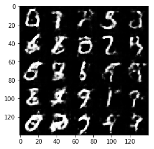


    Epoch 1/2... Discriminator Loss: 1.0733... Generator Loss: 0.8522
    Epoch 1/2... Discriminator Loss: 1.0427... Generator Loss: 0.9065
    Epoch 1/2... Discriminator Loss: 0.8758... Generator Loss: 1.5118
    Epoch 1/2... Discriminator Loss: 1.1713... Generator Loss: 0.7961
    Epoch 1/2... Discriminator Loss: 0.9205... Generator Loss: 1.3741
    Epoch 1/2... Discriminator Loss: 0.8594... Generator Loss: 1.4710
    Epoch 1/2... Discriminator Loss: 0.8531... Generator Loss: 1.2762
    Epoch 1/2... Discriminator Loss: 0.9633... Generator Loss: 1.3705
    Epoch 1/2... Discriminator Loss: 1.0879... Generator Loss: 0.8237
    Epoch 1/2... Discriminator Loss: 1.0294... Generator Loss: 1.6639
    


    Epoch 1/2... Discriminator Loss: 1.4607... Generator Loss: 0.5432
    Epoch 1/2... Discriminator Loss: 0.8875... Generator Loss: 1.2128
    Epoch 1/2... Discriminator Loss: 1.3281... Generator Loss: 0.5649
    Epoch 1/2... Discriminator Loss: 1.3532... Generator Loss: 0.9340
    Epoch 1/2... Discriminator Loss: 0.9527... Generator Loss: 1.2436
    Epoch 1/2... Discriminator Loss: 0.9772... Generator Loss: 1.4394
    Epoch 1/2... Discriminator Loss: 0.9653... Generator Loss: 1.5643
    Epoch 1/2... Discriminator Loss: 0.8248... Generator Loss: 1.4536
    Epoch 1/2... Discriminator Loss: 0.9985... Generator Loss: 0.8723
    Epoch 1/2... Discriminator Loss: 0.8369... Generator Loss: 1.4272
    


    Epoch 1/2... Discriminator Loss: 0.9250... Generator Loss: 1.1344
    Epoch 1/2... Discriminator Loss: 0.9082... Generator Loss: 1.3511
    Epoch 1/2... Discriminator Loss: 1.0393... Generator Loss: 1.2555
    Epoch 1/2... Discriminator Loss: 0.9977... Generator Loss: 1.1022
    Epoch 1/2... Discriminator Loss: 1.0915... Generator Loss: 0.8923
    Epoch 1/2... Discriminator Loss: 1.1041... Generator Loss: 0.7651
    Epoch 1/2... Discriminator Loss: 1.0874... Generator Loss: 0.7516
    Epoch 1/2... Discriminator Loss: 0.8270... Generator Loss: 1.3221
    Epoch 1/2... Discriminator Loss: 0.9658... Generator Loss: 1.2298
    Epoch 1/2... Discriminator Loss: 1.2050... Generator Loss: 0.7405
    


    Epoch 1/2... Discriminator Loss: 0.8604... Generator Loss: 1.2140
    Epoch 1/2... Discriminator Loss: 1.3057... Generator Loss: 0.6402
    Epoch 1/2... Discriminator Loss: 1.0966... Generator Loss: 0.8148
    Epoch 1/2... Discriminator Loss: 0.8720... Generator Loss: 1.8084
    Epoch 1/2... Discriminator Loss: 1.0219... Generator Loss: 1.0196
    Epoch 1/2... Discriminator Loss: 1.5098... Generator Loss: 0.4480
    Epoch 1/2... Discriminator Loss: 0.7983... Generator Loss: 1.3310
    Epoch 1/2... Discriminator Loss: 0.8434... Generator Loss: 1.9071
    Epoch 1/2... Discriminator Loss: 0.9827... Generator Loss: 1.8104
    Epoch 1/2... Discriminator Loss: 1.0987... Generator Loss: 0.7442
    


    Epoch 1/2... Discriminator Loss: 1.0162... Generator Loss: 1.0940
    Epoch 1/2... Discriminator Loss: 0.8039... Generator Loss: 1.2975
    Epoch 1/2... Discriminator Loss: 1.4553... Generator Loss: 2.6297
    Epoch 1/2... Discriminator Loss: 1.1105... Generator Loss: 0.8132
    Epoch 1/2... Discriminator Loss: 1.0676... Generator Loss: 0.7733
    Epoch 1/2... Discriminator Loss: 0.8760... Generator Loss: 1.4093
    Epoch 1/2... Discriminator Loss: 1.1822... Generator Loss: 0.7206
    Epoch 1/2... Discriminator Loss: 0.8094... Generator Loss: 1.9916
    Epoch 1/2... Discriminator Loss: 0.9231... Generator Loss: 1.1529
    Epoch 1/2... Discriminator Loss: 0.7808... Generator Loss: 1.8078
    


    Epoch 1/2... Discriminator Loss: 1.2005... Generator Loss: 0.6221
    Epoch 1/2... Discriminator Loss: 0.6889... Generator Loss: 1.5079
    Epoch 1/2... Discriminator Loss: 1.0945... Generator Loss: 0.7471
    Epoch 1/2... Discriminator Loss: 0.7323... Generator Loss: 1.5356
    Epoch 1/2... Discriminator Loss: 1.6011... Generator Loss: 0.4273
    Epoch 1/2... Discriminator Loss: 1.2350... Generator Loss: 1.7756
    Epoch 1/2... Discriminator Loss: 1.0031... Generator Loss: 1.8206
    Epoch 1/2... Discriminator Loss: 0.8229... Generator Loss: 1.3060
    Epoch 1/2... Discriminator Loss: 1.2902... Generator Loss: 2.0805
    Epoch 1/2... Discriminator Loss: 1.3344... Generator Loss: 0.5629
    


    Epoch 1/2... Discriminator Loss: 1.0180... Generator Loss: 2.1671
    Epoch 1/2... Discriminator Loss: 0.9506... Generator Loss: 0.9036
    Epoch 1/2... Discriminator Loss: 0.8036... Generator Loss: 1.2538
    Epoch 1/2... Discriminator Loss: 1.3448... Generator Loss: 0.5748
    Epoch 1/2... Discriminator Loss: 0.7295... Generator Loss: 1.8176
    Epoch 1/2... Discriminator Loss: 0.6878... Generator Loss: 1.5814
    Epoch 1/2... Discriminator Loss: 0.9819... Generator Loss: 1.0188
    Epoch 1/2... Discriminator Loss: 0.8213... Generator Loss: 1.1145
    Epoch 1/2... Discriminator Loss: 1.2070... Generator Loss: 0.7396
    Epoch 1/2... Discriminator Loss: 0.6262... Generator Loss: 1.7882
    


    Epoch 1/2... Discriminator Loss: 0.8608... Generator Loss: 1.0154
    Epoch 1/2... Discriminator Loss: 0.9186... Generator Loss: 1.2196
    Epoch 1/2... Discriminator Loss: 0.9978... Generator Loss: 1.9774
    Epoch 1/2... Discriminator Loss: 0.8350... Generator Loss: 1.4122
    Epoch 1/2... Discriminator Loss: 0.7458... Generator Loss: 1.7941
    Epoch 1/2... Discriminator Loss: 1.4465... Generator Loss: 0.4921
    Epoch 1/2... Discriminator Loss: 0.7290... Generator Loss: 1.4095
    Epoch 1/2... Discriminator Loss: 0.6977... Generator Loss: 1.4658
    Epoch 1/2... Discriminator Loss: 0.8227... Generator Loss: 1.2420
    Epoch 1/2... Discriminator Loss: 0.6449... Generator Loss: 1.7777
    


    Epoch 1/2... Discriminator Loss: 0.7994... Generator Loss: 1.3622
    Epoch 1/2... Discriminator Loss: 1.3033... Generator Loss: 0.5798
    Epoch 1/2... Discriminator Loss: 1.4279... Generator Loss: 3.6197
    Epoch 1/2... Discriminator Loss: 0.8312... Generator Loss: 1.4547
    Epoch 1/2... Discriminator Loss: 1.0184... Generator Loss: 0.8754
    Epoch 1/2... Discriminator Loss: 1.2444... Generator Loss: 0.6097
    Epoch 1/2... Discriminator Loss: 0.8511... Generator Loss: 1.1846
    Epoch 2/2... Discriminator Loss: 0.6762... Generator Loss: 1.4860
    Epoch 2/2... Discriminator Loss: 0.9423... Generator Loss: 1.5849
    Epoch 2/2... Discriminator Loss: 0.8221... Generator Loss: 1.1877
    Epoch 2/2... Discriminator Loss: 0.8808... Generator Loss: 1.1084
    Epoch 2/2... Discriminator Loss: 0.9703... Generator Loss: 0.9485
    Epoch 2/2... Discriminator Loss: 1.1039... Generator Loss: 0.7965
    Epoch 2/2... Discriminator Loss: 1.1348... Generator Loss: 0.8125
    Epoch 2/2... Discriminator Loss: 0.7541... Generator Loss: 1.4380
    Epoch 2/2... Discriminator Loss: 1.0686... Generator Loss: 0.8238
    Epoch 2/2... Discriminator Loss: 0.9220... Generator Loss: 1.0273
    


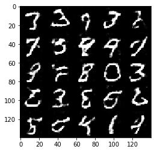


    Epoch 2/2... Discriminator Loss: 2.1365... Generator Loss: 0.3343
    Epoch 2/2... Discriminator Loss: 0.7317... Generator Loss: 1.4446
    Epoch 2/2... Discriminator Loss: 1.1116... Generator Loss: 0.8343
    Epoch 2/2... Discriminator Loss: 1.2274... Generator Loss: 0.6160
    Epoch 2/2... Discriminator Loss: 0.9001... Generator Loss: 1.0912
    Epoch 2/2... Discriminator Loss: 0.7778... Generator Loss: 1.9636
    Epoch 2/2... Discriminator Loss: 1.6040... Generator Loss: 0.4036
    Epoch 2/2... Discriminator Loss: 0.7373... Generator Loss: 1.3428
    Epoch 2/2... Discriminator Loss: 1.0066... Generator Loss: 0.8199
    Epoch 2/2... Discriminator Loss: 0.9094... Generator Loss: 1.0153
    


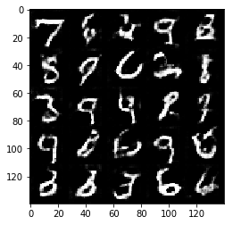


    Epoch 2/2... Discriminator Loss: 1.5760... Generator Loss: 0.4608
    Epoch 2/2... Discriminator Loss: 0.7000... Generator Loss: 1.6883
    Epoch 2/2... Discriminator Loss: 0.7373... Generator Loss: 1.3707
    Epoch 2/2... Discriminator Loss: 0.9686... Generator Loss: 0.8935
    Epoch 2/2... Discriminator Loss: 0.8780... Generator Loss: 1.0658
    Epoch 2/2... Discriminator Loss: 0.6261... Generator Loss: 1.7551
    Epoch 2/2... Discriminator Loss: 0.8220... Generator Loss: 1.2290
    Epoch 2/2... Discriminator Loss: 0.8202... Generator Loss: 1.4364
    Epoch 2/2... Discriminator Loss: 1.1699... Generator Loss: 2.5088
    Epoch 2/2... Discriminator Loss: 0.9323... Generator Loss: 1.1147
    


    Epoch 2/2... Discriminator Loss: 0.6991... Generator Loss: 1.5559
    Epoch 2/2... Discriminator Loss: 1.4048... Generator Loss: 0.5301
    Epoch 2/2... Discriminator Loss: 0.7365... Generator Loss: 1.3808
    Epoch 2/2... Discriminator Loss: 0.7950... Generator Loss: 1.2115
    Epoch 2/2... Discriminator Loss: 0.8672... Generator Loss: 1.0668
    Epoch 2/2... Discriminator Loss: 1.2159... Generator Loss: 0.6791
    Epoch 2/2... Discriminator Loss: 1.0186... Generator Loss: 0.8418
    Epoch 2/2... Discriminator Loss: 1.1896... Generator Loss: 0.6916
    Epoch 2/2... Discriminator Loss: 0.9441... Generator Loss: 0.9848
    Epoch 2/2... Discriminator Loss: 0.7603... Generator Loss: 1.2534
    


    Epoch 2/2... Discriminator Loss: 2.0544... Generator Loss: 0.2797
    Epoch 2/2... Discriminator Loss: 0.8011... Generator Loss: 1.2619
    Epoch 2/2... Discriminator Loss: 0.8800... Generator Loss: 1.1702
    Epoch 2/2... Discriminator Loss: 1.1751... Generator Loss: 0.7424
    Epoch 2/2... Discriminator Loss: 0.6941... Generator Loss: 1.7166
    Epoch 2/2... Discriminator Loss: 0.8793... Generator Loss: 1.8741
    Epoch 2/2... Discriminator Loss: 0.8546... Generator Loss: 1.1536
    Epoch 2/2... Discriminator Loss: 0.9293... Generator Loss: 0.9992
    Epoch 2/2... Discriminator Loss: 0.8619... Generator Loss: 1.0540
    Epoch 2/2... Discriminator Loss: 0.8409... Generator Loss: 1.0849
    


    Epoch 2/2... Discriminator Loss: 0.7627... Generator Loss: 1.3215
    Epoch 2/2... Discriminator Loss: 0.7925... Generator Loss: 1.3717
    Epoch 2/2... Discriminator Loss: 1.0429... Generator Loss: 0.7731
    Epoch 2/2... Discriminator Loss: 1.7384... Generator Loss: 0.4659
    Epoch 2/2... Discriminator Loss: 0.7740... Generator Loss: 1.2954
    Epoch 2/2... Discriminator Loss: 1.1178... Generator Loss: 1.9865
    Epoch 2/2... Discriminator Loss: 0.7363... Generator Loss: 1.6075
    Epoch 2/2... Discriminator Loss: 0.8048... Generator Loss: 1.1773
    Epoch 2/2... Discriminator Loss: 0.6476... Generator Loss: 1.9018
    Epoch 2/2... Discriminator Loss: 0.8949... Generator Loss: 1.1018
    


    Epoch 2/2... Discriminator Loss: 0.9400... Generator Loss: 0.9622
    Epoch 2/2... Discriminator Loss: 0.9220... Generator Loss: 1.0371
    Epoch 2/2... Discriminator Loss: 0.7280... Generator Loss: 1.4572
    Epoch 2/2... Discriminator Loss: 0.7665... Generator Loss: 1.3365
    Epoch 2/2... Discriminator Loss: 0.7159... Generator Loss: 1.9268
    Epoch 2/2... Discriminator Loss: 0.7368... Generator Loss: 1.2572
    Epoch 2/2... Discriminator Loss: 0.8369... Generator Loss: 1.2080
    Epoch 2/2... Discriminator Loss: 0.8280... Generator Loss: 1.2528
    Epoch 2/2... Discriminator Loss: 1.0854... Generator Loss: 0.8654
    Epoch 2/2... Discriminator Loss: 0.7394... Generator Loss: 1.4151
    


    Epoch 2/2... Discriminator Loss: 0.8546... Generator Loss: 1.2843
    Epoch 2/2... Discriminator Loss: 0.8780... Generator Loss: 1.1450
    Epoch 2/2... Discriminator Loss: 0.7043... Generator Loss: 1.7188
    Epoch 2/2... Discriminator Loss: 0.7748... Generator Loss: 1.3194
    Epoch 2/2... Discriminator Loss: 0.7015... Generator Loss: 1.9682
    Epoch 2/2... Discriminator Loss: 0.7064... Generator Loss: 1.4121
    Epoch 2/2... Discriminator Loss: 1.1977... Generator Loss: 3.6952
    Epoch 2/2... Discriminator Loss: 0.7897... Generator Loss: 1.5930
    Epoch 2/2... Discriminator Loss: 1.2946... Generator Loss: 0.6665
    Epoch 2/2... Discriminator Loss: 1.0636... Generator Loss: 0.7893
    


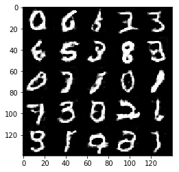


    Epoch 2/2... Discriminator Loss: 0.8599... Generator Loss: 1.8701
    Epoch 2/2... Discriminator Loss: 0.9105... Generator Loss: 1.0577
    Epoch 2/2... Discriminator Loss: 2.7340... Generator Loss: 0.1978
    Epoch 2/2... Discriminator Loss: 0.6261... Generator Loss: 1.6952
    Epoch 2/2... Discriminator Loss: 0.7774... Generator Loss: 1.3451
    Epoch 2/2... Discriminator Loss: 0.7917... Generator Loss: 2.1354
    Epoch 2/2... Discriminator Loss: 1.2407... Generator Loss: 0.6072
    Epoch 2/2... Discriminator Loss: 1.3120... Generator Loss: 0.6042
    Epoch 2/2... Discriminator Loss: 0.8782... Generator Loss: 1.0151
    Epoch 2/2... Discriminator Loss: 0.7119... Generator Loss: 1.4180
    


    Epoch 2/2... Discriminator Loss: 0.8279... Generator Loss: 2.2092
    Epoch 2/2... Discriminator Loss: 0.7308... Generator Loss: 1.4782
    Epoch 2/2... Discriminator Loss: 0.8632... Generator Loss: 1.2971
    Epoch 2/2... Discriminator Loss: 1.1018... Generator Loss: 0.7732
    Epoch 2/2... Discriminator Loss: 0.6193... Generator Loss: 1.9962
    Epoch 2/2... Discriminator Loss: 0.7166... Generator Loss: 1.4719
    Epoch 2/2... Discriminator Loss: 0.8846... Generator Loss: 2.2265
    Epoch 2/2... Discriminator Loss: 0.6596... Generator Loss: 2.2716
    Epoch 2/2... Discriminator Loss: 1.2772... Generator Loss: 0.6322
    Epoch 2/2... Discriminator Loss: 0.8575... Generator Loss: 1.1033
    


    Epoch 2/2... Discriminator Loss: 1.1656... Generator Loss: 0.6997
    Epoch 2/2... Discriminator Loss: 3.4386... Generator Loss: 0.1331
    Epoch 2/2... Discriminator Loss: 0.9928... Generator Loss: 0.8940
    Epoch 2/2... Discriminator Loss: 0.9454... Generator Loss: 0.9146
    Epoch 2/2... Discriminator Loss: 0.6389... Generator Loss: 1.7377
    Epoch 2/2... Discriminator Loss: 0.8706... Generator Loss: 1.2102
    Epoch 2/2... Discriminator Loss: 0.6329... Generator Loss: 1.5590
    Epoch 2/2... Discriminator Loss: 0.8232... Generator Loss: 1.1341
    Epoch 2/2... Discriminator Loss: 0.7420... Generator Loss: 1.3159
    Epoch 2/2... Discriminator Loss: 0.8554... Generator Loss: 1.0991
    


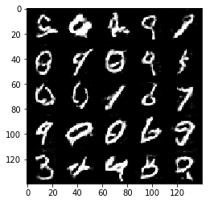


    Epoch 2/2... Discriminator Loss: 2.8728... Generator Loss: 0.2352
    Epoch 2/2... Discriminator Loss: 0.7864... Generator Loss: 2.1374
    Epoch 2/2... Discriminator Loss: 0.7595... Generator Loss: 1.4160
    Epoch 2/2... Discriminator Loss: 0.8175... Generator Loss: 1.3402
    Epoch 2/2... Discriminator Loss: 0.8612... Generator Loss: 1.0726
    Epoch 2/2... Discriminator Loss: 0.7386... Generator Loss: 1.3252
    Epoch 2/2... Discriminator Loss: 1.1834... Generator Loss: 0.6841
    Epoch 2/2... Discriminator Loss: 0.8028... Generator Loss: 1.1207
    Epoch 2/2... Discriminator Loss: 0.6878... Generator Loss: 1.7725
    Epoch 2/2... Discriminator Loss: 1.0159... Generator Loss: 0.8728
    


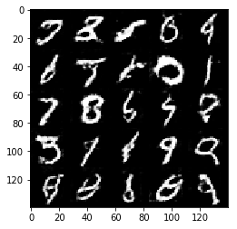


    Epoch 2/2... Discriminator Loss: 0.7279... Generator Loss: 1.5751
    Epoch 2/2... Discriminator Loss: 0.9800... Generator Loss: 1.0534
    Epoch 2/2... Discriminator Loss: 0.8716... Generator Loss: 1.1286
    Epoch 2/2... Discriminator Loss: 0.7485... Generator Loss: 1.3290
    Epoch 2/2... Discriminator Loss: 0.6741... Generator Loss: 1.7114
    Epoch 2/2... Discriminator Loss: 0.7729... Generator Loss: 1.6109
    Epoch 2/2... Discriminator Loss: 1.4359... Generator Loss: 0.5618
    Epoch 2/2... Discriminator Loss: 0.5630... Generator Loss: 1.8954
    Epoch 2/2... Discriminator Loss: 1.1683... Generator Loss: 0.6834
    Epoch 2/2... Discriminator Loss: 1.0435... Generator Loss: 0.9970
    


    Epoch 2/2... Discriminator Loss: 0.6514... Generator Loss: 1.8545
    Epoch 2/2... Discriminator Loss: 1.6487... Generator Loss: 0.4208
    Epoch 2/2... Discriminator Loss: 0.7639... Generator Loss: 1.2816
    Epoch 2/2... Discriminator Loss: 0.6700... Generator Loss: 1.8558
    Epoch 2/2... Discriminator Loss: 0.8035... Generator Loss: 1.2234
    Epoch 2/2... Discriminator Loss: 1.2670... Generator Loss: 0.8494
    Epoch 2/2... Discriminator Loss: 0.7963... Generator Loss: 1.3193
    Epoch 2/2... Discriminator Loss: 0.7015... Generator Loss: 1.4455
    Epoch 2/2... Discriminator Loss: 0.8534... Generator Loss: 1.1139
    Epoch 2/2... Discriminator Loss: 0.8100... Generator Loss: 1.3096
    


    Epoch 2/2... Discriminator Loss: 0.6474... Generator Loss: 2.1556
    Epoch 2/2... Discriminator Loss: 0.9230... Generator Loss: 1.1071
    Epoch 2/2... Discriminator Loss: 3.0421... Generator Loss: 4.8928
    Epoch 2/2... Discriminator Loss: 1.2499... Generator Loss: 1.1554
    Epoch 2/2... Discriminator Loss: 0.8823... Generator Loss: 1.2084
    Epoch 2/2... Discriminator Loss: 0.7229... Generator Loss: 1.4167
    Epoch 2/2... Discriminator Loss: 1.0807... Generator Loss: 0.8170
    Epoch 2/2... Discriminator Loss: 0.7110... Generator Loss: 1.3894
    Epoch 2/2... Discriminator Loss: 0.7999... Generator Loss: 1.4904
    Epoch 2/2... Discriminator Loss: 0.6619... Generator Loss: 2.0754
    


    Epoch 2/2... Discriminator Loss: 1.1400... Generator Loss: 0.7776
    Epoch 2/2... Discriminator Loss: 0.7913... Generator Loss: 1.2578
    Epoch 2/2... Discriminator Loss: 0.7222... Generator Loss: 1.5439
    Epoch 2/2... Discriminator Loss: 0.6528... Generator Loss: 1.7684
    Epoch 2/2... Discriminator Loss: 0.8400... Generator Loss: 1.2700
    Epoch 2/2... Discriminator Loss: 0.7433... Generator Loss: 1.3290
    Epoch 2/2... Discriminator Loss: 0.7542... Generator Loss: 1.3883
    Epoch 2/2... Discriminator Loss: 0.9104... Generator Loss: 1.0393
    Epoch 2/2... Discriminator Loss: 0.8625... Generator Loss: 1.1662
    Epoch 2/2... Discriminator Loss: 0.9696... Generator Loss: 0.9351
    


    Epoch 2/2... Discriminator Loss: 0.8234... Generator Loss: 1.7606
    Epoch 2/2... Discriminator Loss: 0.8760... Generator Loss: 1.1680
    Epoch 2/2... Discriminator Loss: 0.7210... Generator Loss: 1.3984
    Epoch 2/2... Discriminator Loss: 0.8053... Generator Loss: 1.2069
    Epoch 2/2... Discriminator Loss: 0.6442... Generator Loss: 1.6686
    Epoch 2/2... Discriminator Loss: 0.6141... Generator Loss: 1.6574
    Epoch 2/2... Discriminator Loss: 1.0680... Generator Loss: 0.8567
    Epoch 2/2... Discriminator Loss: 0.5595... Generator Loss: 2.1013
    Epoch 2/2... Discriminator Loss: 0.6603... Generator Loss: 1.6602
    Epoch 2/2... Discriminator Loss: 0.6321... Generator Loss: 1.7847
    


    Epoch 2/2... Discriminator Loss: 0.5602... Generator Loss: 1.9261
    Epoch 2/2... Discriminator Loss: 0.7095... Generator Loss: 1.6791
    Epoch 2/2... Discriminator Loss: 0.8813... Generator Loss: 1.2612
    Epoch 2/2... Discriminator Loss: 1.0069... Generator Loss: 1.2920
    Epoch 2/2... Discriminator Loss: 0.6820... Generator Loss: 1.5285
    Epoch 2/2... Discriminator Loss: 1.2014... Generator Loss: 0.7370
    Epoch 2/2... Discriminator Loss: 0.7262... Generator Loss: 1.4200
    Epoch 2/2... Discriminator Loss: 0.7197... Generator Loss: 1.5891
    Epoch 2/2... Discriminator Loss: 0.8257... Generator Loss: 1.2289
    Epoch 2/2... Discriminator Loss: 0.5965... Generator Loss: 1.8246
    


    Epoch 2/2... Discriminator Loss: 0.7498... Generator Loss: 1.3367
    Epoch 2/2... Discriminator Loss: 0.7086... Generator Loss: 1.4015
    Epoch 2/2... Discriminator Loss: 0.8454... Generator Loss: 1.7536
    Epoch 2/2... Discriminator Loss: 0.6732... Generator Loss: 1.6121
    Epoch 2/2... Discriminator Loss: 1.0091... Generator Loss: 0.9021
    Epoch 2/2... Discriminator Loss: 1.0343... Generator Loss: 0.8011
    Epoch 2/2... Discriminator Loss: 0.5863... Generator Loss: 1.9898
    

### CelebA
Run your GANs on CelebA.  It will take around 20 minutes on the average GPU to run one epoch.  You can run the whole epoch or stop when it starts to generate realistic faces.


```python
batch_size = 64
z_dim = 100
learning_rate = 0.0005
beta1 = 0.5


"""
DON'T MODIFY ANYTHING IN THIS CELL THAT IS BELOW THIS LINE
"""
epochs = 1

celeba_dataset = helper.Dataset('celeba', glob(os.path.join(data_dir, 'img_align_celeba/*.jpg')))
with tf.Graph().as_default():
    train(epochs, batch_size, z_dim, learning_rate, beta1, celeba_dataset.get_batches,
          celeba_dataset.shape, celeba_dataset.image_mode)
```

    Epoch 1/1... Discriminator Loss: 0.8798... Generator Loss: 2.0421
    Epoch 1/1... Discriminator Loss: 1.5595... Generator Loss: 0.5931
    Epoch 1/1... Discriminator Loss: 0.6901... Generator Loss: 3.0716
    Epoch 1/1... Discriminator Loss: 1.1946... Generator Loss: 1.3708
    Epoch 1/1... Discriminator Loss: 1.2597... Generator Loss: 0.7939
    Epoch 1/1... Discriminator Loss: 1.1606... Generator Loss: 1.3502
    Epoch 1/1... Discriminator Loss: 1.1983... Generator Loss: 2.4858
    Epoch 1/1... Discriminator Loss: 1.0041... Generator Loss: 1.1061
    Epoch 1/1... Discriminator Loss: 0.9474... Generator Loss: 1.8646
    Epoch 1/1... Discriminator Loss: 1.0963... Generator Loss: 1.7090
    


    Epoch 1/1... Discriminator Loss: 1.1094... Generator Loss: 1.1723
    Epoch 1/1... Discriminator Loss: 1.5491... Generator Loss: 0.4536
    Epoch 1/1... Discriminator Loss: 1.0618... Generator Loss: 1.1139
    Epoch 1/1... Discriminator Loss: 1.2728... Generator Loss: 0.8341
    Epoch 1/1... Discriminator Loss: 1.5895... Generator Loss: 0.6498
    Epoch 1/1... Discriminator Loss: 1.4329... Generator Loss: 0.5951
    Epoch 1/1... Discriminator Loss: 1.1417... Generator Loss: 1.0671
    Epoch 1/1... Discriminator Loss: 1.0355... Generator Loss: 1.4311
    Epoch 1/1... Discriminator Loss: 1.2209... Generator Loss: 1.9928
    Epoch 1/1... Discriminator Loss: 1.0471... Generator Loss: 0.9919
    


    Epoch 1/1... Discriminator Loss: 1.1151... Generator Loss: 0.8913
    Epoch 1/1... Discriminator Loss: 1.1602... Generator Loss: 1.4538
    Epoch 1/1... Discriminator Loss: 1.1616... Generator Loss: 0.8011
    Epoch 1/1... Discriminator Loss: 1.2821... Generator Loss: 1.1419
    Epoch 1/1... Discriminator Loss: 1.3218... Generator Loss: 1.5602
    Epoch 1/1... Discriminator Loss: 1.4686... Generator Loss: 1.5126
    Epoch 1/1... Discriminator Loss: 1.3098... Generator Loss: 0.7581
    Epoch 1/1... Discriminator Loss: 1.6509... Generator Loss: 0.4542
    Epoch 1/1... Discriminator Loss: 1.2591... Generator Loss: 1.3961
    Epoch 1/1... Discriminator Loss: 1.2346... Generator Loss: 0.9134
    


    Epoch 1/1... Discriminator Loss: 1.3163... Generator Loss: 1.0835
    Epoch 1/1... Discriminator Loss: 1.2972... Generator Loss: 0.9448
    Epoch 1/1... Discriminator Loss: 1.2509... Generator Loss: 1.1399
    Epoch 1/1... Discriminator Loss: 1.2904... Generator Loss: 0.7062
    Epoch 1/1... Discriminator Loss: 1.2726... Generator Loss: 1.1438
    Epoch 1/1... Discriminator Loss: 1.6100... Generator Loss: 0.4656
    Epoch 1/1... Discriminator Loss: 1.6096... Generator Loss: 0.4453
    Epoch 1/1... Discriminator Loss: 1.2466... Generator Loss: 0.7981
    Epoch 1/1... Discriminator Loss: 1.2302... Generator Loss: 1.0741
    Epoch 1/1... Discriminator Loss: 1.3458... Generator Loss: 1.3110
    


    Epoch 1/1... Discriminator Loss: 1.2114... Generator Loss: 1.2035
    Epoch 1/1... Discriminator Loss: 1.1475... Generator Loss: 0.9735
    Epoch 1/1... Discriminator Loss: 1.3859... Generator Loss: 0.5666
    Epoch 1/1... Discriminator Loss: 1.2160... Generator Loss: 1.4253
    Epoch 1/1... Discriminator Loss: 1.2258... Generator Loss: 0.7030
    Epoch 1/1... Discriminator Loss: 1.3601... Generator Loss: 0.6293
    Epoch 1/1... Discriminator Loss: 1.4460... Generator Loss: 0.5976
    Epoch 1/1... Discriminator Loss: 1.4309... Generator Loss: 1.0777
    Epoch 1/1... Discriminator Loss: 1.3624... Generator Loss: 1.2715
    Epoch 1/1... Discriminator Loss: 1.2454... Generator Loss: 1.2556
    


    Epoch 1/1... Discriminator Loss: 1.4220... Generator Loss: 0.6315
    Epoch 1/1... Discriminator Loss: 1.2361... Generator Loss: 0.8708
    Epoch 1/1... Discriminator Loss: 1.2654... Generator Loss: 0.9256
    Epoch 1/1... Discriminator Loss: 1.2389... Generator Loss: 0.8686
    Epoch 1/1... Discriminator Loss: 1.4014... Generator Loss: 0.6914
    Epoch 1/1... Discriminator Loss: 1.4521... Generator Loss: 0.6497
    Epoch 1/1... Discriminator Loss: 1.2609... Generator Loss: 1.2256
    Epoch 1/1... Discriminator Loss: 1.4976... Generator Loss: 1.6290
    Epoch 1/1... Discriminator Loss: 1.2994... Generator Loss: 1.1868
    Epoch 1/1... Discriminator Loss: 1.3441... Generator Loss: 0.8443
    


    Epoch 1/1... Discriminator Loss: 1.2868... Generator Loss: 1.1160
    Epoch 1/1... Discriminator Loss: 1.3558... Generator Loss: 0.6544
    Epoch 1/1... Discriminator Loss: 1.2261... Generator Loss: 0.8472
    Epoch 1/1... Discriminator Loss: 1.2869... Generator Loss: 1.0071
    Epoch 1/1... Discriminator Loss: 1.3197... Generator Loss: 0.9755
    Epoch 1/1... Discriminator Loss: 1.2396... Generator Loss: 0.8388
    Epoch 1/1... Discriminator Loss: 1.4005... Generator Loss: 1.2976
    Epoch 1/1... Discriminator Loss: 1.3094... Generator Loss: 1.2824
    Epoch 1/1... Discriminator Loss: 1.2521... Generator Loss: 0.7168
    Epoch 1/1... Discriminator Loss: 1.2565... Generator Loss: 1.1344
    


    Epoch 1/1... Discriminator Loss: 1.4488... Generator Loss: 1.2945
    Epoch 1/1... Discriminator Loss: 1.4324... Generator Loss: 0.9816
    Epoch 1/1... Discriminator Loss: 1.3231... Generator Loss: 0.8272
    Epoch 1/1... Discriminator Loss: 1.3311... Generator Loss: 0.8132
    Epoch 1/1... Discriminator Loss: 1.1495... Generator Loss: 0.9512
    Epoch 1/1... Discriminator Loss: 1.2389... Generator Loss: 0.9240
    Epoch 1/1... Discriminator Loss: 1.3664... Generator Loss: 0.8106
    Epoch 1/1... Discriminator Loss: 1.3916... Generator Loss: 0.6178
    Epoch 1/1... Discriminator Loss: 1.1049... Generator Loss: 1.1796
    Epoch 1/1... Discriminator Loss: 1.3333... Generator Loss: 0.8332
    


    Epoch 1/1... Discriminator Loss: 1.2690... Generator Loss: 0.8254
    Epoch 1/1... Discriminator Loss: 1.3943... Generator Loss: 0.7277
    Epoch 1/1... Discriminator Loss: 1.3008... Generator Loss: 0.7434
    Epoch 1/1... Discriminator Loss: 1.2894... Generator Loss: 1.1467
    Epoch 1/1... Discriminator Loss: 1.2700... Generator Loss: 0.9371
    Epoch 1/1... Discriminator Loss: 1.3313... Generator Loss: 0.8946
    Epoch 1/1... Discriminator Loss: 1.3175... Generator Loss: 1.0990
    Epoch 1/1... Discriminator Loss: 1.3987... Generator Loss: 0.5774
    Epoch 1/1... Discriminator Loss: 1.3053... Generator Loss: 1.0887
    Epoch 1/1... Discriminator Loss: 1.2897... Generator Loss: 0.6718
    


    Epoch 1/1... Discriminator Loss: 1.2549... Generator Loss: 1.0496
    Epoch 1/1... Discriminator Loss: 1.3742... Generator Loss: 1.6887
    Epoch 1/1... Discriminator Loss: 1.1898... Generator Loss: 0.8359
    Epoch 1/1... Discriminator Loss: 1.1613... Generator Loss: 1.1663
    Epoch 1/1... Discriminator Loss: 1.1493... Generator Loss: 0.8713
    Epoch 1/1... Discriminator Loss: 1.1747... Generator Loss: 0.8940
    Epoch 1/1... Discriminator Loss: 1.2643... Generator Loss: 0.7557
    Epoch 1/1... Discriminator Loss: 1.3196... Generator Loss: 0.6177
    Epoch 1/1... Discriminator Loss: 1.1742... Generator Loss: 0.9318
    Epoch 1/1... Discriminator Loss: 1.2097... Generator Loss: 1.3829
    


    Epoch 1/1... Discriminator Loss: 1.2788... Generator Loss: 1.5866
    Epoch 1/1... Discriminator Loss: 1.1786... Generator Loss: 0.8577
    Epoch 1/1... Discriminator Loss: 1.2208... Generator Loss: 0.8778
    Epoch 1/1... Discriminator Loss: 1.2407... Generator Loss: 1.3865
    Epoch 1/1... Discriminator Loss: 1.3278... Generator Loss: 1.2527
    Epoch 1/1... Discriminator Loss: 1.2640... Generator Loss: 0.8309
    Epoch 1/1... Discriminator Loss: 1.3000... Generator Loss: 1.1075
    Epoch 1/1... Discriminator Loss: 1.3451... Generator Loss: 0.6133
    Epoch 1/1... Discriminator Loss: 1.3378... Generator Loss: 0.8424
    Epoch 1/1... Discriminator Loss: 1.3525... Generator Loss: 0.8553
    


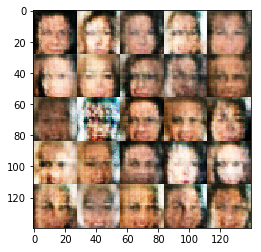


    Epoch 1/1... Discriminator Loss: 1.3410... Generator Loss: 1.2454
    Epoch 1/1... Discriminator Loss: 1.1615... Generator Loss: 1.0702
    Epoch 1/1... Discriminator Loss: 1.3062... Generator Loss: 0.6564
    Epoch 1/1... Discriminator Loss: 1.2010... Generator Loss: 0.8821
    Epoch 1/1... Discriminator Loss: 1.3357... Generator Loss: 0.6466
    Epoch 1/1... Discriminator Loss: 1.1563... Generator Loss: 0.8521
    Epoch 1/1... Discriminator Loss: 1.2405... Generator Loss: 0.9386
    Epoch 1/1... Discriminator Loss: 1.2015... Generator Loss: 0.8128
    Epoch 1/1... Discriminator Loss: 1.1925... Generator Loss: 0.9579
    Epoch 1/1... Discriminator Loss: 1.1339... Generator Loss: 1.2425
    


    Epoch 1/1... Discriminator Loss: 1.2521... Generator Loss: 0.6668
    Epoch 1/1... Discriminator Loss: 1.1756... Generator Loss: 1.0401
    Epoch 1/1... Discriminator Loss: 1.3024... Generator Loss: 0.8562
    Epoch 1/1... Discriminator Loss: 1.2161... Generator Loss: 0.8074
    Epoch 1/1... Discriminator Loss: 1.4151... Generator Loss: 1.6180
    Epoch 1/1... Discriminator Loss: 1.1635... Generator Loss: 1.3572
    Epoch 1/1... Discriminator Loss: 1.2229... Generator Loss: 1.2136
    Epoch 1/1... Discriminator Loss: 1.2930... Generator Loss: 0.7351
    Epoch 1/1... Discriminator Loss: 1.0788... Generator Loss: 1.1131
    Epoch 1/1... Discriminator Loss: 1.6497... Generator Loss: 0.3925
    


    Epoch 1/1... Discriminator Loss: 1.2244... Generator Loss: 0.8509
    Epoch 1/1... Discriminator Loss: 1.3939... Generator Loss: 0.5367
    Epoch 1/1... Discriminator Loss: 1.1881... Generator Loss: 0.8208
    Epoch 1/1... Discriminator Loss: 1.2993... Generator Loss: 0.7278
    Epoch 1/1... Discriminator Loss: 1.1836... Generator Loss: 0.7135
    Epoch 1/1... Discriminator Loss: 1.1944... Generator Loss: 1.5988
    Epoch 1/1... Discriminator Loss: 1.3784... Generator Loss: 0.6770
    Epoch 1/1... Discriminator Loss: 1.2756... Generator Loss: 0.8090
    Epoch 1/1... Discriminator Loss: 1.2409... Generator Loss: 1.0294
    Epoch 1/1... Discriminator Loss: 1.1570... Generator Loss: 1.0697
    


    Epoch 1/1... Discriminator Loss: 1.2095... Generator Loss: 1.4801
    Epoch 1/1... Discriminator Loss: 1.1808... Generator Loss: 1.1020
    Epoch 1/1... Discriminator Loss: 1.1446... Generator Loss: 0.9238
    Epoch 1/1... Discriminator Loss: 1.2140... Generator Loss: 0.8459
    Epoch 1/1... Discriminator Loss: 1.2379... Generator Loss: 0.9611
    Epoch 1/1... Discriminator Loss: 1.1526... Generator Loss: 0.8323
    Epoch 1/1... Discriminator Loss: 1.2917... Generator Loss: 0.7734
    Epoch 1/1... Discriminator Loss: 1.4027... Generator Loss: 0.5686
    Epoch 1/1... Discriminator Loss: 1.1263... Generator Loss: 0.9045
    Epoch 1/1... Discriminator Loss: 1.2223... Generator Loss: 0.8119
    


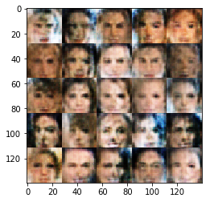


    Epoch 1/1... Discriminator Loss: 1.2883... Generator Loss: 0.9420
    Epoch 1/1... Discriminator Loss: 1.4136... Generator Loss: 0.5264
    Epoch 1/1... Discriminator Loss: 1.1499... Generator Loss: 0.8796
    Epoch 1/1... Discriminator Loss: 1.1146... Generator Loss: 1.1581
    Epoch 1/1... Discriminator Loss: 1.2018... Generator Loss: 1.4083
    Epoch 1/1... Discriminator Loss: 1.2285... Generator Loss: 0.8124
    Epoch 1/1... Discriminator Loss: 1.2190... Generator Loss: 0.8586
    Epoch 1/1... Discriminator Loss: 1.1553... Generator Loss: 1.1648
    Epoch 1/1... Discriminator Loss: 1.3214... Generator Loss: 0.6051
    Epoch 1/1... Discriminator Loss: 1.5482... Generator Loss: 1.3227
    


    Epoch 1/1... Discriminator Loss: 1.4597... Generator Loss: 0.5236
    Epoch 1/1... Discriminator Loss: 1.2097... Generator Loss: 0.9639
    Epoch 1/1... Discriminator Loss: 1.3922... Generator Loss: 0.9512
    Epoch 1/1... Discriminator Loss: 1.2633... Generator Loss: 0.7333
    Epoch 1/1... Discriminator Loss: 1.3053... Generator Loss: 0.7004
    Epoch 1/1... Discriminator Loss: 1.4392... Generator Loss: 0.5186
    Epoch 1/1... Discriminator Loss: 1.2748... Generator Loss: 0.6873
    Epoch 1/1... Discriminator Loss: 1.1793... Generator Loss: 0.7606
    Epoch 1/1... Discriminator Loss: 1.2014... Generator Loss: 1.2532
    Epoch 1/1... Discriminator Loss: 1.0554... Generator Loss: 0.9440
    


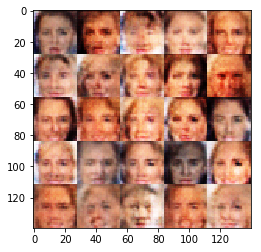


    Epoch 1/1... Discriminator Loss: 1.1977... Generator Loss: 0.7960
    Epoch 1/1... Discriminator Loss: 1.3783... Generator Loss: 0.8383
    Epoch 1/1... Discriminator Loss: 1.0347... Generator Loss: 1.1865
    Epoch 1/1... Discriminator Loss: 1.0612... Generator Loss: 0.9961
    Epoch 1/1... Discriminator Loss: 1.0844... Generator Loss: 1.0145
    Epoch 1/1... Discriminator Loss: 1.2194... Generator Loss: 1.0961
    Epoch 1/1... Discriminator Loss: 1.0842... Generator Loss: 0.9130
    Epoch 1/1... Discriminator Loss: 1.1862... Generator Loss: 0.8491
    Epoch 1/1... Discriminator Loss: 1.2812... Generator Loss: 0.6884
    Epoch 1/1... Discriminator Loss: 1.4401... Generator Loss: 0.5231
    


    Epoch 1/1... Discriminator Loss: 1.2383... Generator Loss: 1.2039
    Epoch 1/1... Discriminator Loss: 1.3670... Generator Loss: 0.6746
    Epoch 1/1... Discriminator Loss: 1.1216... Generator Loss: 0.8512
    Epoch 1/1... Discriminator Loss: 1.1261... Generator Loss: 0.8188
    Epoch 1/1... Discriminator Loss: 1.2244... Generator Loss: 0.8328
    Epoch 1/1... Discriminator Loss: 1.1719... Generator Loss: 1.0874
    Epoch 1/1... Discriminator Loss: 1.2017... Generator Loss: 0.8006
    Epoch 1/1... Discriminator Loss: 1.2682... Generator Loss: 0.6743
    Epoch 1/1... Discriminator Loss: 1.0925... Generator Loss: 1.0604
    Epoch 1/1... Discriminator Loss: 1.1450... Generator Loss: 0.9586
    


    Epoch 1/1... Discriminator Loss: 1.0742... Generator Loss: 1.4188
    Epoch 1/1... Discriminator Loss: 1.5186... Generator Loss: 0.4467
    Epoch 1/1... Discriminator Loss: 1.4443... Generator Loss: 0.4899
    Epoch 1/1... Discriminator Loss: 1.1784... Generator Loss: 0.8323
    Epoch 1/1... Discriminator Loss: 1.3158... Generator Loss: 0.5901
    Epoch 1/1... Discriminator Loss: 1.2798... Generator Loss: 1.3742
    Epoch 1/1... Discriminator Loss: 1.2728... Generator Loss: 0.6796
    Epoch 1/1... Discriminator Loss: 1.2486... Generator Loss: 0.7443
    Epoch 1/1... Discriminator Loss: 1.1240... Generator Loss: 0.9483
    Epoch 1/1... Discriminator Loss: 1.1552... Generator Loss: 1.0463
    


    Epoch 1/1... Discriminator Loss: 1.3403... Generator Loss: 0.5861
    Epoch 1/1... Discriminator Loss: 1.1495... Generator Loss: 0.7641
    Epoch 1/1... Discriminator Loss: 1.0753... Generator Loss: 1.1402
    Epoch 1/1... Discriminator Loss: 1.0983... Generator Loss: 0.8822
    Epoch 1/1... Discriminator Loss: 1.0327... Generator Loss: 0.9790
    Epoch 1/1... Discriminator Loss: 1.1895... Generator Loss: 0.8832
    Epoch 1/1... Discriminator Loss: 1.2556... Generator Loss: 0.6916
    Epoch 1/1... Discriminator Loss: 1.2562... Generator Loss: 0.9516
    Epoch 1/1... Discriminator Loss: 1.2640... Generator Loss: 0.7730
    Epoch 1/1... Discriminator Loss: 1.0180... Generator Loss: 1.0850
    


    Epoch 1/1... Discriminator Loss: 1.2476... Generator Loss: 0.8486
    Epoch 1/1... Discriminator Loss: 1.1561... Generator Loss: 0.8282
    Epoch 1/1... Discriminator Loss: 1.3130... Generator Loss: 1.3303
    Epoch 1/1... Discriminator Loss: 1.1406... Generator Loss: 1.1912
    Epoch 1/1... Discriminator Loss: 1.2274... Generator Loss: 0.7632
    Epoch 1/1... Discriminator Loss: 1.1954... Generator Loss: 0.8039
    Epoch 1/1... Discriminator Loss: 1.4196... Generator Loss: 1.3238
    Epoch 1/1... Discriminator Loss: 1.0959... Generator Loss: 0.8862
    Epoch 1/1... Discriminator Loss: 1.3601... Generator Loss: 0.6289
    Epoch 1/1... Discriminator Loss: 1.1125... Generator Loss: 1.1451
    


    Epoch 1/1... Discriminator Loss: 1.1788... Generator Loss: 1.2484
    Epoch 1/1... Discriminator Loss: 1.2127... Generator Loss: 1.0630
    Epoch 1/1... Discriminator Loss: 1.3219... Generator Loss: 1.2268
    Epoch 1/1... Discriminator Loss: 1.2167... Generator Loss: 0.8958
    Epoch 1/1... Discriminator Loss: 1.1074... Generator Loss: 1.0219
    Epoch 1/1... Discriminator Loss: 1.1753... Generator Loss: 0.7860
    Epoch 1/1... Discriminator Loss: 1.1128... Generator Loss: 0.9576
    Epoch 1/1... Discriminator Loss: 1.2336... Generator Loss: 0.9808
    Epoch 1/1... Discriminator Loss: 1.1168... Generator Loss: 1.5202
    Epoch 1/1... Discriminator Loss: 1.2838... Generator Loss: 1.7633
    


    Epoch 1/1... Discriminator Loss: 1.0983... Generator Loss: 0.9761
    Epoch 1/1... Discriminator Loss: 1.0000... Generator Loss: 1.2907
    Epoch 1/1... Discriminator Loss: 1.1916... Generator Loss: 1.1043
    Epoch 1/1... Discriminator Loss: 1.0861... Generator Loss: 1.1172
    Epoch 1/1... Discriminator Loss: 1.2553... Generator Loss: 1.2208
    Epoch 1/1... Discriminator Loss: 1.2012... Generator Loss: 0.7406
    Epoch 1/1... Discriminator Loss: 1.0994... Generator Loss: 0.8265
    Epoch 1/1... Discriminator Loss: 1.3892... Generator Loss: 0.5207
    Epoch 1/1... Discriminator Loss: 1.1430... Generator Loss: 0.7709
    Epoch 1/1... Discriminator Loss: 1.1691... Generator Loss: 0.6573
    


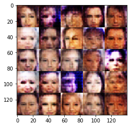


    Epoch 1/1... Discriminator Loss: 1.1998... Generator Loss: 1.1163
    Epoch 1/1... Discriminator Loss: 1.2007... Generator Loss: 0.7758
    Epoch 1/1... Discriminator Loss: 1.2704... Generator Loss: 1.8676
    Epoch 1/1... Discriminator Loss: 1.2070... Generator Loss: 1.0122
    Epoch 1/1... Discriminator Loss: 1.1334... Generator Loss: 0.9486
    Epoch 1/1... Discriminator Loss: 1.1445... Generator Loss: 0.9374
    Epoch 1/1... Discriminator Loss: 1.3077... Generator Loss: 0.6716
    Epoch 1/1... Discriminator Loss: 1.1805... Generator Loss: 0.6996
    Epoch 1/1... Discriminator Loss: 1.0986... Generator Loss: 0.8831
    Epoch 1/1... Discriminator Loss: 1.1538... Generator Loss: 0.9845
    


    Epoch 1/1... Discriminator Loss: 1.1920... Generator Loss: 1.2448
    Epoch 1/1... Discriminator Loss: 1.2203... Generator Loss: 1.5450
    Epoch 1/1... Discriminator Loss: 1.1440... Generator Loss: 0.9767
    Epoch 1/1... Discriminator Loss: 1.1551... Generator Loss: 0.7839
    Epoch 1/1... Discriminator Loss: 1.1988... Generator Loss: 0.9965
    Epoch 1/1... Discriminator Loss: 1.1067... Generator Loss: 1.2612
    Epoch 1/1... Discriminator Loss: 1.1920... Generator Loss: 0.8502
    Epoch 1/1... Discriminator Loss: 1.2750... Generator Loss: 0.6085
    Epoch 1/1... Discriminator Loss: 1.0516... Generator Loss: 1.3153
    Epoch 1/1... Discriminator Loss: 1.3432... Generator Loss: 0.6509
    


    Epoch 1/1... Discriminator Loss: 1.1149... Generator Loss: 0.8623
    Epoch 1/1... Discriminator Loss: 1.2111... Generator Loss: 0.7106
    Epoch 1/1... Discriminator Loss: 1.1434... Generator Loss: 0.7576
    Epoch 1/1... Discriminator Loss: 1.1649... Generator Loss: 0.8533
    Epoch 1/1... Discriminator Loss: 1.2581... Generator Loss: 1.2396
    Epoch 1/1... Discriminator Loss: 1.0973... Generator Loss: 1.3781
    Epoch 1/1... Discriminator Loss: 1.1265... Generator Loss: 1.2161
    Epoch 1/1... Discriminator Loss: 1.1233... Generator Loss: 0.8250
    Epoch 1/1... Discriminator Loss: 1.2063... Generator Loss: 0.7655
    Epoch 1/1... Discriminator Loss: 1.2877... Generator Loss: 0.6086
    


    Epoch 1/1... Discriminator Loss: 0.9741... Generator Loss: 1.1072
    Epoch 1/1... Discriminator Loss: 1.1654... Generator Loss: 0.7471
    Epoch 1/1... Discriminator Loss: 1.2009... Generator Loss: 0.7599
    Epoch 1/1... Discriminator Loss: 1.0450... Generator Loss: 1.2514
    Epoch 1/1... Discriminator Loss: 1.2943... Generator Loss: 1.4292
    Epoch 1/1... Discriminator Loss: 1.0963... Generator Loss: 0.9153
    Epoch 1/1... Discriminator Loss: 1.0450... Generator Loss: 1.1931
    Epoch 1/1... Discriminator Loss: 1.2714... Generator Loss: 0.7833
    Epoch 1/1... Discriminator Loss: 1.3264... Generator Loss: 0.6606
    Epoch 1/1... Discriminator Loss: 0.9744... Generator Loss: 1.3358
    


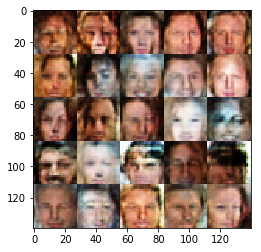


    Epoch 1/1... Discriminator Loss: 1.3434... Generator Loss: 0.6581
    Epoch 1/1... Discriminator Loss: 1.1757... Generator Loss: 0.8300
    Epoch 1/1... Discriminator Loss: 1.2397... Generator Loss: 0.6535
    Epoch 1/1... Discriminator Loss: 1.3038... Generator Loss: 0.6466
    Epoch 1/1... Discriminator Loss: 1.0921... Generator Loss: 0.9924
    Epoch 1/1... Discriminator Loss: 1.1067... Generator Loss: 0.7785
    Epoch 1/1... Discriminator Loss: 1.1210... Generator Loss: 0.7584
    Epoch 1/1... Discriminator Loss: 1.5063... Generator Loss: 0.4402
    Epoch 1/1... Discriminator Loss: 1.0214... Generator Loss: 0.9859
    Epoch 1/1... Discriminator Loss: 1.1290... Generator Loss: 1.1978
    


    Epoch 1/1... Discriminator Loss: 1.2540... Generator Loss: 0.8226
    Epoch 1/1... Discriminator Loss: 1.2638... Generator Loss: 1.6728
    Epoch 1/1... Discriminator Loss: 1.2536... Generator Loss: 0.6750
    Epoch 1/1... Discriminator Loss: 1.2175... Generator Loss: 0.8471
    Epoch 1/1... Discriminator Loss: 1.2836... Generator Loss: 0.6800
    Epoch 1/1... Discriminator Loss: 0.9479... Generator Loss: 1.5507
    Epoch 1/1... Discriminator Loss: 1.0196... Generator Loss: 1.0553
    Epoch 1/1... Discriminator Loss: 1.2227... Generator Loss: 0.7581
    Epoch 1/1... Discriminator Loss: 1.2869... Generator Loss: 0.6628
    Epoch 1/1... Discriminator Loss: 1.3562... Generator Loss: 0.5748
    


    Epoch 1/1... Discriminator Loss: 1.2201... Generator Loss: 1.3318
    Epoch 1/1... Discriminator Loss: 1.2082... Generator Loss: 1.1311
    Epoch 1/1... Discriminator Loss: 1.1335... Generator Loss: 1.0616
    Epoch 1/1... Discriminator Loss: 1.4183... Generator Loss: 1.4284
    Epoch 1/1... Discriminator Loss: 1.0650... Generator Loss: 1.0239
    Epoch 1/1... Discriminator Loss: 1.1114... Generator Loss: 0.9283
    Epoch 1/1... Discriminator Loss: 1.1873... Generator Loss: 0.8004
    Epoch 1/1... Discriminator Loss: 1.0108... Generator Loss: 1.0736
    Epoch 1/1... Discriminator Loss: 1.1266... Generator Loss: 0.9649
    Epoch 1/1... Discriminator Loss: 1.3659... Generator Loss: 0.5750
    


    Epoch 1/1... Discriminator Loss: 1.2468... Generator Loss: 0.8394
    Epoch 1/1... Discriminator Loss: 1.1640... Generator Loss: 0.7448
    Epoch 1/1... Discriminator Loss: 1.1302... Generator Loss: 1.0238
    Epoch 1/1... Discriminator Loss: 1.0980... Generator Loss: 1.0211
    Epoch 1/1... Discriminator Loss: 1.1857... Generator Loss: 0.9305
    Epoch 1/1... Discriminator Loss: 1.3628... Generator Loss: 0.5306
    

### Submitting This Project
When submitting this project, make sure to run all the cells before saving the notebook. Save the notebook file as "dlnd_face_generation.ipynb" and save it as a HTML file under "File" -> "Download as". Include the "helper.py" and "problem_unittests.py" files in your submission.
