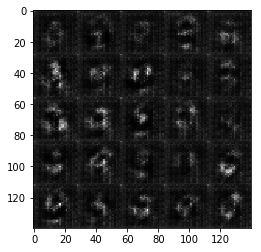
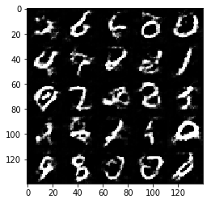
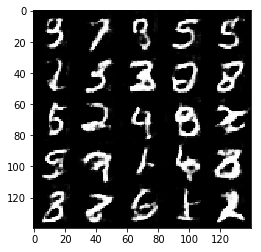
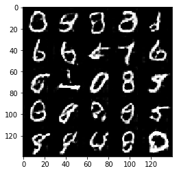
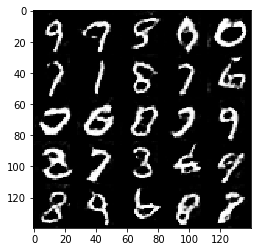
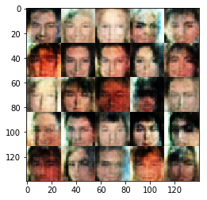

# Face Generation
In this project, I've used generative adversarial networks to generate new images of faces.
### Get the Data
This project useed two datasets:
- MNIST
- CelebA

The neural network on MNIST before CelebA.  Running the GANs on MNIST allowed me to see how well the model trains sooner.

If you're using [FloydHub](https://www.floydhub.com/), set `data_dir` to "/input" and use the [FloydHub data ID](http://docs.floydhub.com/home/using_datasets/) "R5KrjnANiKVhLWAkpXhNBe".


```python
data_dir = './data'

# FloydHub - Use with data ID "R5KrjnANiKVhLWAkpXhNBe"
#data_dir = '/input'


"""
DON'T MODIFY ANYTHING IN THIS CELL
"""
import helper

helper.download_extract('mnist', data_dir)
helper.download_extract('celeba', data_dir)
```

    Found mnist Data
    Found celeba Data
    

## Explore the Data
### MNIST
The [MNIST](http://yann.lecun.com/exdb/mnist/) dataset contains images of handwritten digits. It is possible to view the first number of examples by changing `show_n_images`. 


```python
show_n_images = 25

"""
DON'T MODIFY ANYTHING IN THIS CELL
"""
%matplotlib inline
import os
from glob import glob
from matplotlib import pyplot

mnist_images = helper.get_batch(glob(os.path.join(data_dir, 'mnist/*.jpg'))[:show_n_images], 28, 28, 'L')
pyplot.imshow(helper.images_square_grid(mnist_images, 'L'), cmap='gray')
```


    <matplotlib.image.AxesImage at 0xc3fcef0>


### CelebA
The [CelebFaces Attributes Dataset (CelebA)](http://mmlab.ie.cuhk.edu.hk/projects/CelebA.html) dataset contains over 200,000 celebrity images with annotations.  Since faces were generated, the annotations were not be used.  It is possible to view the first number of examples by changing `show_n_images`.


```python
show_n_images = 25

"""
DON'T MODIFY ANYTHING IN THIS CELL
"""
mnist_images = helper.get_batch(glob(os.path.join(data_dir, 'img_align_celeba/*.jpg'))[:show_n_images], 28, 28, 'RGB')
pyplot.imshow(helper.images_square_grid(mnist_images, 'RGB'))
```


    <matplotlib.image.AxesImage at 0xcf279b0>


## Preprocess the Data
The values of the MNIST and CelebA dataset are be in the range of -0.5 to 0.5 of 28x28 dimensional images.  The CelebA images were cropped to remove parts of the image that don't include a face, then resized down to 28x28.

The MNIST images are black and white images with a single [color channel](https://en.wikipedia.org/wiki/Channel_(digital_image%29) while the CelebA images have [3 color channels (RGB color channel)](https://en.wikipedia.org/wiki/Channel_(digital_image%29#RGB_Images).
## Build the Neural Network
The components necessary to build a GANs are the functions below:
- `model_inputs`
- `discriminator`
- `generator`
- `model_loss`
- `model_opt`
- `train`

### Check the Version of TensorFlow and Access to GPU
This check is to make sure that the correct version of TensorFlow is in use and it has access to a GPU


```python
"""
DON'T MODIFY ANYTHING IN THIS CELL
"""
from distutils.version import LooseVersion
import warnings
import tensorflow as tf

# Check TensorFlow Version
assert LooseVersion(tf.__version__) >= LooseVersion('1.0'), 'Please use TensorFlow version 1.0 or newer.  You are using {}'.format(tf.__version__)
print('TensorFlow Version: {}'.format(tf.__version__))

# Check for a GPU
if not tf.test.gpu_device_name():
    warnings.warn('No GPU found. Please use a GPU to train your neural network.')
else:
    print('Default GPU Device: {}'.format(tf.test.gpu_device_name()))
```

    TensorFlow Version: 1.1.0
    

    C:\Users\Pitto\Anaconda3\envs\tensorflow1_1\lib\site-packages\ipykernel_launcher.py:14: UserWarning: No GPU found. Please use a GPU to train your neural network.
      
    

### Input
Implemented the `model_inputs` function to create TF Placeholders for the Neural Network. It creates the following placeholders:
- Real input images placeholder with rank 4 using `image_width`, `image_height`, and `image_channels`.
- Z input placeholder with rank 2 using `z_dim`.
- Learning rate placeholder with rank 0.

The placeholders are returned in the following the tuple (tensor of real input images, tensor of z data)


```python
import problem_unittests as tests

def model_inputs(image_width, image_height, image_channels, z_dim):
    """
    Create the model inputs
    :param image_width: The input image width
    :param image_height: The input image height
    :param image_channels: The number of image channels
    :param z_dim: The dimension of Z
    :return: Tuple of (tensor of real input images, tensor of z data, learning rate)
    """
    input_real = tf.placeholder(tf.float32, shape=(None, image_height, image_width, image_channels))
    input_z = tf.placeholder(tf.float32, shape=(None, z_dim))
    learning_rate = tf.placeholder(tf.float32, shape=())

    return input_real, input_z, learning_rate

"""
DON'T MODIFY ANYTHING IN THIS CELL THAT IS BELOW THIS LINE
"""
tests.test_model_inputs(model_inputs)
```

    Tests Passed
    

### Discriminator
Implemented `discriminator` to create a discriminator neural network that discriminates on `images`.  This function reuses the variables in the neural network.  Used [`tf.variable_scope`](https://www.tensorflow.org/api_docs/python/tf/variable_scope) with a scope name of "discriminator" to allow the variables to be reused.  The function returns a tuple of (tensor output of the discriminator, tensor logits of the discriminator).


```python
def LeakyReLU(x, alpha=0.2):
    return tf.maximum(alpha * x, x)

def discriminator(images, reuse=False):
    """
    Create the discriminator network
    :param images: Tensor of input image(s)
    :param reuse: Boolean if the weights should be reused
    :return: Tuple of (tensor output of the discriminator, tensor logits of the discriminator)
    """
    with tf.variable_scope('discriminator', reuse=reuse):
        alpha = 0.2
        x1 = tf.layers.conv2d(images, 64, 5, strides=2, padding='same',kernel_initializer =tf.random_normal_initializer(stddev=0.05))
        relu1 = tf.maximum(alpha * x1, x1)
        x2 = tf.layers.conv2d(relu1, 128, 5, strides=2, padding='same',kernel_initializer =tf.random_normal_initializer(stddev=0.05))
        bn2 = tf.layers.batch_normalization(x2, training=True)
        relu2 = tf.maximum(alpha * bn2, bn2)
        x3 = tf.layers.conv2d(relu2, 256, 5, strides=2, padding='same',kernel_initializer =tf.random_normal_initializer(stddev=0.05))
        bn3 = tf.layers.batch_normalization(x3, training=True)
        relu3 = tf.maximum(alpha * bn3, bn3)
        flat = tf.reshape(relu3, (-1, 4*4*256))
        logits = tf.layers.dense(flat, 1)
        out = tf.sigmoid(logits)
        return out, logits


"""
DON'T MODIFY ANYTHING IN THIS CELL THAT IS BELOW THIS LINE
"""
tests.test_discriminator(discriminator, tf)
```

    Tests Passed
    

### Generator
Implemented `generator` to generate an image using `z`. This function is able to reuse the variables in the neural network.  Used [`tf.variable_scope`](https://www.tensorflow.org/api_docs/python/tf/variable_scope) with a scope name of "generator" to allow the variables to be reused. The functionreturns the generated 28 x 28 x `out_channel_dim` images.


```python
def generator(z, out_channel_dim, is_train=True):
    """
    Create the generator network
    :param z: Input z
    :param out_channel_dim: The number of channels in the output image
    :param is_train: Boolean if generator is being used for training
    :return: The tensor output of the generator
    """
    with tf.variable_scope('generator', reuse= not is_train):
        alpha = 0.2
        strt = 7
        st_filt = 512 
        x1 = tf.layers.dense(z, 7*7*512)
        x1 = tf.reshape(x1, (-1, 7, 7, 512))
        x1 = tf.layers.batch_normalization(x1, training=is_train)
        x1 = tf.maximum(alpha * x1, x1)
        x2 = tf.layers.conv2d_transpose(x1, 256, 5, strides=1, padding="SAME")
        x2 = tf.layers.batch_normalization(x2, training=is_train)
        x2 = tf.maximum(alpha * x2, x2)
        x3 = tf.layers.conv2d_transpose(x2, 128, 5, strides=1, padding='SAME')
        x3 = tf.layers.batch_normalization(x3, training=is_train)
        x3 = tf.maximum(alpha * x3, x3)
        x4 = tf.layers.conv2d_transpose(x3, 64, 5, strides=2, padding='SAME')
        x4 = tf.layers.batch_normalization(x4, training=is_train)
        x4 = tf.maximum(alpha * x4, x4)
        logits = tf.layers.conv2d_transpose(x4, out_channel_dim, 5, strides=2, padding="SAME")
        out = tf.tanh(logits)
        return out


"""
DON'T MODIFY ANYTHING IN THIS CELL THAT IS BELOW THIS LINE
"""
tests.test_generator(generator, tf)
```

    Tests Passed
    

### Loss
Implemented `model_loss` to build the GANs for training and calculate the loss.  The functionreturns a tuple of (discriminator loss, generator loss).  Used the previously implemented functions:
- `discriminator(images, reuse=False)`
- `generator(z, out_channel_dim, is_train=True)`


```python
def model_loss(input_real, input_z, out_channel_dim):
    """
    Get the loss for the discriminator and generator
    :param input_real: Images from the real dataset
    :param input_z: Z input
    :param out_channel_dim: The number of channels in the output image
    :return: A tuple of (discriminator loss, generator loss)
    """
    d_out_real,d_logits_real = discriminator(input_real, False)
    g_model = generator(input_z, out_channel_dim)
    d_out_fake,d_logits_fake = discriminator(g_model, True)
    smooth = 0.1
    d_loss_real = tf.reduce_mean(
                      tf.nn.sigmoid_cross_entropy_with_logits(logits=d_logits_real, 
                                                              labels=tf.ones_like(d_logits_real)*(1-smooth)))
    d_loss_fake = tf.reduce_mean(
                      tf.nn.sigmoid_cross_entropy_with_logits(logits=d_logits_fake, 
                                                              labels=tf.zeros_like(d_logits_real)))
    d_loss = d_loss_real + d_loss_fake
    g_loss = tf.reduce_mean(
                 tf.nn.sigmoid_cross_entropy_with_logits(logits=d_logits_fake,
                                                         labels=tf.ones_like(d_logits_fake)))    
    return d_loss, g_loss


"""
DON'T MODIFY ANYTHING IN THIS CELL THAT IS BELOW THIS LINE
"""
tests.test_model_loss(model_loss)
```

    Tests Passed
    

### Optimization
Implemented `model_opt` to create the optimization operations for the GANs. Used [`tf.trainable_variables`](https://www.tensorflow.org/api_docs/python/tf/trainable_variables) to get all the trainable variables.  Filtered the variables with names that are in the discriminator and generator scope names.  The function returns a tuple of (discriminator training operation, generator training operation).


```python
def model_opt(d_loss, g_loss, learning_rate, beta1):
    """
    Get optimization operations
    :param d_loss: Discriminator loss Tensor
    :param g_loss: Generator loss Tensor
    :param learning_rate: Learning Rate Placeholder
    :param beta1: The exponential decay rate for the 1st moment in the optimizer
    :return: A tuple of (discriminator training operation, generator training operation)
    """
    t_vars = tf.trainable_variables()
    g_vars = [var for var in t_vars if var.name.startswith('generator')]
    d_vars = [var for var in t_vars if var.name.startswith('discriminator')]
    with tf.control_dependencies(tf.get_collection(tf.GraphKeys.UPDATE_OPS)):
         d_train_opt = tf.train.AdamOptimizer(learning_rate, beta1 = beta1).minimize(d_loss, var_list=d_vars)
         g_train_opt = tf.train.AdamOptimizer(learning_rate, beta1 = beta1).minimize(g_loss, var_list=g_vars)
    return d_train_opt, g_train_opt


"""
DON'T MODIFY ANYTHING IN THIS CELL THAT IS BELOW THIS LINE
"""
tests.test_model_opt(model_opt, tf)
```

    Tests Passed
    

## Neural Network Training
### Show Output
Used this function to show the current output of the generator during training. It will help to determine how well the GANs is training.


```python
"""
DON'T MODIFY ANYTHING IN THIS CELL
"""
import numpy as np

def show_generator_output(sess, n_images, input_z, out_channel_dim, image_mode):
    """
    Show example output for the generator
    :param sess: TensorFlow session
    :param n_images: Number of Images to display
    :param input_z: Input Z Tensor
    :param out_channel_dim: The number of channels in the output image
    :param image_mode: The mode to use for images ("RGB" or "L")
    """
    cmap = None if image_mode == 'RGB' else 'gray'
    z_dim = input_z.get_shape().as_list()[-1]
    example_z = np.random.uniform(-1, 1, size=[n_images, z_dim])

    samples = sess.run(
        generator(input_z, out_channel_dim, False),
        feed_dict={input_z: example_z})

    images_grid = helper.images_square_grid(samples, image_mode)
    pyplot.imshow(images_grid, cmap=cmap)
    pyplot.show()
```

### Train
Implemented `train` to build and train the GANs.  Using the following functions:
- `model_inputs(image_width, image_height, image_channels, z_dim)`
- `model_loss(input_real, input_z, out_channel_dim)`
- `model_opt(d_loss, g_loss, learning_rate, beta1)`

Used the `show_generator_output` to show `generator` output during the training. Running `show_generator_output` for every batch will drastically increase training time and increase the size of the notebook.  It's recommended to print the `generator` output every 100 batches.


```python
def train(epoch_count, batch_size, z_dim, learning_rate, beta1, get_batches, data_shape, data_image_mode):
    """
    Train the GAN
    :param epoch_count: Number of epochs
    :param batch_size: Batch Size
    :param z_dim: Z dimension
    :param learning_rate: Learning Rate
    :param beta1: The exponential decay rate for the 1st moment in the optimizer
    :param get_batches: Function to get batches
    :param data_shape: Shape of the data
    :param data_image_mode: The image mode to use for images ("RGB" or "L")
    """
    b,x,y,c=data_shape
    input_real, input_z, _ = model_inputs(x, y, c, z_dim)
    d_loss, g_loss = model_loss(input_real, input_z, c)
    d_train_opt , g_train_opt = model_opt(d_loss, g_loss, learning_rate, beta1)
    with tf.Session() as sess:
        sess.run(tf.global_variables_initializer())
        for epoch_i in range(epoch_count):
            ii = 0
            for batch_images in get_batches(batch_size):
                ii = ii+1
                batch_images = batch_images*2
                batch_z = np.random.uniform(-1, 1, size=(batch_size, z_dim))
                _ = sess.run(d_train_opt, feed_dict={input_real: batch_images, input_z: batch_z})
                _ = sess.run(g_train_opt, feed_dict={input_real: batch_images, input_z: batch_z})
                if ii % 10 == 0 : 
                    train_loss_d = d_loss.eval({input_real: batch_images, input_z: batch_z})
                    train_loss_g = g_loss.eval({input_z: batch_z})
                    print("Epoch {}/{}...".format(epoch_i+1, epoch_count),
                          "Discriminator Loss: {:.4f}...".format(train_loss_d),
                          "Generator Loss: {:.4f}".format(train_loss_g))    
                if ii % 100 == 0 : 
                    show_generator_output(sess, 25, input_z, c, data_image_mode)
                
                
```

### MNIST
Tested GANs architecture on MNIST.  After 2 epochs, the GANs is able to generate images that look like handwritten digits.  The loss of the generator must be lower than the loss of the discriminator or close to 0.


```python
batch_size = 32
z_dim = 100
learning_rate = 0.0002
beta1 = 0.5


"""
DON'T MODIFY ANYTHING IN THIS CELL THAT IS BELOW THIS LINE
"""
epochs = 2

mnist_dataset = helper.Dataset('mnist', glob(os.path.join(data_dir, 'mnist/*.jpg')))
with tf.Graph().as_default():
    train(epochs, batch_size, z_dim, learning_rate, beta1, mnist_dataset.get_batches,
          mnist_dataset.shape, mnist_dataset.image_mode)
```

    Epoch 1/2... Discriminator Loss: 3.6531... Generator Loss: 0.0535
    Epoch 1/2... Discriminator Loss: 2.4076... Generator Loss: 0.1802
    Epoch 1/2... Discriminator Loss: 1.9081... Generator Loss: 0.4286
    Epoch 1/2... Discriminator Loss: 1.9946... Generator Loss: 0.4481
    Epoch 1/2... Discriminator Loss: 2.0570... Generator Loss: 0.5454
    Epoch 1/2... Discriminator Loss: 1.4406... Generator Loss: 0.7387
    Epoch 1/2... Discriminator Loss: 0.8773... Generator Loss: 1.2392
    Epoch 1/2... Discriminator Loss: 0.8360... Generator Loss: 1.2243
    Epoch 1/2... Discriminator Loss: 1.1767... Generator Loss: 0.8239
    Epoch 1/2... Discriminator Loss: 0.7482... Generator Loss: 1.4000
    


    Epoch 1/2... Discriminator Loss: 1.1398... Generator Loss: 0.7878
    Epoch 1/2... Discriminator Loss: 1.3044... Generator Loss: 0.6856
    Epoch 1/2... Discriminator Loss: 1.5789... Generator Loss: 0.7212
    Epoch 1/2... Discriminator Loss: 1.3232... Generator Loss: 0.8059
    Epoch 1/2... Discriminator Loss: 1.0239... Generator Loss: 1.0328
    Epoch 1/2... Discriminator Loss: 1.5996... Generator Loss: 0.7903
    Epoch 1/2... Discriminator Loss: 1.5071... Generator Loss: 0.5577
    Epoch 1/2... Discriminator Loss: 1.2124... Generator Loss: 1.0530
    Epoch 1/2... Discriminator Loss: 1.4109... Generator Loss: 0.8999
    Epoch 1/2... Discriminator Loss: 1.6625... Generator Loss: 0.7202
    





    Epoch 1/2... Discriminator Loss: 1.5282... Generator Loss: 0.6262
    Epoch 1/2... Discriminator Loss: 1.3088... Generator Loss: 0.7707
    Epoch 1/2... Discriminator Loss: 1.3744... Generator Loss: 0.8822
    Epoch 1/2... Discriminator Loss: 1.4804... Generator Loss: 0.7104
    Epoch 1/2... Discriminator Loss: 1.2820... Generator Loss: 0.7797
    Epoch 1/2... Discriminator Loss: 1.6366... Generator Loss: 0.7035
    Epoch 1/2... Discriminator Loss: 1.4454... Generator Loss: 0.7897
    Epoch 1/2... Discriminator Loss: 1.3152... Generator Loss: 0.7935
    Epoch 1/2... Discriminator Loss: 1.3482... Generator Loss: 1.1258
    Epoch 1/2... Discriminator Loss: 1.3947... Generator Loss: 0.9361
    


    Epoch 1/2... Discriminator Loss: 1.3200... Generator Loss: 0.7203
    Epoch 1/2... Discriminator Loss: 1.3382... Generator Loss: 0.9445
    Epoch 1/2... Discriminator Loss: 1.3599... Generator Loss: 0.9508
    Epoch 1/2... Discriminator Loss: 1.2947... Generator Loss: 0.8595
    Epoch 1/2... Discriminator Loss: 1.1904... Generator Loss: 0.9019
    Epoch 1/2... Discriminator Loss: 1.2126... Generator Loss: 0.8408
    Epoch 1/2... Discriminator Loss: 1.2053... Generator Loss: 0.9046
    Epoch 1/2... Discriminator Loss: 1.3280... Generator Loss: 0.6363
    Epoch 1/2... Discriminator Loss: 1.2478... Generator Loss: 0.7574
    Epoch 1/2... Discriminator Loss: 1.2778... Generator Loss: 0.6249
    


    Epoch 1/2... Discriminator Loss: 1.4683... Generator Loss: 0.9666
    Epoch 1/2... Discriminator Loss: 1.0075... Generator Loss: 1.0148
    Epoch 1/2... Discriminator Loss: 1.1839... Generator Loss: 0.8535
    Epoch 1/2... Discriminator Loss: 1.2377... Generator Loss: 0.9449
    Epoch 1/2... Discriminator Loss: 1.1381... Generator Loss: 1.0465
    Epoch 1/2... Discriminator Loss: 1.2528... Generator Loss: 0.8411
    Epoch 1/2... Discriminator Loss: 1.0816... Generator Loss: 0.7984
    Epoch 1/2... Discriminator Loss: 1.3012... Generator Loss: 0.7822
    Epoch 1/2... Discriminator Loss: 1.6214... Generator Loss: 0.3882
    Epoch 1/2... Discriminator Loss: 1.1062... Generator Loss: 0.8655
    


    Epoch 1/2... Discriminator Loss: 1.2202... Generator Loss: 0.8421
    Epoch 1/2... Discriminator Loss: 1.2482... Generator Loss: 0.8061
    Epoch 1/2... Discriminator Loss: 1.1351... Generator Loss: 0.9122
    Epoch 1/2... Discriminator Loss: 1.0491... Generator Loss: 1.1821
    Epoch 1/2... Discriminator Loss: 1.2243... Generator Loss: 0.7918
    Epoch 1/2... Discriminator Loss: 1.2925... Generator Loss: 1.2404
    Epoch 1/2... Discriminator Loss: 1.1412... Generator Loss: 0.9824
    Epoch 1/2... Discriminator Loss: 1.4714... Generator Loss: 1.8242
    Epoch 1/2... Discriminator Loss: 1.1492... Generator Loss: 0.8012
    Epoch 1/2... Discriminator Loss: 1.1610... Generator Loss: 0.7719
    


    Epoch 1/2... Discriminator Loss: 1.1738... Generator Loss: 1.0976
    Epoch 1/2... Discriminator Loss: 1.2067... Generator Loss: 0.7586
    Epoch 1/2... Discriminator Loss: 1.2909... Generator Loss: 0.6152
    Epoch 1/2... Discriminator Loss: 1.4276... Generator Loss: 0.5601
    Epoch 1/2... Discriminator Loss: 1.3263... Generator Loss: 0.5432
    Epoch 1/2... Discriminator Loss: 1.2889... Generator Loss: 0.6586
    Epoch 1/2... Discriminator Loss: 1.4179... Generator Loss: 0.9949
    Epoch 1/2... Discriminator Loss: 1.2486... Generator Loss: 0.6166
    Epoch 1/2... Discriminator Loss: 1.5166... Generator Loss: 0.4508
    Epoch 1/2... Discriminator Loss: 1.2233... Generator Loss: 0.8641
    


    Epoch 1/2... Discriminator Loss: 1.5546... Generator Loss: 0.5129
    Epoch 1/2... Discriminator Loss: 1.2942... Generator Loss: 0.7157
    Epoch 1/2... Discriminator Loss: 1.4279... Generator Loss: 0.5675
    Epoch 1/2... Discriminator Loss: 1.3877... Generator Loss: 0.6286
    Epoch 1/2... Discriminator Loss: 1.1518... Generator Loss: 0.9117
    Epoch 1/2... Discriminator Loss: 1.1214... Generator Loss: 1.5881
    Epoch 1/2... Discriminator Loss: 1.3677... Generator Loss: 0.6565
    Epoch 1/2... Discriminator Loss: 1.4268... Generator Loss: 0.7667
    Epoch 1/2... Discriminator Loss: 1.3320... Generator Loss: 0.9492
    Epoch 1/2... Discriminator Loss: 1.4271... Generator Loss: 0.6975
    


    Epoch 1/2... Discriminator Loss: 1.1352... Generator Loss: 0.8872
    Epoch 1/2... Discriminator Loss: 1.3511... Generator Loss: 0.6339
    Epoch 1/2... Discriminator Loss: 1.4442... Generator Loss: 0.5586
    Epoch 1/2... Discriminator Loss: 1.4056... Generator Loss: 1.1346
    Epoch 1/2... Discriminator Loss: 1.4376... Generator Loss: 0.5419
    Epoch 1/2... Discriminator Loss: 1.2815... Generator Loss: 0.7306
    Epoch 1/2... Discriminator Loss: 1.3373... Generator Loss: 0.6205
    Epoch 1/2... Discriminator Loss: 1.5683... Generator Loss: 0.5428
    Epoch 1/2... Discriminator Loss: 1.3588... Generator Loss: 0.5295
    Epoch 1/2... Discriminator Loss: 1.2650... Generator Loss: 0.9080
    


    Epoch 1/2... Discriminator Loss: 1.2638... Generator Loss: 0.9081
    Epoch 1/2... Discriminator Loss: 1.1131... Generator Loss: 0.8307
    Epoch 1/2... Discriminator Loss: 1.3143... Generator Loss: 0.8622
    Epoch 1/2... Discriminator Loss: 1.3851... Generator Loss: 0.5264
    Epoch 1/2... Discriminator Loss: 1.2140... Generator Loss: 0.9566
    Epoch 1/2... Discriminator Loss: 1.1996... Generator Loss: 1.1450
    Epoch 1/2... Discriminator Loss: 1.4926... Generator Loss: 0.5480
    Epoch 1/2... Discriminator Loss: 1.2172... Generator Loss: 1.0892
    Epoch 1/2... Discriminator Loss: 1.3200... Generator Loss: 0.7603
    Epoch 1/2... Discriminator Loss: 1.3729... Generator Loss: 0.5623
    


    Epoch 1/2... Discriminator Loss: 1.4262... Generator Loss: 0.6340
    Epoch 1/2... Discriminator Loss: 1.3094... Generator Loss: 1.2294
    Epoch 1/2... Discriminator Loss: 1.4566... Generator Loss: 0.4883
    Epoch 1/2... Discriminator Loss: 1.3401... Generator Loss: 0.6906
    Epoch 1/2... Discriminator Loss: 1.2623... Generator Loss: 1.0771
    Epoch 1/2... Discriminator Loss: 1.2184... Generator Loss: 0.7625
    Epoch 1/2... Discriminator Loss: 1.0713... Generator Loss: 1.1942
    Epoch 1/2... Discriminator Loss: 1.2182... Generator Loss: 0.9752
    Epoch 1/2... Discriminator Loss: 1.2399... Generator Loss: 0.8363
    Epoch 1/2... Discriminator Loss: 1.3896... Generator Loss: 0.5463
    





    Epoch 1/2... Discriminator Loss: 1.5682... Generator Loss: 0.4870
    Epoch 1/2... Discriminator Loss: 1.2054... Generator Loss: 0.7226
    Epoch 1/2... Discriminator Loss: 1.5638... Generator Loss: 0.4768
    Epoch 1/2... Discriminator Loss: 1.4559... Generator Loss: 0.8608
    Epoch 1/2... Discriminator Loss: 1.2902... Generator Loss: 0.6107
    Epoch 1/2... Discriminator Loss: 1.3614... Generator Loss: 1.1060
    Epoch 1/2... Discriminator Loss: 1.4121... Generator Loss: 0.6804
    Epoch 1/2... Discriminator Loss: 1.3521... Generator Loss: 0.6330
    Epoch 1/2... Discriminator Loss: 1.3804... Generator Loss: 1.1199
    Epoch 1/2... Discriminator Loss: 1.2140... Generator Loss: 1.1192
    


    Epoch 1/2... Discriminator Loss: 1.2459... Generator Loss: 0.9034
    Epoch 1/2... Discriminator Loss: 1.1854... Generator Loss: 0.9537
    Epoch 1/2... Discriminator Loss: 1.3851... Generator Loss: 0.8809
    Epoch 1/2... Discriminator Loss: 1.3591... Generator Loss: 0.6112
    Epoch 1/2... Discriminator Loss: 1.2670... Generator Loss: 0.7818
    Epoch 1/2... Discriminator Loss: 1.3276... Generator Loss: 1.0785
    Epoch 1/2... Discriminator Loss: 1.3594... Generator Loss: 0.6269
    Epoch 1/2... Discriminator Loss: 1.2001... Generator Loss: 0.9766
    Epoch 1/2... Discriminator Loss: 1.3560... Generator Loss: 0.7003
    Epoch 1/2... Discriminator Loss: 1.3269... Generator Loss: 0.7250
    


    Epoch 1/2... Discriminator Loss: 1.2438... Generator Loss: 1.1155
    Epoch 1/2... Discriminator Loss: 1.3329... Generator Loss: 0.7053
    Epoch 1/2... Discriminator Loss: 1.3558... Generator Loss: 1.2210
    Epoch 1/2... Discriminator Loss: 1.3196... Generator Loss: 1.1787
    Epoch 1/2... Discriminator Loss: 1.2750... Generator Loss: 0.7949
    Epoch 1/2... Discriminator Loss: 1.5271... Generator Loss: 0.6122
    Epoch 1/2... Discriminator Loss: 1.2558... Generator Loss: 0.8649
    Epoch 1/2... Discriminator Loss: 1.1925... Generator Loss: 1.0733
    Epoch 1/2... Discriminator Loss: 1.2846... Generator Loss: 0.7500
    Epoch 1/2... Discriminator Loss: 1.5085... Generator Loss: 0.4434
    


    Epoch 1/2... Discriminator Loss: 1.2068... Generator Loss: 0.9247
    Epoch 1/2... Discriminator Loss: 1.1923... Generator Loss: 1.0795
    Epoch 1/2... Discriminator Loss: 1.1778... Generator Loss: 1.1828
    Epoch 1/2... Discriminator Loss: 1.3536... Generator Loss: 0.6662
    Epoch 1/2... Discriminator Loss: 1.4032... Generator Loss: 0.7952
    Epoch 1/2... Discriminator Loss: 1.2985... Generator Loss: 0.7340
    Epoch 1/2... Discriminator Loss: 1.4510... Generator Loss: 0.5450
    Epoch 1/2... Discriminator Loss: 1.1679... Generator Loss: 0.7090
    Epoch 1/2... Discriminator Loss: 1.3673... Generator Loss: 0.6651
    Epoch 1/2... Discriminator Loss: 1.2066... Generator Loss: 0.7839
    


    Epoch 1/2... Discriminator Loss: 1.2970... Generator Loss: 0.7206
    Epoch 1/2... Discriminator Loss: 1.2863... Generator Loss: 0.6397
    Epoch 1/2... Discriminator Loss: 1.4098... Generator Loss: 0.6559
    Epoch 1/2... Discriminator Loss: 1.1500... Generator Loss: 0.9405
    Epoch 1/2... Discriminator Loss: 1.2559... Generator Loss: 0.6861
    Epoch 1/2... Discriminator Loss: 1.2716... Generator Loss: 0.8367
    Epoch 1/2... Discriminator Loss: 1.2169... Generator Loss: 1.1238
    Epoch 1/2... Discriminator Loss: 1.3439... Generator Loss: 0.6044
    Epoch 1/2... Discriminator Loss: 1.2766... Generator Loss: 1.0923
    Epoch 1/2... Discriminator Loss: 1.4863... Generator Loss: 0.5121
    


    Epoch 1/2... Discriminator Loss: 1.2458... Generator Loss: 0.9465
    Epoch 1/2... Discriminator Loss: 1.2818... Generator Loss: 0.7510
    Epoch 1/2... Discriminator Loss: 1.3138... Generator Loss: 0.7734
    Epoch 1/2... Discriminator Loss: 1.1969... Generator Loss: 0.9469
    Epoch 1/2... Discriminator Loss: 1.0687... Generator Loss: 1.0239
    Epoch 1/2... Discriminator Loss: 1.2112... Generator Loss: 0.7651
    Epoch 1/2... Discriminator Loss: 1.3035... Generator Loss: 1.0532
    Epoch 1/2... Discriminator Loss: 1.1768... Generator Loss: 0.7486
    Epoch 1/2... Discriminator Loss: 1.6107... Generator Loss: 0.4410
    Epoch 1/2... Discriminator Loss: 1.0086... Generator Loss: 1.0020
    


    Epoch 1/2... Discriminator Loss: 1.0666... Generator Loss: 1.0133
    Epoch 1/2... Discriminator Loss: 1.4396... Generator Loss: 0.7786
    Epoch 1/2... Discriminator Loss: 1.2498... Generator Loss: 0.6765
    Epoch 1/2... Discriminator Loss: 1.2077... Generator Loss: 0.9451
    Epoch 1/2... Discriminator Loss: 0.9977... Generator Loss: 1.0840
    Epoch 1/2... Discriminator Loss: 1.3203... Generator Loss: 0.5421
    Epoch 1/2... Discriminator Loss: 1.0985... Generator Loss: 0.9807
    Epoch 1/2... Discriminator Loss: 1.1467... Generator Loss: 0.8030
    Epoch 1/2... Discriminator Loss: 1.0617... Generator Loss: 0.9102
    Epoch 1/2... Discriminator Loss: 1.0964... Generator Loss: 1.0991
    


    Epoch 1/2... Discriminator Loss: 1.3343... Generator Loss: 0.6046
    Epoch 1/2... Discriminator Loss: 1.1816... Generator Loss: 0.7705
    Epoch 1/2... Discriminator Loss: 1.2471... Generator Loss: 0.9136
    Epoch 1/2... Discriminator Loss: 1.2396... Generator Loss: 0.7851
    Epoch 1/2... Discriminator Loss: 1.4969... Generator Loss: 0.4651
    Epoch 1/2... Discriminator Loss: 1.4763... Generator Loss: 0.5070
    Epoch 1/2... Discriminator Loss: 1.1659... Generator Loss: 0.9437
    Epoch 2/2... Discriminator Loss: 1.2112... Generator Loss: 0.7560
    Epoch 2/2... Discriminator Loss: 1.5278... Generator Loss: 0.4905
    Epoch 2/2... Discriminator Loss: 1.5530... Generator Loss: 0.4191
    Epoch 2/2... Discriminator Loss: 1.1917... Generator Loss: 0.9445
    Epoch 2/2... Discriminator Loss: 1.2418... Generator Loss: 0.7994
    Epoch 2/2... Discriminator Loss: 1.1941... Generator Loss: 0.8573
    Epoch 2/2... Discriminator Loss: 1.5061... Generator Loss: 0.4470
    Epoch 2/2... Discriminator Loss: 1.1845... Generator Loss: 0.7854
    Epoch 2/2... Discriminator Loss: 1.1016... Generator Loss: 0.9192
    Epoch 2/2... Discriminator Loss: 1.2451... Generator Loss: 0.6715
    


    Epoch 2/2... Discriminator Loss: 1.1338... Generator Loss: 1.0098
    Epoch 2/2... Discriminator Loss: 1.2036... Generator Loss: 0.7653
    Epoch 2/2... Discriminator Loss: 1.2096... Generator Loss: 0.8168
    Epoch 2/2... Discriminator Loss: 1.2482... Generator Loss: 0.6252
    Epoch 2/2... Discriminator Loss: 1.1779... Generator Loss: 0.8284
    Epoch 2/2... Discriminator Loss: 1.1652... Generator Loss: 0.7789
    Epoch 2/2... Discriminator Loss: 1.3356... Generator Loss: 0.9184
    Epoch 2/2... Discriminator Loss: 1.2330... Generator Loss: 0.6880
    Epoch 2/2... Discriminator Loss: 1.2541... Generator Loss: 0.6095
    Epoch 2/2... Discriminator Loss: 1.2996... Generator Loss: 0.7200
    


    Epoch 2/2... Discriminator Loss: 1.4903... Generator Loss: 0.4922
    Epoch 2/2... Discriminator Loss: 1.1268... Generator Loss: 0.7625
    Epoch 2/2... Discriminator Loss: 1.1212... Generator Loss: 0.8929
    Epoch 2/2... Discriminator Loss: 1.3900... Generator Loss: 0.5768
    Epoch 2/2... Discriminator Loss: 1.2197... Generator Loss: 0.7160
    Epoch 2/2... Discriminator Loss: 1.2269... Generator Loss: 0.6313
    Epoch 2/2... Discriminator Loss: 1.2407... Generator Loss: 0.8780
    Epoch 2/2... Discriminator Loss: 1.2162... Generator Loss: 0.9899
    Epoch 2/2... Discriminator Loss: 1.2071... Generator Loss: 0.7273
    Epoch 2/2... Discriminator Loss: 1.3732... Generator Loss: 0.5440
    


    Epoch 2/2... Discriminator Loss: 1.0741... Generator Loss: 0.7705
    Epoch 2/2... Discriminator Loss: 1.2393... Generator Loss: 0.6195
    Epoch 2/2... Discriminator Loss: 1.2103... Generator Loss: 0.8268
    Epoch 2/2... Discriminator Loss: 1.3264... Generator Loss: 0.7513
    Epoch 2/2... Discriminator Loss: 1.2374... Generator Loss: 1.1136
    Epoch 2/2... Discriminator Loss: 1.3055... Generator Loss: 0.6531
    Epoch 2/2... Discriminator Loss: 1.2785... Generator Loss: 0.6764
    Epoch 2/2... Discriminator Loss: 1.2856... Generator Loss: 0.6120
    Epoch 2/2... Discriminator Loss: 0.9993... Generator Loss: 1.0929
    Epoch 2/2... Discriminator Loss: 1.1292... Generator Loss: 0.7655
    





    Epoch 2/2... Discriminator Loss: 1.3038... Generator Loss: 0.6105
    Epoch 2/2... Discriminator Loss: 1.1428... Generator Loss: 0.7194
    Epoch 2/2... Discriminator Loss: 1.1895... Generator Loss: 1.2479
    Epoch 2/2... Discriminator Loss: 1.6153... Generator Loss: 0.4140
    Epoch 2/2... Discriminator Loss: 1.1052... Generator Loss: 0.8028
    Epoch 2/2... Discriminator Loss: 1.2329... Generator Loss: 0.7792
    Epoch 2/2... Discriminator Loss: 1.1395... Generator Loss: 0.8721
    Epoch 2/2... Discriminator Loss: 1.2265... Generator Loss: 0.9668
    Epoch 2/2... Discriminator Loss: 1.2296... Generator Loss: 0.6608
    Epoch 2/2... Discriminator Loss: 1.1444... Generator Loss: 0.7652
    


    Epoch 2/2... Discriminator Loss: 1.2290... Generator Loss: 1.3211
    Epoch 2/2... Discriminator Loss: 1.1283... Generator Loss: 0.7830
    Epoch 2/2... Discriminator Loss: 1.1574... Generator Loss: 0.7772
    Epoch 2/2... Discriminator Loss: 1.1184... Generator Loss: 0.8713
    Epoch 2/2... Discriminator Loss: 0.9309... Generator Loss: 1.4118
    Epoch 2/2... Discriminator Loss: 1.1325... Generator Loss: 1.0792
    Epoch 2/2... Discriminator Loss: 1.1224... Generator Loss: 1.0036
    Epoch 2/2... Discriminator Loss: 1.1886... Generator Loss: 1.3350
    Epoch 2/2... Discriminator Loss: 0.9730... Generator Loss: 1.4852
    Epoch 2/2... Discriminator Loss: 1.2154... Generator Loss: 0.7761
    


    Epoch 2/2... Discriminator Loss: 1.1305... Generator Loss: 1.0512
    Epoch 2/2... Discriminator Loss: 1.2190... Generator Loss: 0.7503
    Epoch 2/2... Discriminator Loss: 1.1962... Generator Loss: 1.3971
    Epoch 2/2... Discriminator Loss: 1.1015... Generator Loss: 1.1230
    Epoch 2/2... Discriminator Loss: 1.0695... Generator Loss: 1.6513
    Epoch 2/2... Discriminator Loss: 1.0915... Generator Loss: 0.9557
    Epoch 2/2... Discriminator Loss: 1.2505... Generator Loss: 1.1848
    Epoch 2/2... Discriminator Loss: 1.2275... Generator Loss: 0.9263
    Epoch 2/2... Discriminator Loss: 1.2580... Generator Loss: 0.6914
    Epoch 2/2... Discriminator Loss: 1.0409... Generator Loss: 0.9234
    


    Epoch 2/2... Discriminator Loss: 1.4939... Generator Loss: 0.4705
    Epoch 2/2... Discriminator Loss: 0.9850... Generator Loss: 1.1267
    Epoch 2/2... Discriminator Loss: 1.3964... Generator Loss: 0.9177
    Epoch 2/2... Discriminator Loss: 1.0447... Generator Loss: 1.0080
    Epoch 2/2... Discriminator Loss: 1.0423... Generator Loss: 1.1992
    Epoch 2/2... Discriminator Loss: 0.9090... Generator Loss: 1.2953
    Epoch 2/2... Discriminator Loss: 1.1797... Generator Loss: 0.7327
    Epoch 2/2... Discriminator Loss: 1.0817... Generator Loss: 0.8341
    Epoch 2/2... Discriminator Loss: 1.2746... Generator Loss: 0.6254
    Epoch 2/2... Discriminator Loss: 1.5441... Generator Loss: 0.4141
    


    Epoch 2/2... Discriminator Loss: 1.1552... Generator Loss: 0.7339
    Epoch 2/2... Discriminator Loss: 1.0698... Generator Loss: 1.0092
    Epoch 2/2... Discriminator Loss: 1.1415... Generator Loss: 0.7717
    Epoch 2/2... Discriminator Loss: 1.1600... Generator Loss: 1.8099
    Epoch 2/2... Discriminator Loss: 1.2510... Generator Loss: 0.7253
    Epoch 2/2... Discriminator Loss: 1.2452... Generator Loss: 0.6476
    Epoch 2/2... Discriminator Loss: 1.1250... Generator Loss: 0.8035
    Epoch 2/2... Discriminator Loss: 1.5251... Generator Loss: 0.4036
    Epoch 2/2... Discriminator Loss: 0.9596... Generator Loss: 0.9610
    Epoch 2/2... Discriminator Loss: 1.1340... Generator Loss: 0.9224
    


    Epoch 2/2... Discriminator Loss: 1.0619... Generator Loss: 1.1276
    Epoch 2/2... Discriminator Loss: 1.0758... Generator Loss: 0.8435
    Epoch 2/2... Discriminator Loss: 1.2217... Generator Loss: 0.6674
    Epoch 2/2... Discriminator Loss: 1.1277... Generator Loss: 0.8384
    Epoch 2/2... Discriminator Loss: 1.0527... Generator Loss: 0.8729
    Epoch 2/2... Discriminator Loss: 1.0578... Generator Loss: 0.9409
    Epoch 2/2... Discriminator Loss: 1.1314... Generator Loss: 0.7740
    Epoch 2/2... Discriminator Loss: 1.0844... Generator Loss: 1.8794
    Epoch 2/2... Discriminator Loss: 1.1861... Generator Loss: 0.7214
    Epoch 2/2... Discriminator Loss: 1.1138... Generator Loss: 0.9991
    





    Epoch 2/2... Discriminator Loss: 1.1826... Generator Loss: 1.1064
    Epoch 2/2... Discriminator Loss: 1.1251... Generator Loss: 1.0162
    Epoch 2/2... Discriminator Loss: 1.2399... Generator Loss: 0.6145
    Epoch 2/2... Discriminator Loss: 1.0199... Generator Loss: 1.1273
    Epoch 2/2... Discriminator Loss: 0.8808... Generator Loss: 1.1225
    Epoch 2/2... Discriminator Loss: 1.1536... Generator Loss: 1.2242
    Epoch 2/2... Discriminator Loss: 1.0021... Generator Loss: 1.0457
    Epoch 2/2... Discriminator Loss: 1.0896... Generator Loss: 0.8475
    Epoch 2/2... Discriminator Loss: 1.1752... Generator Loss: 1.0455
    Epoch 2/2... Discriminator Loss: 1.2359... Generator Loss: 0.6378
    


    Epoch 2/2... Discriminator Loss: 1.3901... Generator Loss: 0.5601
    Epoch 2/2... Discriminator Loss: 1.0655... Generator Loss: 0.9360
    Epoch 2/2... Discriminator Loss: 1.1656... Generator Loss: 0.6851
    Epoch 2/2... Discriminator Loss: 1.2032... Generator Loss: 1.3518
    Epoch 2/2... Discriminator Loss: 1.0894... Generator Loss: 0.9090
    Epoch 2/2... Discriminator Loss: 1.1998... Generator Loss: 1.4965
    Epoch 2/2... Discriminator Loss: 1.1539... Generator Loss: 0.8105
    Epoch 2/2... Discriminator Loss: 1.0516... Generator Loss: 0.8867
    Epoch 2/2... Discriminator Loss: 0.9822... Generator Loss: 1.0826
    Epoch 2/2... Discriminator Loss: 1.2274... Generator Loss: 0.7168
    


    Epoch 2/2... Discriminator Loss: 0.9526... Generator Loss: 1.3366
    Epoch 2/2... Discriminator Loss: 0.9658... Generator Loss: 1.1878
    Epoch 2/2... Discriminator Loss: 1.3141... Generator Loss: 0.5390
    Epoch 2/2... Discriminator Loss: 1.1412... Generator Loss: 0.8219
    Epoch 2/2... Discriminator Loss: 1.1208... Generator Loss: 0.7732
    Epoch 2/2... Discriminator Loss: 0.9556... Generator Loss: 1.0278
    Epoch 2/2... Discriminator Loss: 1.5291... Generator Loss: 0.4797
    Epoch 2/2... Discriminator Loss: 0.7707... Generator Loss: 1.5392
    Epoch 2/2... Discriminator Loss: 1.8451... Generator Loss: 0.3082
    Epoch 2/2... Discriminator Loss: 1.1196... Generator Loss: 0.9465
    





    Epoch 2/2... Discriminator Loss: 0.8698... Generator Loss: 1.4064
    Epoch 2/2... Discriminator Loss: 1.2948... Generator Loss: 0.5713
    Epoch 2/2... Discriminator Loss: 1.1190... Generator Loss: 0.9190
    Epoch 2/2... Discriminator Loss: 1.2824... Generator Loss: 0.5658
    Epoch 2/2... Discriminator Loss: 1.1567... Generator Loss: 0.7821
    Epoch 2/2... Discriminator Loss: 1.7148... Generator Loss: 0.4191
    Epoch 2/2... Discriminator Loss: 1.2136... Generator Loss: 0.9048
    Epoch 2/2... Discriminator Loss: 1.0868... Generator Loss: 0.7986
    Epoch 2/2... Discriminator Loss: 0.9587... Generator Loss: 1.0400
    Epoch 2/2... Discriminator Loss: 1.5291... Generator Loss: 0.4318
    


    Epoch 2/2... Discriminator Loss: 0.9336... Generator Loss: 1.0604
    Epoch 2/2... Discriminator Loss: 1.4138... Generator Loss: 0.5260
    Epoch 2/2... Discriminator Loss: 1.1354... Generator Loss: 0.8819
    Epoch 2/2... Discriminator Loss: 0.9815... Generator Loss: 1.0250
    Epoch 2/2... Discriminator Loss: 0.8800... Generator Loss: 1.3297
    Epoch 2/2... Discriminator Loss: 1.1924... Generator Loss: 0.6176
    Epoch 2/2... Discriminator Loss: 1.5193... Generator Loss: 0.4405
    Epoch 2/2... Discriminator Loss: 1.1426... Generator Loss: 0.7737
    Epoch 2/2... Discriminator Loss: 1.1861... Generator Loss: 1.1007
    Epoch 2/2... Discriminator Loss: 0.8768... Generator Loss: 1.0267
    


    Epoch 2/2... Discriminator Loss: 1.5985... Generator Loss: 0.3999
    Epoch 2/2... Discriminator Loss: 0.8193... Generator Loss: 1.5464
    Epoch 2/2... Discriminator Loss: 1.0242... Generator Loss: 0.9255
    Epoch 2/2... Discriminator Loss: 0.8943... Generator Loss: 1.7133
    Epoch 2/2... Discriminator Loss: 1.2622... Generator Loss: 0.6199
    Epoch 2/2... Discriminator Loss: 1.1881... Generator Loss: 1.1200
    Epoch 2/2... Discriminator Loss: 1.1522... Generator Loss: 1.0583
    Epoch 2/2... Discriminator Loss: 0.9857... Generator Loss: 1.3367
    Epoch 2/2... Discriminator Loss: 0.9581... Generator Loss: 1.0537
    Epoch 2/2... Discriminator Loss: 1.3637... Generator Loss: 0.5573
    


    Epoch 2/2... Discriminator Loss: 1.1279... Generator Loss: 0.8605
    Epoch 2/2... Discriminator Loss: 1.0912... Generator Loss: 0.8326
    Epoch 2/2... Discriminator Loss: 0.9377... Generator Loss: 1.1324
    Epoch 2/2... Discriminator Loss: 1.1181... Generator Loss: 0.7302
    Epoch 2/2... Discriminator Loss: 0.8570... Generator Loss: 1.4903
    Epoch 2/2... Discriminator Loss: 0.9526... Generator Loss: 1.1092
    Epoch 2/2... Discriminator Loss: 1.2194... Generator Loss: 0.6900
    Epoch 2/2... Discriminator Loss: 0.8937... Generator Loss: 1.1182
    Epoch 2/2... Discriminator Loss: 1.1746... Generator Loss: 0.7995
    Epoch 2/2... Discriminator Loss: 1.0380... Generator Loss: 0.7976
    


    Epoch 2/2... Discriminator Loss: 0.8583... Generator Loss: 1.7853
    Epoch 2/2... Discriminator Loss: 1.2398... Generator Loss: 0.8291
    Epoch 2/2... Discriminator Loss: 1.2137... Generator Loss: 0.7073
    Epoch 2/2... Discriminator Loss: 1.1052... Generator Loss: 1.1510
    Epoch 2/2... Discriminator Loss: 0.8930... Generator Loss: 1.0320
    Epoch 2/2... Discriminator Loss: 1.3886... Generator Loss: 0.5616
    Epoch 2/2... Discriminator Loss: 1.3408... Generator Loss: 0.5332
    Epoch 2/2... Discriminator Loss: 0.7612... Generator Loss: 1.7395
    Epoch 2/2... Discriminator Loss: 1.0956... Generator Loss: 0.8414
    Epoch 2/2... Discriminator Loss: 0.7231... Generator Loss: 1.4079
    


    Epoch 2/2... Discriminator Loss: 1.1826... Generator Loss: 0.7995
    Epoch 2/2... Discriminator Loss: 1.0695... Generator Loss: 0.8113
    Epoch 2/2... Discriminator Loss: 1.4396... Generator Loss: 0.5444
    Epoch 2/2... Discriminator Loss: 0.9383... Generator Loss: 1.1203
    Epoch 2/2... Discriminator Loss: 1.1324... Generator Loss: 0.9976
    Epoch 2/2... Discriminator Loss: 1.2861... Generator Loss: 0.5881
    Epoch 2/2... Discriminator Loss: 0.8955... Generator Loss: 1.2679
    

### CelebA
Ran GANs on CelebA.  It will take around 20 minutes on the average GPU to run one epoch.  It is possible to run the whole epoch or stop when it starts to generate realistic faces.


```python
batch_size = 64
z_dim = 100
learning_rate = 0.0005
beta1 = 0.5


"""
DON'T MODIFY ANYTHING IN THIS CELL THAT IS BELOW THIS LINE
"""
epochs = 1

celeba_dataset = helper.Dataset('celeba', glob(os.path.join(data_dir, 'img_align_celeba/*.jpg')))
with tf.Graph().as_default():
    train(epochs, batch_size, z_dim, learning_rate, beta1, celeba_dataset.get_batches,
          celeba_dataset.shape, celeba_dataset.image_mode)
```

    Epoch 1/1... Discriminator Loss: 2.8456... Generator Loss: 0.2575
    Epoch 1/1... Discriminator Loss: 1.8049... Generator Loss: 0.6150
    Epoch 1/1... Discriminator Loss: 1.3031... Generator Loss: 2.1447
    Epoch 1/1... Discriminator Loss: 1.3294... Generator Loss: 1.5035
    Epoch 1/1... Discriminator Loss: 2.0351... Generator Loss: 0.5850
    Epoch 1/1... Discriminator Loss: 1.7895... Generator Loss: 0.8190
    Epoch 1/1... Discriminator Loss: 2.0205... Generator Loss: 0.6407
    Epoch 1/1... Discriminator Loss: 1.3557... Generator Loss: 1.1461
    Epoch 1/1... Discriminator Loss: 1.7510... Generator Loss: 0.5458
    Epoch 1/1... Discriminator Loss: 2.2636... Generator Loss: 0.4686
    


    Epoch 1/1... Discriminator Loss: 1.3579... Generator Loss: 0.9787
    Epoch 1/1... Discriminator Loss: 1.4235... Generator Loss: 0.9443
    Epoch 1/1... Discriminator Loss: 1.6361... Generator Loss: 0.7128
    Epoch 1/1... Discriminator Loss: 1.1366... Generator Loss: 0.9574
    Epoch 1/1... Discriminator Loss: 1.5264... Generator Loss: 0.9260
    Epoch 1/1... Discriminator Loss: 1.6815... Generator Loss: 0.5283
    Epoch 1/1... Discriminator Loss: 1.4319... Generator Loss: 1.2990
    Epoch 1/1... Discriminator Loss: 1.6498... Generator Loss: 0.6470
    Epoch 1/1... Discriminator Loss: 1.1667... Generator Loss: 0.8090
    Epoch 1/1... Discriminator Loss: 1.5146... Generator Loss: 0.9902
    


    Epoch 1/1... Discriminator Loss: 1.4838... Generator Loss: 0.9672
    Epoch 1/1... Discriminator Loss: 1.4977... Generator Loss: 0.7497
    Epoch 1/1... Discriminator Loss: 1.7651... Generator Loss: 1.0352
    Epoch 1/1... Discriminator Loss: 1.5860... Generator Loss: 0.6451
    Epoch 1/1... Discriminator Loss: 1.6744... Generator Loss: 0.7858
    Epoch 1/1... Discriminator Loss: 1.6301... Generator Loss: 0.9250
    Epoch 1/1... Discriminator Loss: 1.3772... Generator Loss: 0.8985
    Epoch 1/1... Discriminator Loss: 1.2345... Generator Loss: 1.1508
    Epoch 1/1... Discriminator Loss: 1.4894... Generator Loss: 0.6982
    Epoch 1/1... Discriminator Loss: 1.7798... Generator Loss: 0.4991
    


    Epoch 1/1... Discriminator Loss: 1.5014... Generator Loss: 0.8787
    Epoch 1/1... Discriminator Loss: 1.3267... Generator Loss: 0.7197
    Epoch 1/1... Discriminator Loss: 1.5558... Generator Loss: 0.7526
    Epoch 1/1... Discriminator Loss: 1.6847... Generator Loss: 0.6546
    Epoch 1/1... Discriminator Loss: 1.6135... Generator Loss: 0.8842
    Epoch 1/1... Discriminator Loss: 1.3036... Generator Loss: 1.4510
    Epoch 1/1... Discriminator Loss: 1.3500... Generator Loss: 0.8497
    Epoch 1/1... Discriminator Loss: 1.3161... Generator Loss: 0.7768
    Epoch 1/1... Discriminator Loss: 1.4159... Generator Loss: 1.1144
    Epoch 1/1... Discriminator Loss: 1.5100... Generator Loss: 0.6053
    


    Epoch 1/1... Discriminator Loss: 1.3032... Generator Loss: 1.1212
    Epoch 1/1... Discriminator Loss: 1.3566... Generator Loss: 0.8817
    Epoch 1/1... Discriminator Loss: 1.4751... Generator Loss: 0.9370
    Epoch 1/1... Discriminator Loss: 1.0453... Generator Loss: 1.3028
    Epoch 1/1... Discriminator Loss: 1.3500... Generator Loss: 0.8928
    Epoch 1/1... Discriminator Loss: 1.4998... Generator Loss: 1.0469
    Epoch 1/1... Discriminator Loss: 1.4517... Generator Loss: 0.8885
    Epoch 1/1... Discriminator Loss: 1.6185... Generator Loss: 0.6187
    Epoch 1/1... Discriminator Loss: 1.3178... Generator Loss: 1.0430
    Epoch 1/1... Discriminator Loss: 1.6162... Generator Loss: 0.5665
    


    Epoch 1/1... Discriminator Loss: 1.3859... Generator Loss: 0.8407
    Epoch 1/1... Discriminator Loss: 1.2146... Generator Loss: 0.9174
    Epoch 1/1... Discriminator Loss: 1.4929... Generator Loss: 0.8835
    Epoch 1/1... Discriminator Loss: 1.3286... Generator Loss: 0.6475
    Epoch 1/1... Discriminator Loss: 1.2959... Generator Loss: 0.7303
    Epoch 1/1... Discriminator Loss: 1.4297... Generator Loss: 0.7728
    Epoch 1/1... Discriminator Loss: 1.2981... Generator Loss: 0.9814
    Epoch 1/1... Discriminator Loss: 1.3035... Generator Loss: 0.7605
    Epoch 1/1... Discriminator Loss: 1.3625... Generator Loss: 0.7401
    Epoch 1/1... Discriminator Loss: 1.3744... Generator Loss: 0.8581
    


    Epoch 1/1... Discriminator Loss: 1.4667... Generator Loss: 1.5790
    Epoch 1/1... Discriminator Loss: 1.2797... Generator Loss: 0.8843
    Epoch 1/1... Discriminator Loss: 1.4004... Generator Loss: 0.8779
    Epoch 1/1... Discriminator Loss: 1.2917... Generator Loss: 0.9300
    Epoch 1/1... Discriminator Loss: 1.3921... Generator Loss: 0.8118
    Epoch 1/1... Discriminator Loss: 1.1878... Generator Loss: 0.8749
    Epoch 1/1... Discriminator Loss: 1.4141... Generator Loss: 1.3080
    Epoch 1/1... Discriminator Loss: 1.3142... Generator Loss: 0.9117
    Epoch 1/1... Discriminator Loss: 1.3137... Generator Loss: 1.0777
    Epoch 1/1... Discriminator Loss: 1.4306... Generator Loss: 1.0194
    


    Epoch 1/1... Discriminator Loss: 1.3341... Generator Loss: 0.9642
    Epoch 1/1... Discriminator Loss: 1.2635... Generator Loss: 1.0481
    Epoch 1/1... Discriminator Loss: 1.4124... Generator Loss: 0.8373
    Epoch 1/1... Discriminator Loss: 1.3801... Generator Loss: 0.8182
    Epoch 1/1... Discriminator Loss: 1.3947... Generator Loss: 0.6184
    Epoch 1/1... Discriminator Loss: 1.4588... Generator Loss: 0.9705
    Epoch 1/1... Discriminator Loss: 1.4894... Generator Loss: 1.1296
    Epoch 1/1... Discriminator Loss: 1.4026... Generator Loss: 0.7776
    Epoch 1/1... Discriminator Loss: 1.5009... Generator Loss: 1.1090
    Epoch 1/1... Discriminator Loss: 1.4163... Generator Loss: 0.8928
    


    Epoch 1/1... Discriminator Loss: 1.4306... Generator Loss: 0.9626
    Epoch 1/1... Discriminator Loss: 1.2711... Generator Loss: 1.0784
    Epoch 1/1... Discriminator Loss: 1.5388... Generator Loss: 0.6689
    Epoch 1/1... Discriminator Loss: 1.0917... Generator Loss: 1.3512
    Epoch 1/1... Discriminator Loss: 1.3111... Generator Loss: 0.8713
    Epoch 1/1... Discriminator Loss: 1.2882... Generator Loss: 0.9830
    Epoch 1/1... Discriminator Loss: 1.6136... Generator Loss: 1.0965
    Epoch 1/1... Discriminator Loss: 1.2620... Generator Loss: 1.1858
    Epoch 1/1... Discriminator Loss: 1.4057... Generator Loss: 0.7893
    Epoch 1/1... Discriminator Loss: 1.3524... Generator Loss: 0.8255
    


    Epoch 1/1... Discriminator Loss: 1.3074... Generator Loss: 0.9649
    Epoch 1/1... Discriminator Loss: 1.5989... Generator Loss: 0.9046
    Epoch 1/1... Discriminator Loss: 1.4995... Generator Loss: 0.9381
    Epoch 1/1... Discriminator Loss: 1.2627... Generator Loss: 0.8465
    Epoch 1/1... Discriminator Loss: 1.3392... Generator Loss: 0.8206
    Epoch 1/1... Discriminator Loss: 1.3460... Generator Loss: 0.8497
    Epoch 1/1... Discriminator Loss: 1.4968... Generator Loss: 0.6541
    Epoch 1/1... Discriminator Loss: 1.3486... Generator Loss: 0.8516
    Epoch 1/1... Discriminator Loss: 1.4013... Generator Loss: 0.6803
    Epoch 1/1... Discriminator Loss: 1.4346... Generator Loss: 0.9457
    


    Epoch 1/1... Discriminator Loss: 1.3766... Generator Loss: 1.0560
    Epoch 1/1... Discriminator Loss: 1.4341... Generator Loss: 0.7500
    Epoch 1/1... Discriminator Loss: 1.3050... Generator Loss: 1.0509
    Epoch 1/1... Discriminator Loss: 1.3779... Generator Loss: 0.7539
    Epoch 1/1... Discriminator Loss: 1.7425... Generator Loss: 0.5057
    Epoch 1/1... Discriminator Loss: 1.4369... Generator Loss: 0.6655
    Epoch 1/1... Discriminator Loss: 1.5565... Generator Loss: 0.7919
    Epoch 1/1... Discriminator Loss: 1.4135... Generator Loss: 0.8205
    Epoch 1/1... Discriminator Loss: 1.6007... Generator Loss: 0.5917
    Epoch 1/1... Discriminator Loss: 1.3656... Generator Loss: 0.8134
    


    Epoch 1/1... Discriminator Loss: 1.5833... Generator Loss: 0.6854
    Epoch 1/1... Discriminator Loss: 1.2413... Generator Loss: 1.0300
    Epoch 1/1... Discriminator Loss: 1.1465... Generator Loss: 0.9026
    Epoch 1/1... Discriminator Loss: 1.2270... Generator Loss: 0.9066
    Epoch 1/1... Discriminator Loss: 1.4687... Generator Loss: 0.6864
    Epoch 1/1... Discriminator Loss: 1.2701... Generator Loss: 0.8770
    Epoch 1/1... Discriminator Loss: 1.4235... Generator Loss: 0.7018
    Epoch 1/1... Discriminator Loss: 1.3417... Generator Loss: 0.7579
    Epoch 1/1... Discriminator Loss: 1.5011... Generator Loss: 0.8704
    Epoch 1/1... Discriminator Loss: 1.2547... Generator Loss: 0.9623
    


    Epoch 1/1... Discriminator Loss: 1.3926... Generator Loss: 0.6908
    Epoch 1/1... Discriminator Loss: 1.4788... Generator Loss: 0.7900
    Epoch 1/1... Discriminator Loss: 1.2663... Generator Loss: 0.9605
    Epoch 1/1... Discriminator Loss: 1.2748... Generator Loss: 0.8604
    Epoch 1/1... Discriminator Loss: 1.4546... Generator Loss: 0.9967
    Epoch 1/1... Discriminator Loss: 1.3407... Generator Loss: 0.8726
    Epoch 1/1... Discriminator Loss: 1.3436... Generator Loss: 0.8800
    Epoch 1/1... Discriminator Loss: 1.1976... Generator Loss: 0.8038
    Epoch 1/1... Discriminator Loss: 1.3429... Generator Loss: 1.0835
    Epoch 1/1... Discriminator Loss: 1.3328... Generator Loss: 1.0466
    


    Epoch 1/1... Discriminator Loss: 1.3695... Generator Loss: 0.8499
    Epoch 1/1... Discriminator Loss: 1.3546... Generator Loss: 0.8766
    Epoch 1/1... Discriminator Loss: 1.2911... Generator Loss: 0.8889
    Epoch 1/1... Discriminator Loss: 1.4933... Generator Loss: 0.7739
    Epoch 1/1... Discriminator Loss: 1.4207... Generator Loss: 0.6982
    Epoch 1/1... Discriminator Loss: 1.3846... Generator Loss: 0.9513
    Epoch 1/1... Discriminator Loss: 1.2137... Generator Loss: 1.1122
    Epoch 1/1... Discriminator Loss: 1.2646... Generator Loss: 0.9223
    Epoch 1/1... Discriminator Loss: 1.3427... Generator Loss: 0.9707
    Epoch 1/1... Discriminator Loss: 1.3589... Generator Loss: 1.0102
    


    Epoch 1/1... Discriminator Loss: 1.2339... Generator Loss: 0.9864
    Epoch 1/1... Discriminator Loss: 1.3669... Generator Loss: 0.9054
    Epoch 1/1... Discriminator Loss: 1.4148... Generator Loss: 0.9501
    Epoch 1/1... Discriminator Loss: 1.3092... Generator Loss: 0.7825
    Epoch 1/1... Discriminator Loss: 1.2622... Generator Loss: 0.9403
    Epoch 1/1... Discriminator Loss: 1.4953... Generator Loss: 0.7388
    Epoch 1/1... Discriminator Loss: 1.4985... Generator Loss: 0.8531
    Epoch 1/1... Discriminator Loss: 1.2378... Generator Loss: 0.9419
    Epoch 1/1... Discriminator Loss: 1.3268... Generator Loss: 0.8330
    Epoch 1/1... Discriminator Loss: 1.4962... Generator Loss: 0.7214
    


    Epoch 1/1... Discriminator Loss: 1.3826... Generator Loss: 0.9301
    Epoch 1/1... Discriminator Loss: 1.3431... Generator Loss: 0.8917
    Epoch 1/1... Discriminator Loss: 1.6009... Generator Loss: 0.6806
    Epoch 1/1... Discriminator Loss: 1.3317... Generator Loss: 0.8158
    Epoch 1/1... Discriminator Loss: 1.5538... Generator Loss: 0.7562
    Epoch 1/1... Discriminator Loss: 1.3733... Generator Loss: 0.6869
    Epoch 1/1... Discriminator Loss: 1.2919... Generator Loss: 0.9386
    Epoch 1/1... Discriminator Loss: 1.3776... Generator Loss: 0.7800
    Epoch 1/1... Discriminator Loss: 1.4181... Generator Loss: 0.6972
    Epoch 1/1... Discriminator Loss: 1.2688... Generator Loss: 0.9177
    


    Epoch 1/1... Discriminator Loss: 1.4206... Generator Loss: 0.7744
    Epoch 1/1... Discriminator Loss: 1.5500... Generator Loss: 0.7055
    Epoch 1/1... Discriminator Loss: 1.3387... Generator Loss: 0.8459
    Epoch 1/1... Discriminator Loss: 1.3732... Generator Loss: 0.9605
    Epoch 1/1... Discriminator Loss: 1.2120... Generator Loss: 1.1088
    Epoch 1/1... Discriminator Loss: 1.3748... Generator Loss: 0.8201
    Epoch 1/1... Discriminator Loss: 1.3362... Generator Loss: 0.8156
    Epoch 1/1... Discriminator Loss: 1.3526... Generator Loss: 0.8005
    Epoch 1/1... Discriminator Loss: 1.2402... Generator Loss: 0.8750
    Epoch 1/1... Discriminator Loss: 1.4214... Generator Loss: 0.6953
    


    Epoch 1/1... Discriminator Loss: 1.3145... Generator Loss: 0.7979
    Epoch 1/1... Discriminator Loss: 1.3539... Generator Loss: 0.9147
    Epoch 1/1... Discriminator Loss: 1.4301... Generator Loss: 0.6367
    Epoch 1/1... Discriminator Loss: 1.5953... Generator Loss: 0.7007
    Epoch 1/1... Discriminator Loss: 1.2646... Generator Loss: 0.8219
    Epoch 1/1... Discriminator Loss: 1.3161... Generator Loss: 0.8531
    Epoch 1/1... Discriminator Loss: 1.3751... Generator Loss: 0.8149
    Epoch 1/1... Discriminator Loss: 1.4362... Generator Loss: 0.6525
    Epoch 1/1... Discriminator Loss: 1.2576... Generator Loss: 0.8394
    Epoch 1/1... Discriminator Loss: 1.4172... Generator Loss: 0.7257
    


    Epoch 1/1... Discriminator Loss: 1.3580... Generator Loss: 0.7704
    Epoch 1/1... Discriminator Loss: 1.4366... Generator Loss: 0.7402
    Epoch 1/1... Discriminator Loss: 1.4629... Generator Loss: 0.8133
    Epoch 1/1... Discriminator Loss: 1.2570... Generator Loss: 0.7492
    Epoch 1/1... Discriminator Loss: 1.3964... Generator Loss: 0.7521
    Epoch 1/1... Discriminator Loss: 1.5431... Generator Loss: 0.7491
    Epoch 1/1... Discriminator Loss: 1.5088... Generator Loss: 0.5753
    Epoch 1/1... Discriminator Loss: 1.3810... Generator Loss: 0.9893
    Epoch 1/1... Discriminator Loss: 1.3001... Generator Loss: 0.9325
    Epoch 1/1... Discriminator Loss: 1.3184... Generator Loss: 0.9910
    


    Epoch 1/1... Discriminator Loss: 1.2970... Generator Loss: 0.8997
    Epoch 1/1... Discriminator Loss: 1.2773... Generator Loss: 0.7463
    Epoch 1/1... Discriminator Loss: 1.3207... Generator Loss: 0.8676
    Epoch 1/1... Discriminator Loss: 1.3743... Generator Loss: 1.0423
    Epoch 1/1... Discriminator Loss: 1.2681... Generator Loss: 0.8535
    Epoch 1/1... Discriminator Loss: 1.3427... Generator Loss: 1.2308
    Epoch 1/1... Discriminator Loss: 1.3767... Generator Loss: 0.6646
    Epoch 1/1... Discriminator Loss: 1.2329... Generator Loss: 0.8580
    Epoch 1/1... Discriminator Loss: 1.4666... Generator Loss: 0.6866
    Epoch 1/1... Discriminator Loss: 1.3685... Generator Loss: 1.1811
    


    Epoch 1/1... Discriminator Loss: 1.3097... Generator Loss: 0.8860
    Epoch 1/1... Discriminator Loss: 1.4014... Generator Loss: 1.1171
    Epoch 1/1... Discriminator Loss: 1.1856... Generator Loss: 0.9861
    Epoch 1/1... Discriminator Loss: 1.2573... Generator Loss: 0.8906
    Epoch 1/1... Discriminator Loss: 1.2429... Generator Loss: 1.3174
    Epoch 1/1... Discriminator Loss: 1.6393... Generator Loss: 1.2274
    Epoch 1/1... Discriminator Loss: 1.3250... Generator Loss: 0.8781
    Epoch 1/1... Discriminator Loss: 1.3110... Generator Loss: 0.8320
    Epoch 1/1... Discriminator Loss: 1.3810... Generator Loss: 0.8189
    Epoch 1/1... Discriminator Loss: 1.3601... Generator Loss: 0.8288
    


    Epoch 1/1... Discriminator Loss: 1.4346... Generator Loss: 0.7388
    Epoch 1/1... Discriminator Loss: 1.4625... Generator Loss: 0.7609
    Epoch 1/1... Discriminator Loss: 1.2867... Generator Loss: 0.9077
    Epoch 1/1... Discriminator Loss: 1.2901... Generator Loss: 0.9531
    Epoch 1/1... Discriminator Loss: 1.3073... Generator Loss: 0.7836
    Epoch 1/1... Discriminator Loss: 1.2956... Generator Loss: 0.8919
    Epoch 1/1... Discriminator Loss: 1.4143... Generator Loss: 0.7951
    Epoch 1/1... Discriminator Loss: 1.2997... Generator Loss: 0.9671
    Epoch 1/1... Discriminator Loss: 1.4694... Generator Loss: 0.6927
    Epoch 1/1... Discriminator Loss: 1.2140... Generator Loss: 0.8383
    





    Epoch 1/1... Discriminator Loss: 1.3584... Generator Loss: 1.0645
    Epoch 1/1... Discriminator Loss: 1.2098... Generator Loss: 0.8822
    Epoch 1/1... Discriminator Loss: 1.4676... Generator Loss: 1.0294
    Epoch 1/1... Discriminator Loss: 1.3253... Generator Loss: 0.8293
    Epoch 1/1... Discriminator Loss: 1.2558... Generator Loss: 0.9504
    Epoch 1/1... Discriminator Loss: 1.3253... Generator Loss: 0.8613
    Epoch 1/1... Discriminator Loss: 1.3740... Generator Loss: 0.9058
    Epoch 1/1... Discriminator Loss: 1.4320... Generator Loss: 0.7002
    Epoch 1/1... Discriminator Loss: 1.4115... Generator Loss: 1.0094
    Epoch 1/1... Discriminator Loss: 1.2604... Generator Loss: 1.1081
    


    Epoch 1/1... Discriminator Loss: 1.4475... Generator Loss: 0.7657
    Epoch 1/1... Discriminator Loss: 1.2745... Generator Loss: 0.9233
    Epoch 1/1... Discriminator Loss: 1.4361... Generator Loss: 0.8520
    Epoch 1/1... Discriminator Loss: 1.3540... Generator Loss: 0.8186
    Epoch 1/1... Discriminator Loss: 1.3641... Generator Loss: 0.9973
    Epoch 1/1... Discriminator Loss: 1.2791... Generator Loss: 0.9409
    Epoch 1/1... Discriminator Loss: 1.4152... Generator Loss: 0.6831
    Epoch 1/1... Discriminator Loss: 1.2661... Generator Loss: 0.8257
    Epoch 1/1... Discriminator Loss: 1.3602... Generator Loss: 0.6626
    Epoch 1/1... Discriminator Loss: 1.3728... Generator Loss: 0.7439
    


    Epoch 1/1... Discriminator Loss: 1.4983... Generator Loss: 0.7309
    Epoch 1/1... Discriminator Loss: 1.5595... Generator Loss: 0.5630
    Epoch 1/1... Discriminator Loss: 1.2483... Generator Loss: 1.0899
    Epoch 1/1... Discriminator Loss: 1.3966... Generator Loss: 1.2838
    Epoch 1/1... Discriminator Loss: 1.4082... Generator Loss: 0.9299
    Epoch 1/1... Discriminator Loss: 1.2196... Generator Loss: 1.1533
    Epoch 1/1... Discriminator Loss: 1.3506... Generator Loss: 0.6992
    Epoch 1/1... Discriminator Loss: 1.4590... Generator Loss: 0.6858
    Epoch 1/1... Discriminator Loss: 1.1817... Generator Loss: 0.9375
    Epoch 1/1... Discriminator Loss: 1.2306... Generator Loss: 0.8981
    


    Epoch 1/1... Discriminator Loss: 1.4457... Generator Loss: 0.9769
    Epoch 1/1... Discriminator Loss: 1.4552... Generator Loss: 0.9302
    Epoch 1/1... Discriminator Loss: 1.1962... Generator Loss: 1.0067
    Epoch 1/1... Discriminator Loss: 1.2885... Generator Loss: 0.8126
    Epoch 1/1... Discriminator Loss: 1.2484... Generator Loss: 0.9249
    Epoch 1/1... Discriminator Loss: 1.4392... Generator Loss: 0.6228
    Epoch 1/1... Discriminator Loss: 1.2277... Generator Loss: 1.0382
    Epoch 1/1... Discriminator Loss: 1.3478... Generator Loss: 0.6599
    Epoch 1/1... Discriminator Loss: 1.2754... Generator Loss: 0.9525
    Epoch 1/1... Discriminator Loss: 1.1341... Generator Loss: 0.9867
    


    Epoch 1/1... Discriminator Loss: 1.3240... Generator Loss: 0.6914
    Epoch 1/1... Discriminator Loss: 1.4621... Generator Loss: 0.5619
    Epoch 1/1... Discriminator Loss: 1.3356... Generator Loss: 0.6751
    Epoch 1/1... Discriminator Loss: 1.2636... Generator Loss: 0.9096
    Epoch 1/1... Discriminator Loss: 1.2499... Generator Loss: 0.8405
    Epoch 1/1... Discriminator Loss: 1.3869... Generator Loss: 0.9502
    Epoch 1/1... Discriminator Loss: 1.2601... Generator Loss: 0.7509
    Epoch 1/1... Discriminator Loss: 1.3169... Generator Loss: 1.0419
    Epoch 1/1... Discriminator Loss: 1.3222... Generator Loss: 0.6842
    Epoch 1/1... Discriminator Loss: 1.1673... Generator Loss: 0.9471
    


    Epoch 1/1... Discriminator Loss: 1.2797... Generator Loss: 0.9486
    Epoch 1/1... Discriminator Loss: 1.4509... Generator Loss: 0.5878
    Epoch 1/1... Discriminator Loss: 1.4788... Generator Loss: 0.6312
    Epoch 1/1... Discriminator Loss: 1.3521... Generator Loss: 0.6773
    Epoch 1/1... Discriminator Loss: 1.3560... Generator Loss: 0.8064
    Epoch 1/1... Discriminator Loss: 1.3743... Generator Loss: 0.8641
    Epoch 1/1... Discriminator Loss: 1.2699... Generator Loss: 0.8247
    Epoch 1/1... Discriminator Loss: 1.3361... Generator Loss: 0.7519
    Epoch 1/1... Discriminator Loss: 1.2709... Generator Loss: 0.8291
    Epoch 1/1... Discriminator Loss: 1.2842... Generator Loss: 0.8198
    


    Epoch 1/1... Discriminator Loss: 1.5334... Generator Loss: 0.4609
    Epoch 1/1... Discriminator Loss: 1.1564... Generator Loss: 0.8831
    Epoch 1/1... Discriminator Loss: 1.3520... Generator Loss: 0.7985
    Epoch 1/1... Discriminator Loss: 1.3401... Generator Loss: 0.6941
    Epoch 1/1... Discriminator Loss: 1.2452... Generator Loss: 0.9371
    Epoch 1/1... Discriminator Loss: 1.4160... Generator Loss: 0.7517
    Epoch 1/1... Discriminator Loss: 1.4557... Generator Loss: 0.5746
    Epoch 1/1... Discriminator Loss: 1.1636... Generator Loss: 1.0727
    Epoch 1/1... Discriminator Loss: 1.1298... Generator Loss: 1.1641
    Epoch 1/1... Discriminator Loss: 1.4635... Generator Loss: 0.5862
    


    Epoch 1/1... Discriminator Loss: 1.2445... Generator Loss: 0.7694
    Epoch 1/1... Discriminator Loss: 1.2444... Generator Loss: 0.8553
    Epoch 1/1... Discriminator Loss: 1.3485... Generator Loss: 0.8233
    Epoch 1/1... Discriminator Loss: 1.4684... Generator Loss: 1.3343
    Epoch 1/1... Discriminator Loss: 1.2553... Generator Loss: 0.7493
    Epoch 1/1... Discriminator Loss: 1.3042... Generator Loss: 0.9233
    Epoch 1/1... Discriminator Loss: 1.3125... Generator Loss: 0.8156
    Epoch 1/1... Discriminator Loss: 1.4583... Generator Loss: 0.6173
    Epoch 1/1... Discriminator Loss: 1.3383... Generator Loss: 0.9021
    Epoch 1/1... Discriminator Loss: 1.4664... Generator Loss: 0.5716
    


    Epoch 1/1... Discriminator Loss: 1.3233... Generator Loss: 0.8152
    Epoch 1/1... Discriminator Loss: 1.5719... Generator Loss: 0.6200
    Epoch 1/1... Discriminator Loss: 1.3066... Generator Loss: 0.8549
    Epoch 1/1... Discriminator Loss: 1.3872... Generator Loss: 0.7325
    Epoch 1/1... Discriminator Loss: 1.1968... Generator Loss: 0.8912
    Epoch 1/1... Discriminator Loss: 1.3923... Generator Loss: 0.8565
    Epoch 1/1... Discriminator Loss: 1.2576... Generator Loss: 0.9959
    Epoch 1/1... Discriminator Loss: 1.2860... Generator Loss: 1.0080
    Epoch 1/1... Discriminator Loss: 1.3045... Generator Loss: 1.0469
    Epoch 1/1... Discriminator Loss: 1.2621... Generator Loss: 0.9133
    


    Epoch 1/1... Discriminator Loss: 1.3312... Generator Loss: 0.7791
    Epoch 1/1... Discriminator Loss: 1.3765... Generator Loss: 0.8126
    Epoch 1/1... Discriminator Loss: 1.4294... Generator Loss: 0.6864
    Epoch 1/1... Discriminator Loss: 1.2277... Generator Loss: 0.9946
    Epoch 1/1... Discriminator Loss: 1.4567... Generator Loss: 0.8671
    Epoch 1/1... Discriminator Loss: 1.2559... Generator Loss: 0.7147
    
