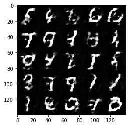
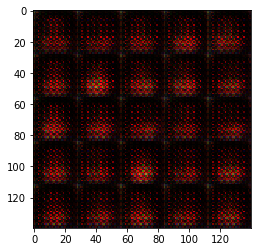
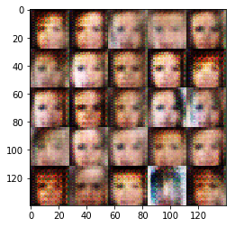
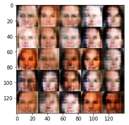
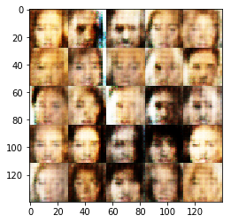
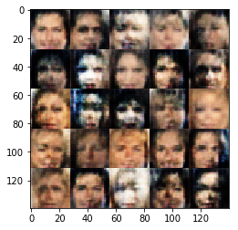
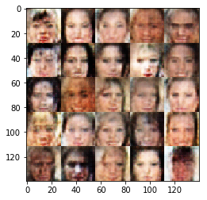
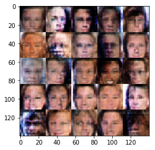
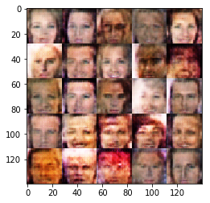
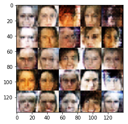

# Face Generation
In this project, you'll use generative adversarial networks to generate new images of faces.
### Get the Data
You'll be using two datasets in this project:
- MNIST
- CelebA

Since the celebA dataset is complex and you're doing GANs in a project for the first time, we want you to test your neural network on MNIST before CelebA.  Running the GANs on MNIST will allow you to see how well your model trains sooner.

If you're using [FloydHub](https://www.floydhub.com/), set `data_dir` to "/input" and use the [FloydHub data ID](http://docs.floydhub.com/home/using_datasets/) "R5KrjnANiKVhLWAkpXhNBe".


```python
data_dir = './data'

# FloydHub - Use with data ID "R5KrjnANiKVhLWAkpXhNBe"
#data_dir = '/input'


"""
DON'T MODIFY ANYTHING IN THIS CELL
"""
import helper

helper.download_extract('mnist', data_dir)
helper.download_extract('celeba', data_dir)
```

    Found mnist Data
    Found celeba Data
    

## Explore the Data
### MNIST
As you're aware, the [MNIST](http://yann.lecun.com/exdb/mnist/) dataset contains images of handwritten digits. You can view the first number of examples by changing `show_n_images`. 


```python
show_n_images = 25

"""
DON'T MODIFY ANYTHING IN THIS CELL
"""
%matplotlib inline
import os
from glob import glob
from matplotlib import pyplot

mnist_images = helper.get_batch(glob(os.path.join(data_dir, 'mnist/*.jpg'))[:show_n_images], 28, 28, 'L')
pyplot.imshow(helper.images_square_grid(mnist_images, 'L'), cmap='gray')
```


    <matplotlib.image.AxesImage at 0x86cdef0>


### CelebA
The [CelebFaces Attributes Dataset (CelebA)](http://mmlab.ie.cuhk.edu.hk/projects/CelebA.html) dataset contains over 200,000 celebrity images with annotations.  Since you're going to be generating faces, you won't need the annotations.  You can view the first number of examples by changing `show_n_images`.


```python
show_n_images = 25

"""
DON'T MODIFY ANYTHING IN THIS CELL
"""
mnist_images = helper.get_batch(glob(os.path.join(data_dir, 'img_align_celeba/*.jpg'))[:show_n_images], 28, 28, 'RGB')
pyplot.imshow(helper.images_square_grid(mnist_images, 'RGB'))
```


    <matplotlib.image.AxesImage at 0x87cafd0>


## Preprocess the Data
Since the project's main focus is on building the GANs, we'll preprocess the data for you.  The values of the MNIST and CelebA dataset will be in the range of -0.5 to 0.5 of 28x28 dimensional images.  The CelebA images will be cropped to remove parts of the image that don't include a face, then resized down to 28x28.

The MNIST images are black and white images with a single [color channel](https://en.wikipedia.org/wiki/Channel_(digital_image%29) while the CelebA images have [3 color channels (RGB color channel)](https://en.wikipedia.org/wiki/Channel_(digital_image%29#RGB_Images).
## Build the Neural Network
You'll build the components necessary to build a GANs by implementing the following functions below:
- `model_inputs`
- `discriminator`
- `generator`
- `model_loss`
- `model_opt`
- `train`

### Check the Version of TensorFlow and Access to GPU
This will check to make sure you have the correct version of TensorFlow and access to a GPU


```python
"""
DON'T MODIFY ANYTHING IN THIS CELL
"""
from distutils.version import LooseVersion
import warnings
import tensorflow as tf

# Check TensorFlow Version
assert LooseVersion(tf.__version__) >= LooseVersion('1.0'), 'Please use TensorFlow version 1.0 or newer.  You are using {}'.format(tf.__version__)
print('TensorFlow Version: {}'.format(tf.__version__))

# Check for a GPU
if not tf.test.gpu_device_name():
    warnings.warn('No GPU found. Please use a GPU to train your neural network.')
else:
    print('Default GPU Device: {}'.format(tf.test.gpu_device_name()))
```

    TensorFlow Version: 1.1.0
    

    C:\Users\Pitto\Anaconda3\envs\tensorflow1_1\lib\site-packages\ipykernel_launcher.py:14: UserWarning: No GPU found. Please use a GPU to train your neural network.
      
    

### Input
Implement the `model_inputs` function to create TF Placeholders for the Neural Network. It should create the following placeholders:
- Real input images placeholder with rank 4 using `image_width`, `image_height`, and `image_channels`.
- Z input placeholder with rank 2 using `z_dim`.
- Learning rate placeholder with rank 0.

Return the placeholders in the following the tuple (tensor of real input images, tensor of z data)


```python
import problem_unittests as tests

def model_inputs(image_width, image_height, image_channels, z_dim):
    """
    Create the model inputs
    :param image_width: The input image width
    :param image_height: The input image height
    :param image_channels: The number of image channels
    :param z_dim: The dimension of Z
    :return: Tuple of (tensor of real input images, tensor of z data, learning rate)
    """
    input_real = tf.placeholder(tf.float32, shape=(None, image_height, image_width, image_channels))
    input_z = tf.placeholder(tf.float32, shape=(None, z_dim))
    learning_rate = tf.placeholder(tf.float32, shape=())

    return input_real, input_z, learning_rate

"""
DON'T MODIFY ANYTHING IN THIS CELL THAT IS BELOW THIS LINE
"""
tests.test_model_inputs(model_inputs)
```

    Tests Passed
    

### Discriminator
Implement `discriminator` to create a discriminator neural network that discriminates on `images`.  This function should be able to reuse the variables in the neural network.  Use [`tf.variable_scope`](https://www.tensorflow.org/api_docs/python/tf/variable_scope) with a scope name of "discriminator" to allow the variables to be reused.  The function should return a tuple of (tensor output of the discriminator, tensor logits of the discriminator).


```python
def discriminator(images, reuse=False):
    """
    Create the discriminator network
    :param images: Tensor of input image(s)
    :param reuse: Boolean if the weights should be reused
    :return: Tuple of (tensor output of the discriminator, tensor logits of the discriminator)
    """
    with tf.variable_scope('discriminator', reuse=reuse):
        alpha = 0.2
        x1 = tf.layers.conv2d(images, 128, 5, strides=2, padding='same',kernel_initializer =tf.random_normal_initializer(stddev=0.05))
        relu1 = tf.maximum(alpha * x1, x1)
        x2 = tf.layers.conv2d(relu1, 256, 5, strides=2, padding='same',kernel_initializer =tf.random_normal_initializer(stddev=0.05))
        bn2 = tf.layers.batch_normalization(x2, training=True)
        relu2 = tf.maximum(alpha * bn2, bn2)
        x3 = tf.layers.conv2d(relu2, 512, 5, strides=2, padding='same',kernel_initializer =tf.random_normal_initializer(stddev=0.05))
        bn3 = tf.layers.batch_normalization(x3, training=True)
        relu3 = tf.maximum(alpha * bn3, bn3)
        flat = tf.reshape(relu3, (-1, 4*4*256))
        logits = tf.layers.dense(flat, 1)
        out = tf.sigmoid(logits)
        return out, logits


"""
DON'T MODIFY ANYTHING IN THIS CELL THAT IS BELOW THIS LINE
"""
tests.test_discriminator(discriminator, tf)
```

    Tests Passed
    

### Generator
Implement `generator` to generate an image using `z`. This function should be able to reuse the variables in the neural network.  Use [`tf.variable_scope`](https://www.tensorflow.org/api_docs/python/tf/variable_scope) with a scope name of "generator" to allow the variables to be reused. The function should return the generated 28 x 28 x `out_channel_dim` images.


```python
def generator(z, out_channel_dim, is_train=True):
    """
    Create the generator network
    :param z: Input z
    :param out_channel_dim: The number of channels in the output image
    :param is_train: Boolean if generator is being used for training
    :return: The tensor output of the generator
    """
    with tf.variable_scope('generator', reuse= not is_train):
        alpha = 0.2
        strt = 7
        st_filt = 512 
        x1 = tf.layers.dense(z, 7*7*256)
        x1 = tf.reshape(x1, (-1, 7, 7, 256))
        x1 = tf.layers.batch_normalization(x1, training=is_train)
        x1 = tf.maximum(alpha * x1, x1)
        x2 = tf.layers.conv2d_transpose(x1, 128, 5, strides=1, padding="SAME")
        x2 = tf.layers.batch_normalization(x2, training=is_train)
        x2 = tf.maximum(alpha * x2, x2)
        x3 = tf.layers.conv2d_transpose(x2, 64, 5, strides=2, padding='SAME')
        x3 = tf.layers.batch_normalization(x3, training=is_train)
        x3 = tf.maximum(alpha * x3, x3)
        logits = tf.layers.conv2d_transpose(x3, out_channel_dim, 5, strides=2, padding="SAME")
        out = tf.tanh(logits)
        return out


"""
DON'T MODIFY ANYTHING IN THIS CELL THAT IS BELOW THIS LINE
"""
tests.test_generator(generator, tf)
```

    Tests Passed
    

### Loss
Implement `model_loss` to build the GANs for training and calculate the loss.  The function should return a tuple of (discriminator loss, generator loss).  Use the following functions you implemented:
- `discriminator(images, reuse=False)`
- `generator(z, out_channel_dim, is_train=True)`


```python
def model_loss(input_real, input_z, out_channel_dim):
    """
    Get the loss for the discriminator and generator
    :param input_real: Images from the real dataset
    :param input_z: Z input
    :param out_channel_dim: The number of channels in the output image
    :return: A tuple of (discriminator loss, generator loss)
    """
    d_out_real,d_logits_real = discriminator(input_real, False)
    g_model = generator(input_z, out_channel_dim)
    d_out_fake,d_logits_fake = discriminator(g_model, True)
    smooth = 0.1
    d_loss_real = tf.reduce_mean(
                      tf.nn.sigmoid_cross_entropy_with_logits(logits=d_logits_real, 
                                                              labels=tf.ones_like(d_logits_real)*(1-smooth)))
    d_loss_fake = tf.reduce_mean(
                      tf.nn.sigmoid_cross_entropy_with_logits(logits=d_logits_fake, 
                                                              labels=tf.zeros_like(d_logits_real)))
    d_loss = d_loss_real + d_loss_fake
    g_loss = tf.reduce_mean(
                 tf.nn.sigmoid_cross_entropy_with_logits(logits=d_logits_fake,
                                                         labels=tf.ones_like(d_logits_fake)))    
    return d_loss, g_loss


"""
DON'T MODIFY ANYTHING IN THIS CELL THAT IS BELOW THIS LINE
"""
tests.test_model_loss(model_loss)
```

    Tests Passed
    

### Optimization
Implement `model_opt` to create the optimization operations for the GANs. Use [`tf.trainable_variables`](https://www.tensorflow.org/api_docs/python/tf/trainable_variables) to get all the trainable variables.  Filter the variables with names that are in the discriminator and generator scope names.  The function should return a tuple of (discriminator training operation, generator training operation).


```python
def model_opt(d_loss, g_loss, learning_rate, beta1):
    """
    Get optimization operations
    :param d_loss: Discriminator loss Tensor
    :param g_loss: Generator loss Tensor
    :param learning_rate: Learning Rate Placeholder
    :param beta1: The exponential decay rate for the 1st moment in the optimizer
    :return: A tuple of (discriminator training operation, generator training operation)
    """
    t_vars = tf.trainable_variables()
    g_vars = [var for var in t_vars if var.name.startswith('generator')]
    d_vars = [var for var in t_vars if var.name.startswith('discriminator')]
    d_train_opt = tf.train.AdamOptimizer(learning_rate,beta1).minimize(d_loss, var_list=d_vars)
    g_train_opt = tf.train.AdamOptimizer(learning_rate,beta1).minimize(g_loss, var_list=g_vars)
    return d_train_opt, g_train_opt


"""
DON'T MODIFY ANYTHING IN THIS CELL THAT IS BELOW THIS LINE
"""
tests.test_model_opt(model_opt, tf)
```

    Tests Passed
    

## Neural Network Training
### Show Output
Use this function to show the current output of the generator during training. It will help you determine how well the GANs is training.


```python
"""
DON'T MODIFY ANYTHING IN THIS CELL
"""
import numpy as np

def show_generator_output(sess, n_images, input_z, out_channel_dim, image_mode):
    """
    Show example output for the generator
    :param sess: TensorFlow session
    :param n_images: Number of Images to display
    :param input_z: Input Z Tensor
    :param out_channel_dim: The number of channels in the output image
    :param image_mode: The mode to use for images ("RGB" or "L")
    """
    cmap = None if image_mode == 'RGB' else 'gray'
    z_dim = input_z.get_shape().as_list()[-1]
    example_z = np.random.uniform(-1, 1, size=[n_images, z_dim])

    samples = sess.run(
        generator(input_z, out_channel_dim, False),
        feed_dict={input_z: example_z})

    images_grid = helper.images_square_grid(samples, image_mode)
    pyplot.imshow(images_grid, cmap=cmap)
    pyplot.show()
```

### Train
Implement `train` to build and train the GANs.  Use the following functions you implemented:
- `model_inputs(image_width, image_height, image_channels, z_dim)`
- `model_loss(input_real, input_z, out_channel_dim)`
- `model_opt(d_loss, g_loss, learning_rate, beta1)`

Use the `show_generator_output` to show `generator` output while you train. Running `show_generator_output` for every batch will drastically increase training time and increase the size of the notebook.  It's recommended to print the `generator` output every 100 batches.


```python
def train(epoch_count, batch_size, z_dim, learning_rate, beta1, get_batches, data_shape, data_image_mode):
    """
    Train the GAN
    :param epoch_count: Number of epochs
    :param batch_size: Batch Size
    :param z_dim: Z dimension
    :param learning_rate: Learning Rate
    :param beta1: The exponential decay rate for the 1st moment in the optimizer
    :param get_batches: Function to get batches
    :param data_shape: Shape of the data
    :param data_image_mode: The image mode to use for images ("RGB" or "L")
    """
    b,x,y,c=data_shape
    input_real, input_z, _ = model_inputs(x, y, c, z_dim)
    d_loss, g_loss = model_loss(input_real, input_z, c)
    d_train_opt , g_train_opt = model_opt(d_loss, g_loss, learning_rate, beta1)
    with tf.Session() as sess:
        sess.run(tf.global_variables_initializer())
        for epoch_i in range(epoch_count):
            ii = 0
            for batch_images in get_batches(batch_size):
                ii = ii+1
                batch_images = batch_images*2
                batch_z = np.random.uniform(-1, 1, size=(batch_size, z_dim))
                _ = sess.run(d_train_opt, feed_dict={input_real: batch_images, input_z: batch_z})
                _ = sess.run(g_train_opt, feed_dict={input_z: batch_z})
                if ii % 10 == 0 : 
                    train_loss_d = sess.run(d_loss, {input_z: batch_z, input_real: batch_images})
                    train_loss_g = g_loss.eval({input_z: batch_z})
                    print("Epoch {}/{}...".format(epoch_i+1, epoch_count),
                          "Discriminator Loss: {:.4f}...".format(train_loss_d),
                          "Generator Loss: {:.4f}".format(train_loss_g))    
                if ii % 100 == 0 : 
                    show_generator_output(sess, 25, input_z, c, data_image_mode)
                
                
```

### MNIST
Test your GANs architecture on MNIST.  After 2 epochs, the GANs should be able to generate images that look like handwritten digits.  Make sure the loss of the generator is lower than the loss of the discriminator or close to 0.


```python
batch_size = 64
z_dim = 128
learning_rate = 0.0005
beta1 = 0.5


"""
DON'T MODIFY ANYTHING IN THIS CELL THAT IS BELOW THIS LINE
"""
epochs = 2

mnist_dataset = helper.Dataset('mnist', glob(os.path.join(data_dir, 'mnist/*.jpg')))
with tf.Graph().as_default():
    train(epochs, batch_size, z_dim, learning_rate, beta1, mnist_dataset.get_batches,
          mnist_dataset.shape, mnist_dataset.image_mode)
```

    Epoch 1/2... Discriminator Loss: 1.7284... Generator Loss: 0.4341
    Epoch 1/2... Discriminator Loss: 2.0316... Generator Loss: 0.2711
    Epoch 1/2... Discriminator Loss: 2.0055... Generator Loss: 0.4550
    Epoch 1/2... Discriminator Loss: 1.6306... Generator Loss: 0.9062
    Epoch 1/2... Discriminator Loss: 1.0704... Generator Loss: 1.2127
    Epoch 1/2... Discriminator Loss: 1.8716... Generator Loss: 0.3175
    Epoch 1/2... Discriminator Loss: 1.2958... Generator Loss: 0.7733
    Epoch 1/2... Discriminator Loss: 1.2546... Generator Loss: 1.5685
    Epoch 1/2... Discriminator Loss: 1.2246... Generator Loss: 1.0371
    Epoch 1/2... Discriminator Loss: 1.6435... Generator Loss: 0.3899
    


    Epoch 1/2... Discriminator Loss: 1.3739... Generator Loss: 0.5215
    Epoch 1/2... Discriminator Loss: 1.2871... Generator Loss: 0.6568
    Epoch 1/2... Discriminator Loss: 1.1919... Generator Loss: 0.8767
    Epoch 1/2... Discriminator Loss: 1.5823... Generator Loss: 1.9378
    Epoch 1/2... Discriminator Loss: 1.2243... Generator Loss: 1.5061
    Epoch 1/2... Discriminator Loss: 1.1200... Generator Loss: 0.9857
    Epoch 1/2... Discriminator Loss: 1.0633... Generator Loss: 1.1966
    Epoch 1/2... Discriminator Loss: 1.0502... Generator Loss: 1.2046
    Epoch 1/2... Discriminator Loss: 1.3776... Generator Loss: 0.5678
    Epoch 1/2... Discriminator Loss: 1.0393... Generator Loss: 1.1640
    


    Epoch 1/2... Discriminator Loss: 1.1205... Generator Loss: 1.7705
    Epoch 1/2... Discriminator Loss: 1.1163... Generator Loss: 0.8400
    Epoch 1/2... Discriminator Loss: 1.2503... Generator Loss: 2.0858
    Epoch 1/2... Discriminator Loss: 1.4284... Generator Loss: 0.5292
    Epoch 1/2... Discriminator Loss: 1.0620... Generator Loss: 0.9121
    Epoch 1/2... Discriminator Loss: 0.8923... Generator Loss: 1.3445
    Epoch 1/2... Discriminator Loss: 1.0134... Generator Loss: 0.9571
    Epoch 1/2... Discriminator Loss: 1.3687... Generator Loss: 0.5335
    Epoch 1/2... Discriminator Loss: 1.5606... Generator Loss: 0.4235
    Epoch 1/2... Discriminator Loss: 0.9942... Generator Loss: 1.2764
    


    Epoch 1/2... Discriminator Loss: 0.9972... Generator Loss: 0.9222
    Epoch 1/2... Discriminator Loss: 1.3740... Generator Loss: 0.6029
    Epoch 1/2... Discriminator Loss: 0.9922... Generator Loss: 1.4401
    Epoch 1/2... Discriminator Loss: 1.1491... Generator Loss: 1.7634
    Epoch 1/2... Discriminator Loss: 0.9382... Generator Loss: 1.3369
    Epoch 1/2... Discriminator Loss: 1.1344... Generator Loss: 0.7789
    Epoch 1/2... Discriminator Loss: 1.2527... Generator Loss: 0.6788
    Epoch 1/2... Discriminator Loss: 1.0038... Generator Loss: 1.0238
    Epoch 1/2... Discriminator Loss: 0.9951... Generator Loss: 1.1517
    Epoch 1/2... Discriminator Loss: 1.7131... Generator Loss: 0.3962
    


    Epoch 1/2... Discriminator Loss: 1.1432... Generator Loss: 0.7280
    Epoch 1/2... Discriminator Loss: 1.1542... Generator Loss: 1.0403
    Epoch 1/2... Discriminator Loss: 1.3349... Generator Loss: 0.5876
    Epoch 1/2... Discriminator Loss: 1.1529... Generator Loss: 0.7737
    Epoch 1/2... Discriminator Loss: 1.0260... Generator Loss: 1.3777
    Epoch 1/2... Discriminator Loss: 1.2713... Generator Loss: 0.6366
    Epoch 1/2... Discriminator Loss: 1.1015... Generator Loss: 0.7791
    Epoch 1/2... Discriminator Loss: 1.1971... Generator Loss: 0.7494
    Epoch 1/2... Discriminator Loss: 1.0402... Generator Loss: 1.4183
    Epoch 1/2... Discriminator Loss: 1.0739... Generator Loss: 1.1289
    


    Epoch 1/2... Discriminator Loss: 1.1704... Generator Loss: 1.0818
    Epoch 1/2... Discriminator Loss: 1.2465... Generator Loss: 0.7011
    Epoch 1/2... Discriminator Loss: 1.0663... Generator Loss: 0.9776
    Epoch 1/2... Discriminator Loss: 1.1145... Generator Loss: 0.8480
    Epoch 1/2... Discriminator Loss: 1.0624... Generator Loss: 1.0385
    Epoch 1/2... Discriminator Loss: 1.1943... Generator Loss: 0.7451
    Epoch 1/2... Discriminator Loss: 1.4858... Generator Loss: 0.4814
    Epoch 1/2... Discriminator Loss: 1.1026... Generator Loss: 0.8076
    Epoch 1/2... Discriminator Loss: 0.9188... Generator Loss: 1.3563
    Epoch 1/2... Discriminator Loss: 1.0767... Generator Loss: 1.1642
    


    Epoch 1/2... Discriminator Loss: 1.1989... Generator Loss: 0.7891
    Epoch 1/2... Discriminator Loss: 1.5584... Generator Loss: 0.4273
    Epoch 1/2... Discriminator Loss: 1.1664... Generator Loss: 0.8082
    Epoch 1/2... Discriminator Loss: 1.0019... Generator Loss: 1.0864
    Epoch 1/2... Discriminator Loss: 1.2404... Generator Loss: 1.3304
    Epoch 1/2... Discriminator Loss: 1.3805... Generator Loss: 0.5964
    Epoch 1/2... Discriminator Loss: 1.1198... Generator Loss: 0.9349
    Epoch 1/2... Discriminator Loss: 1.4122... Generator Loss: 1.6415
    Epoch 1/2... Discriminator Loss: 1.2525... Generator Loss: 0.6470
    Epoch 1/2... Discriminator Loss: 1.1146... Generator Loss: 1.1770
    





    Epoch 1/2... Discriminator Loss: 1.5040... Generator Loss: 2.2104
    Epoch 1/2... Discriminator Loss: 1.1500... Generator Loss: 1.0513
    Epoch 1/2... Discriminator Loss: 1.0361... Generator Loss: 1.2286
    Epoch 1/2... Discriminator Loss: 0.9877... Generator Loss: 1.4569
    Epoch 1/2... Discriminator Loss: 1.3455... Generator Loss: 0.5588
    Epoch 1/2... Discriminator Loss: 0.9231... Generator Loss: 1.1622
    Epoch 1/2... Discriminator Loss: 1.0873... Generator Loss: 1.0145
    Epoch 1/2... Discriminator Loss: 2.2227... Generator Loss: 0.2601
    Epoch 1/2... Discriminator Loss: 1.1815... Generator Loss: 0.8751
    Epoch 1/2... Discriminator Loss: 1.1976... Generator Loss: 0.7093
    


    Epoch 1/2... Discriminator Loss: 0.9668... Generator Loss: 1.2910
    Epoch 1/2... Discriminator Loss: 0.9596... Generator Loss: 1.4072
    Epoch 1/2... Discriminator Loss: 1.0689... Generator Loss: 1.4462
    Epoch 1/2... Discriminator Loss: 1.0465... Generator Loss: 0.8388
    Epoch 1/2... Discriminator Loss: 1.1188... Generator Loss: 1.1399
    Epoch 1/2... Discriminator Loss: 1.5712... Generator Loss: 0.4895
    Epoch 1/2... Discriminator Loss: 1.1376... Generator Loss: 1.4726
    Epoch 1/2... Discriminator Loss: 1.1052... Generator Loss: 0.9435
    Epoch 1/2... Discriminator Loss: 1.0970... Generator Loss: 0.9159
    Epoch 1/2... Discriminator Loss: 1.0829... Generator Loss: 0.8446
    


    Epoch 1/2... Discriminator Loss: 2.1407... Generator Loss: 0.2564
    Epoch 1/2... Discriminator Loss: 1.0088... Generator Loss: 0.9902
    Epoch 1/2... Discriminator Loss: 1.1267... Generator Loss: 0.7234
    Epoch 2/2... Discriminator Loss: 0.9119... Generator Loss: 1.2033
    Epoch 2/2... Discriminator Loss: 1.2325... Generator Loss: 0.6442
    Epoch 2/2... Discriminator Loss: 1.1661... Generator Loss: 0.9653
    Epoch 2/2... Discriminator Loss: 1.1400... Generator Loss: 1.0877
    Epoch 2/2... Discriminator Loss: 1.0280... Generator Loss: 1.0766
    Epoch 2/2... Discriminator Loss: 1.7649... Generator Loss: 1.8499
    Epoch 2/2... Discriminator Loss: 1.1343... Generator Loss: 0.9213
    Epoch 2/2... Discriminator Loss: 1.0376... Generator Loss: 0.9617
    Epoch 2/2... Discriminator Loss: 0.9374... Generator Loss: 1.1065
    Epoch 2/2... Discriminator Loss: 1.0122... Generator Loss: 1.0139
    


    Epoch 2/2... Discriminator Loss: 0.9626... Generator Loss: 1.0187
    Epoch 2/2... Discriminator Loss: 0.8963... Generator Loss: 1.4667
    Epoch 2/2... Discriminator Loss: 0.9199... Generator Loss: 1.2057
    Epoch 2/2... Discriminator Loss: 0.9415... Generator Loss: 1.3262
    Epoch 2/2... Discriminator Loss: 1.0779... Generator Loss: 0.7765
    Epoch 2/2... Discriminator Loss: 1.0613... Generator Loss: 0.7664
    Epoch 2/2... Discriminator Loss: 1.2461... Generator Loss: 1.0363
    Epoch 2/2... Discriminator Loss: 1.0993... Generator Loss: 1.1196
    Epoch 2/2... Discriminator Loss: 1.1225... Generator Loss: 0.9042
    Epoch 2/2... Discriminator Loss: 0.9454... Generator Loss: 1.1678
    


    Epoch 2/2... Discriminator Loss: 0.8772... Generator Loss: 1.3654
    Epoch 2/2... Discriminator Loss: 1.0086... Generator Loss: 0.9953
    Epoch 2/2... Discriminator Loss: 1.0406... Generator Loss: 1.0999
    Epoch 2/2... Discriminator Loss: 1.1552... Generator Loss: 0.7866
    Epoch 2/2... Discriminator Loss: 0.8685... Generator Loss: 1.1032
    Epoch 2/2... Discriminator Loss: 1.0804... Generator Loss: 0.8428
    Epoch 2/2... Discriminator Loss: 1.0248... Generator Loss: 1.3061
    Epoch 2/2... Discriminator Loss: 1.0814... Generator Loss: 0.8923
    Epoch 2/2... Discriminator Loss: 1.1202... Generator Loss: 0.8540
    Epoch 2/2... Discriminator Loss: 0.9419... Generator Loss: 1.2565
    


    Epoch 2/2... Discriminator Loss: 0.9123... Generator Loss: 1.3231
    Epoch 2/2... Discriminator Loss: 1.3234... Generator Loss: 0.6379
    Epoch 2/2... Discriminator Loss: 0.9170... Generator Loss: 1.6280
    Epoch 2/2... Discriminator Loss: 0.8957... Generator Loss: 1.1148
    Epoch 2/2... Discriminator Loss: 0.8288... Generator Loss: 1.3631
    Epoch 2/2... Discriminator Loss: 1.1133... Generator Loss: 0.7453
    Epoch 2/2... Discriminator Loss: 1.1796... Generator Loss: 0.6661
    Epoch 2/2... Discriminator Loss: 0.6958... Generator Loss: 1.7910
    Epoch 2/2... Discriminator Loss: 1.9430... Generator Loss: 2.8969
    Epoch 2/2... Discriminator Loss: 1.2402... Generator Loss: 0.6646
    


    Epoch 2/2... Discriminator Loss: 1.0034... Generator Loss: 1.6110
    Epoch 2/2... Discriminator Loss: 1.0236... Generator Loss: 1.5020
    Epoch 2/2... Discriminator Loss: 1.1605... Generator Loss: 1.7007
    Epoch 2/2... Discriminator Loss: 0.9505... Generator Loss: 0.9788
    Epoch 2/2... Discriminator Loss: 1.0318... Generator Loss: 0.9298
    Epoch 2/2... Discriminator Loss: 0.9695... Generator Loss: 0.9424
    Epoch 2/2... Discriminator Loss: 1.3190... Generator Loss: 0.6357
    Epoch 2/2... Discriminator Loss: 0.9967... Generator Loss: 1.0664
    Epoch 2/2... Discriminator Loss: 1.2142... Generator Loss: 0.6455
    Epoch 2/2... Discriminator Loss: 0.9362... Generator Loss: 1.0039
    


    Epoch 2/2... Discriminator Loss: 0.9666... Generator Loss: 1.0838
    Epoch 2/2... Discriminator Loss: 0.8169... Generator Loss: 1.1903
    Epoch 2/2... Discriminator Loss: 1.5908... Generator Loss: 3.0650
    Epoch 2/2... Discriminator Loss: 1.0957... Generator Loss: 0.9747
    Epoch 2/2... Discriminator Loss: 0.9818... Generator Loss: 1.9202
    Epoch 2/2... Discriminator Loss: 0.9649... Generator Loss: 1.0281
    Epoch 2/2... Discriminator Loss: 1.0983... Generator Loss: 0.8163
    Epoch 2/2... Discriminator Loss: 0.8276... Generator Loss: 1.4425
    Epoch 2/2... Discriminator Loss: 0.8548... Generator Loss: 1.0903
    Epoch 2/2... Discriminator Loss: 0.7406... Generator Loss: 1.6918
    


    Epoch 2/2... Discriminator Loss: 0.9367... Generator Loss: 1.4779
    Epoch 2/2... Discriminator Loss: 0.9085... Generator Loss: 1.4873
    Epoch 2/2... Discriminator Loss: 1.0865... Generator Loss: 1.5079
    Epoch 2/2... Discriminator Loss: 1.1121... Generator Loss: 1.7754
    Epoch 2/2... Discriminator Loss: 1.2607... Generator Loss: 0.7537
    Epoch 2/2... Discriminator Loss: 1.0248... Generator Loss: 1.0017
    Epoch 2/2... Discriminator Loss: 1.1064... Generator Loss: 1.0218
    Epoch 2/2... Discriminator Loss: 1.7840... Generator Loss: 0.3431
    Epoch 2/2... Discriminator Loss: 0.8693... Generator Loss: 1.2975
    Epoch 2/2... Discriminator Loss: 1.3058... Generator Loss: 0.6074
    


    Epoch 2/2... Discriminator Loss: 1.1808... Generator Loss: 0.8997
    Epoch 2/2... Discriminator Loss: 1.1072... Generator Loss: 0.8161
    Epoch 2/2... Discriminator Loss: 0.8657... Generator Loss: 1.8158
    Epoch 2/2... Discriminator Loss: 0.8682... Generator Loss: 1.2657
    Epoch 2/2... Discriminator Loss: 0.7570... Generator Loss: 1.3905
    Epoch 2/2... Discriminator Loss: 0.7901... Generator Loss: 1.2574
    Epoch 2/2... Discriminator Loss: 1.4357... Generator Loss: 0.6175
    Epoch 2/2... Discriminator Loss: 1.2563... Generator Loss: 0.6630
    Epoch 2/2... Discriminator Loss: 1.3235... Generator Loss: 0.6824
    Epoch 2/2... Discriminator Loss: 1.2084... Generator Loss: 2.7911
    


    Epoch 2/2... Discriminator Loss: 0.9023... Generator Loss: 1.0335
    Epoch 2/2... Discriminator Loss: 1.0298... Generator Loss: 0.8395
    Epoch 2/2... Discriminator Loss: 0.7134... Generator Loss: 1.7489
    Epoch 2/2... Discriminator Loss: 0.6336... Generator Loss: 1.9331
    Epoch 2/2... Discriminator Loss: 0.8998... Generator Loss: 1.3282
    Epoch 2/2... Discriminator Loss: 1.4570... Generator Loss: 0.8138
    Epoch 2/2... Discriminator Loss: 1.0299... Generator Loss: 1.0626
    Epoch 2/2... Discriminator Loss: 0.8733... Generator Loss: 1.4124
    Epoch 2/2... Discriminator Loss: 0.8851... Generator Loss: 1.2404
    Epoch 2/2... Discriminator Loss: 0.8221... Generator Loss: 1.1951
    


    Epoch 2/2... Discriminator Loss: 1.1731... Generator Loss: 0.7584
    Epoch 2/2... Discriminator Loss: 0.9214... Generator Loss: 1.5949
    Epoch 2/2... Discriminator Loss: 1.0661... Generator Loss: 0.8834
    

### CelebA
Run your GANs on CelebA.  It will take around 20 minutes on the average GPU to run one epoch.  You can run the whole epoch or stop when it starts to generate realistic faces.


```python
batch_size = 64
z_dim = 100
learning_rate = 0.0005
beta1 = 0.5


"""
DON'T MODIFY ANYTHING IN THIS CELL THAT IS BELOW THIS LINE
"""
epochs = 1

celeba_dataset = helper.Dataset('celeba', glob(os.path.join(data_dir, 'img_align_celeba/*.jpg')))
with tf.Graph().as_default():
    train(epochs, batch_size, z_dim, learning_rate, beta1, celeba_dataset.get_batches,
          celeba_dataset.shape, celeba_dataset.image_mode)
```

    Epoch 1/1... Discriminator Loss: 1.1663... Generator Loss: 1.0064
    Epoch 1/1... Discriminator Loss: 1.0724... Generator Loss: 1.2406
    Epoch 1/1... Discriminator Loss: 0.7446... Generator Loss: 3.5910
    Epoch 1/1... Discriminator Loss: 0.9882... Generator Loss: 1.6711
    Epoch 1/1... Discriminator Loss: 1.4310... Generator Loss: 1.3298
    Epoch 1/1... Discriminator Loss: 1.4231... Generator Loss: 0.6102
    Epoch 1/1... Discriminator Loss: 1.0454... Generator Loss: 1.4634
    Epoch 1/1... Discriminator Loss: 1.4196... Generator Loss: 0.6189
    Epoch 1/1... Discriminator Loss: 1.3190... Generator Loss: 2.2911
    Epoch 1/1... Discriminator Loss: 0.9926... Generator Loss: 1.1054
    





    Epoch 1/1... Discriminator Loss: 1.7139... Generator Loss: 0.4211
    Epoch 1/1... Discriminator Loss: 0.9947... Generator Loss: 1.1522
    Epoch 1/1... Discriminator Loss: 1.1635... Generator Loss: 0.8546
    Epoch 1/1... Discriminator Loss: 1.1528... Generator Loss: 1.0620
    Epoch 1/1... Discriminator Loss: 1.0113... Generator Loss: 1.9935
    Epoch 1/1... Discriminator Loss: 1.4412... Generator Loss: 0.5699
    Epoch 1/1... Discriminator Loss: 2.0983... Generator Loss: 0.2709
    Epoch 1/1... Discriminator Loss: 1.4507... Generator Loss: 1.7323
    Epoch 1/1... Discriminator Loss: 1.1855... Generator Loss: 1.0658
    Epoch 1/1... Discriminator Loss: 1.2799... Generator Loss: 0.7743
    


    Epoch 1/1... Discriminator Loss: 1.3144... Generator Loss: 0.6761
    Epoch 1/1... Discriminator Loss: 1.0816... Generator Loss: 1.2378
    Epoch 1/1... Discriminator Loss: 1.0942... Generator Loss: 1.1085
    Epoch 1/1... Discriminator Loss: 1.1508... Generator Loss: 1.0873
    Epoch 1/1... Discriminator Loss: 1.0820... Generator Loss: 1.0737
    Epoch 1/1... Discriminator Loss: 1.4965... Generator Loss: 0.5697
    Epoch 1/1... Discriminator Loss: 1.8202... Generator Loss: 2.5927
    Epoch 1/1... Discriminator Loss: 1.5180... Generator Loss: 2.1057
    Epoch 1/1... Discriminator Loss: 1.2929... Generator Loss: 1.7541
    Epoch 1/1... Discriminator Loss: 1.0826... Generator Loss: 1.1812
    





    Epoch 1/1... Discriminator Loss: 1.5715... Generator Loss: 0.4470
    Epoch 1/1... Discriminator Loss: 1.2311... Generator Loss: 1.0062
    Epoch 1/1... Discriminator Loss: 1.5030... Generator Loss: 1.0800
    Epoch 1/1... Discriminator Loss: 1.2004... Generator Loss: 1.3243
    Epoch 1/1... Discriminator Loss: 1.5055... Generator Loss: 0.4909
    Epoch 1/1... Discriminator Loss: 1.6038... Generator Loss: 0.4735
    Epoch 1/1... Discriminator Loss: 1.2061... Generator Loss: 0.9531
    Epoch 1/1... Discriminator Loss: 1.3398... Generator Loss: 0.8041
    Epoch 1/1... Discriminator Loss: 1.3844... Generator Loss: 0.6131
    Epoch 1/1... Discriminator Loss: 1.2748... Generator Loss: 0.7924
    


    Epoch 1/1... Discriminator Loss: 1.1773... Generator Loss: 1.1056
    Epoch 1/1... Discriminator Loss: 1.1562... Generator Loss: 0.9867
    Epoch 1/1... Discriminator Loss: 1.6852... Generator Loss: 0.3846
    Epoch 1/1... Discriminator Loss: 1.3270... Generator Loss: 0.6546
    Epoch 1/1... Discriminator Loss: 1.1226... Generator Loss: 1.0092
    Epoch 1/1... Discriminator Loss: 1.2815... Generator Loss: 0.8312
    Epoch 1/1... Discriminator Loss: 1.4108... Generator Loss: 0.6731
    Epoch 1/1... Discriminator Loss: 1.3579... Generator Loss: 0.6297
    Epoch 1/1... Discriminator Loss: 1.3420... Generator Loss: 0.6225
    Epoch 1/1... Discriminator Loss: 1.2674... Generator Loss: 0.7360
    


    Epoch 1/1... Discriminator Loss: 1.4875... Generator Loss: 0.5935
    Epoch 1/1... Discriminator Loss: 1.2912... Generator Loss: 1.0200
    Epoch 1/1... Discriminator Loss: 1.4043... Generator Loss: 0.9972
    Epoch 1/1... Discriminator Loss: 1.2133... Generator Loss: 0.9276
    Epoch 1/1... Discriminator Loss: 1.3117... Generator Loss: 0.7552
    Epoch 1/1... Discriminator Loss: 1.3388... Generator Loss: 0.8096
    Epoch 1/1... Discriminator Loss: 1.3551... Generator Loss: 1.1227
    Epoch 1/1... Discriminator Loss: 1.2864... Generator Loss: 0.8170
    Epoch 1/1... Discriminator Loss: 1.2582... Generator Loss: 1.1316
    Epoch 1/1... Discriminator Loss: 1.5041... Generator Loss: 1.4780
    


    Epoch 1/1... Discriminator Loss: 1.3458... Generator Loss: 0.6319
    Epoch 1/1... Discriminator Loss: 1.5371... Generator Loss: 0.5113
    Epoch 1/1... Discriminator Loss: 1.3632... Generator Loss: 0.7601
    Epoch 1/1... Discriminator Loss: 1.2358... Generator Loss: 1.0268
    Epoch 1/1... Discriminator Loss: 1.2214... Generator Loss: 0.8987
    Epoch 1/1... Discriminator Loss: 1.1797... Generator Loss: 0.8494
    Epoch 1/1... Discriminator Loss: 1.2992... Generator Loss: 0.9992
    Epoch 1/1... Discriminator Loss: 1.1681... Generator Loss: 1.0875
    Epoch 1/1... Discriminator Loss: 1.1782... Generator Loss: 1.0406
    Epoch 1/1... Discriminator Loss: 1.2575... Generator Loss: 0.7559
    





    Epoch 1/1... Discriminator Loss: 1.2703... Generator Loss: 0.9623
    Epoch 1/1... Discriminator Loss: 1.4039... Generator Loss: 0.7643
    Epoch 1/1... Discriminator Loss: 1.1181... Generator Loss: 1.1173
    Epoch 1/1... Discriminator Loss: 1.2169... Generator Loss: 1.2351
    Epoch 1/1... Discriminator Loss: 1.2533... Generator Loss: 0.8974
    Epoch 1/1... Discriminator Loss: 1.4168... Generator Loss: 0.7338
    Epoch 1/1... Discriminator Loss: 1.4544... Generator Loss: 0.7466
    Epoch 1/1... Discriminator Loss: 1.2733... Generator Loss: 0.8976
    Epoch 1/1... Discriminator Loss: 1.2800... Generator Loss: 0.9349
    Epoch 1/1... Discriminator Loss: 1.2158... Generator Loss: 0.7656
    


    Epoch 1/1... Discriminator Loss: 1.3600... Generator Loss: 1.2067
    Epoch 1/1... Discriminator Loss: 1.2883... Generator Loss: 0.9641
    Epoch 1/1... Discriminator Loss: 1.1630... Generator Loss: 1.0322
    Epoch 1/1... Discriminator Loss: 1.4075... Generator Loss: 0.5660
    Epoch 1/1... Discriminator Loss: 1.2143... Generator Loss: 0.7404
    Epoch 1/1... Discriminator Loss: 1.2666... Generator Loss: 0.7711
    Epoch 1/1... Discriminator Loss: 1.3461... Generator Loss: 1.5706
    Epoch 1/1... Discriminator Loss: 1.1610... Generator Loss: 0.8358
    Epoch 1/1... Discriminator Loss: 1.3728... Generator Loss: 1.3530
    Epoch 1/1... Discriminator Loss: 1.4223... Generator Loss: 0.5997
    


    Epoch 1/1... Discriminator Loss: 1.2026... Generator Loss: 1.1890
    Epoch 1/1... Discriminator Loss: 1.0831... Generator Loss: 1.3392
    Epoch 1/1... Discriminator Loss: 1.1984... Generator Loss: 1.0788
    Epoch 1/1... Discriminator Loss: 1.1299... Generator Loss: 1.3718
    Epoch 1/1... Discriminator Loss: 1.2229... Generator Loss: 0.8075
    Epoch 1/1... Discriminator Loss: 1.2283... Generator Loss: 0.9158
    Epoch 1/1... Discriminator Loss: 1.1549... Generator Loss: 0.9104
    Epoch 1/1... Discriminator Loss: 1.3473... Generator Loss: 0.6777
    Epoch 1/1... Discriminator Loss: 1.2227... Generator Loss: 0.8155
    Epoch 1/1... Discriminator Loss: 1.1917... Generator Loss: 0.9580
    





    Epoch 1/1... Discriminator Loss: 1.0855... Generator Loss: 1.1926
    Epoch 1/1... Discriminator Loss: 1.1506... Generator Loss: 0.8206
    Epoch 1/1... Discriminator Loss: 1.2626... Generator Loss: 0.7115
    Epoch 1/1... Discriminator Loss: 1.2639... Generator Loss: 1.4768
    Epoch 1/1... Discriminator Loss: 1.3029... Generator Loss: 1.2016
    Epoch 1/1... Discriminator Loss: 1.3890... Generator Loss: 1.7006
    Epoch 1/1... Discriminator Loss: 1.1924... Generator Loss: 1.2262
    Epoch 1/1... Discriminator Loss: 1.4390... Generator Loss: 0.5229
    Epoch 1/1... Discriminator Loss: 1.2387... Generator Loss: 0.7223
    Epoch 1/1... Discriminator Loss: 1.1784... Generator Loss: 0.8365
    


    Epoch 1/1... Discriminator Loss: 1.1148... Generator Loss: 0.8890
    Epoch 1/1... Discriminator Loss: 1.1135... Generator Loss: 1.2453
    Epoch 1/1... Discriminator Loss: 1.3419... Generator Loss: 0.5849
    Epoch 1/1... Discriminator Loss: 1.1419... Generator Loss: 1.1503
    Epoch 1/1... Discriminator Loss: 1.3754... Generator Loss: 0.6124
    Epoch 1/1... Discriminator Loss: 1.1312... Generator Loss: 1.1285
    Epoch 1/1... Discriminator Loss: 1.2623... Generator Loss: 0.7734
    Epoch 1/1... Discriminator Loss: 1.1528... Generator Loss: 0.8005
    Epoch 1/1... Discriminator Loss: 1.2589... Generator Loss: 0.7872
    Epoch 1/1... Discriminator Loss: 1.2077... Generator Loss: 0.8432
    


    Epoch 1/1... Discriminator Loss: 1.1590... Generator Loss: 1.0693
    Epoch 1/1... Discriminator Loss: 1.2507... Generator Loss: 1.0849
    Epoch 1/1... Discriminator Loss: 1.2300... Generator Loss: 0.7355
    Epoch 1/1... Discriminator Loss: 1.1668... Generator Loss: 1.5835
    Epoch 1/1... Discriminator Loss: 1.1821... Generator Loss: 0.9532
    Epoch 1/1... Discriminator Loss: 1.2501... Generator Loss: 0.8232
    Epoch 1/1... Discriminator Loss: 1.1831... Generator Loss: 1.0378
    Epoch 1/1... Discriminator Loss: 1.2565... Generator Loss: 0.6113
    Epoch 1/1... Discriminator Loss: 1.2652... Generator Loss: 1.1016
    Epoch 1/1... Discriminator Loss: 1.4521... Generator Loss: 0.6371
    





    Epoch 1/1... Discriminator Loss: 1.1638... Generator Loss: 0.8273
    Epoch 1/1... Discriminator Loss: 1.1658... Generator Loss: 0.8100
    Epoch 1/1... Discriminator Loss: 1.3605... Generator Loss: 0.6020
    Epoch 1/1... Discriminator Loss: 1.2130... Generator Loss: 0.9264
    Epoch 1/1... Discriminator Loss: 1.2627... Generator Loss: 0.6699
    Epoch 1/1... Discriminator Loss: 1.2190... Generator Loss: 1.0045
    Epoch 1/1... Discriminator Loss: 1.3349... Generator Loss: 0.6000
    Epoch 1/1... Discriminator Loss: 1.1748... Generator Loss: 0.8786
    Epoch 1/1... Discriminator Loss: 1.1813... Generator Loss: 1.1869
    Epoch 1/1... Discriminator Loss: 1.2531... Generator Loss: 1.2948
    


    Epoch 1/1... Discriminator Loss: 1.3096... Generator Loss: 0.6537
    Epoch 1/1... Discriminator Loss: 1.2523... Generator Loss: 0.7456
    Epoch 1/1... Discriminator Loss: 1.3874... Generator Loss: 0.5481
    Epoch 1/1... Discriminator Loss: 1.2862... Generator Loss: 0.6182
    Epoch 1/1... Discriminator Loss: 1.1546... Generator Loss: 0.9106
    Epoch 1/1... Discriminator Loss: 1.2026... Generator Loss: 0.7984
    Epoch 1/1... Discriminator Loss: 1.3043... Generator Loss: 0.6857
    Epoch 1/1... Discriminator Loss: 1.4135... Generator Loss: 0.5210
    Epoch 1/1... Discriminator Loss: 1.1436... Generator Loss: 0.7818
    Epoch 1/1... Discriminator Loss: 1.2583... Generator Loss: 0.8172
    


    Epoch 1/1... Discriminator Loss: 1.1717... Generator Loss: 0.8241
    Epoch 1/1... Discriminator Loss: 1.1488... Generator Loss: 0.9167
    Epoch 1/1... Discriminator Loss: 1.1869... Generator Loss: 0.9099
    Epoch 1/1... Discriminator Loss: 1.0609... Generator Loss: 1.1742
    Epoch 1/1... Discriminator Loss: 1.1810... Generator Loss: 0.8803
    Epoch 1/1... Discriminator Loss: 1.2108... Generator Loss: 0.8314
    Epoch 1/1... Discriminator Loss: 1.0806... Generator Loss: 1.0072
    Epoch 1/1... Discriminator Loss: 1.1092... Generator Loss: 0.8830
    Epoch 1/1... Discriminator Loss: 1.4849... Generator Loss: 1.2628
    Epoch 1/1... Discriminator Loss: 1.2596... Generator Loss: 0.8284
    


    Epoch 1/1... Discriminator Loss: 1.2690... Generator Loss: 0.7730
    Epoch 1/1... Discriminator Loss: 1.4176... Generator Loss: 1.2924
    Epoch 1/1... Discriminator Loss: 1.1607... Generator Loss: 1.0315
    Epoch 1/1... Discriminator Loss: 1.3589... Generator Loss: 0.6297
    Epoch 1/1... Discriminator Loss: 1.2024... Generator Loss: 0.8316
    Epoch 1/1... Discriminator Loss: 1.2620... Generator Loss: 0.7449
    Epoch 1/1... Discriminator Loss: 1.1251... Generator Loss: 1.0440
    Epoch 1/1... Discriminator Loss: 1.1880... Generator Loss: 1.2271
    Epoch 1/1... Discriminator Loss: 1.1413... Generator Loss: 0.9102
    Epoch 1/1... Discriminator Loss: 1.2039... Generator Loss: 0.6804
    


    Epoch 1/1... Discriminator Loss: 1.1703... Generator Loss: 0.8818
    Epoch 1/1... Discriminator Loss: 1.2461... Generator Loss: 0.7762
    Epoch 1/1... Discriminator Loss: 1.1922... Generator Loss: 1.3962
    Epoch 1/1... Discriminator Loss: 1.2106... Generator Loss: 0.9952
    Epoch 1/1... Discriminator Loss: 1.1692... Generator Loss: 0.9416
    Epoch 1/1... Discriminator Loss: 1.1253... Generator Loss: 1.3239
    Epoch 1/1... Discriminator Loss: 1.2068... Generator Loss: 0.7798
    Epoch 1/1... Discriminator Loss: 1.2182... Generator Loss: 0.7813
    Epoch 1/1... Discriminator Loss: 1.3056... Generator Loss: 0.6805
    Epoch 1/1... Discriminator Loss: 1.2971... Generator Loss: 1.0618
    





    Epoch 1/1... Discriminator Loss: 1.1791... Generator Loss: 0.8814
    Epoch 1/1... Discriminator Loss: 1.1107... Generator Loss: 0.9796
    Epoch 1/1... Discriminator Loss: 1.0792... Generator Loss: 1.0056
    Epoch 1/1... Discriminator Loss: 1.3150... Generator Loss: 0.5742
    Epoch 1/1... Discriminator Loss: 1.1095... Generator Loss: 0.9691
    Epoch 1/1... Discriminator Loss: 1.2225... Generator Loss: 0.7595
    Epoch 1/1... Discriminator Loss: 1.5353... Generator Loss: 0.4384
    Epoch 1/1... Discriminator Loss: 1.1766... Generator Loss: 0.9140
    Epoch 1/1... Discriminator Loss: 1.1954... Generator Loss: 0.9081
    Epoch 1/1... Discriminator Loss: 1.2828... Generator Loss: 1.2583
    


    Epoch 1/1... Discriminator Loss: 1.1278... Generator Loss: 1.0494
    Epoch 1/1... Discriminator Loss: 1.3370... Generator Loss: 0.5747
    Epoch 1/1... Discriminator Loss: 1.3856... Generator Loss: 0.5566
    Epoch 1/1... Discriminator Loss: 1.2298... Generator Loss: 1.1131
    Epoch 1/1... Discriminator Loss: 1.2264... Generator Loss: 0.7062
    Epoch 1/1... Discriminator Loss: 1.1581... Generator Loss: 1.3062
    Epoch 1/1... Discriminator Loss: 1.5510... Generator Loss: 0.4419
    Epoch 1/1... Discriminator Loss: 1.2412... Generator Loss: 1.1429
    Epoch 1/1... Discriminator Loss: 1.2378... Generator Loss: 0.6543
    Epoch 1/1... Discriminator Loss: 1.1505... Generator Loss: 1.3124
    


    Epoch 1/1... Discriminator Loss: 1.2958... Generator Loss: 0.7361
    Epoch 1/1... Discriminator Loss: 1.4731... Generator Loss: 0.4567
    Epoch 1/1... Discriminator Loss: 1.2349... Generator Loss: 0.7085
    Epoch 1/1... Discriminator Loss: 1.2731... Generator Loss: 0.6525
    Epoch 1/1... Discriminator Loss: 1.2503... Generator Loss: 1.4002
    Epoch 1/1... Discriminator Loss: 1.2313... Generator Loss: 0.7535
    Epoch 1/1... Discriminator Loss: 1.1283... Generator Loss: 0.8368
    Epoch 1/1... Discriminator Loss: 1.0967... Generator Loss: 0.8526
    Epoch 1/1... Discriminator Loss: 1.2406... Generator Loss: 1.3709
    Epoch 1/1... Discriminator Loss: 1.0022... Generator Loss: 1.1490
    


    Epoch 1/1... Discriminator Loss: 1.0986... Generator Loss: 1.0815
    Epoch 1/1... Discriminator Loss: 1.1598... Generator Loss: 0.8491
    Epoch 1/1... Discriminator Loss: 1.1881... Generator Loss: 0.8951
    Epoch 1/1... Discriminator Loss: 1.1745... Generator Loss: 0.8573
    Epoch 1/1... Discriminator Loss: 1.2101... Generator Loss: 0.7065
    Epoch 1/1... Discriminator Loss: 1.1407... Generator Loss: 1.1009
    Epoch 1/1... Discriminator Loss: 1.3319... Generator Loss: 0.5617
    Epoch 1/1... Discriminator Loss: 1.2702... Generator Loss: 0.6048
    Epoch 1/1... Discriminator Loss: 1.2449... Generator Loss: 0.6871
    Epoch 1/1... Discriminator Loss: 1.3752... Generator Loss: 2.0270
    


    Epoch 1/1... Discriminator Loss: 1.1512... Generator Loss: 1.0213
    Epoch 1/1... Discriminator Loss: 1.2071... Generator Loss: 0.7140
    Epoch 1/1... Discriminator Loss: 1.3321... Generator Loss: 0.6609
    Epoch 1/1... Discriminator Loss: 1.2793... Generator Loss: 1.1480
    Epoch 1/1... Discriminator Loss: 1.1863... Generator Loss: 0.9575
    Epoch 1/1... Discriminator Loss: 1.1373... Generator Loss: 0.7643
    Epoch 1/1... Discriminator Loss: 1.0541... Generator Loss: 0.9121
    Epoch 1/1... Discriminator Loss: 1.1627... Generator Loss: 1.0835
    Epoch 1/1... Discriminator Loss: 1.0324... Generator Loss: 1.2362
    Epoch 1/1... Discriminator Loss: 1.2258... Generator Loss: 1.6421
    





    Epoch 1/1... Discriminator Loss: 1.0180... Generator Loss: 1.0115
    Epoch 1/1... Discriminator Loss: 1.0925... Generator Loss: 1.2367
    Epoch 1/1... Discriminator Loss: 1.1206... Generator Loss: 1.1164
    Epoch 1/1... Discriminator Loss: 1.1058... Generator Loss: 0.9942
    Epoch 1/1... Discriminator Loss: 1.1620... Generator Loss: 0.7599
    Epoch 1/1... Discriminator Loss: 1.2828... Generator Loss: 0.6593
    Epoch 1/1... Discriminator Loss: 1.2200... Generator Loss: 0.7098
    Epoch 1/1... Discriminator Loss: 1.1204... Generator Loss: 0.8103
    Epoch 1/1... Discriminator Loss: 1.0365... Generator Loss: 0.8983
    Epoch 1/1... Discriminator Loss: 1.3818... Generator Loss: 0.5591
    


    Epoch 1/1... Discriminator Loss: 1.1343... Generator Loss: 1.2980
    Epoch 1/1... Discriminator Loss: 1.1487... Generator Loss: 1.0770
    Epoch 1/1... Discriminator Loss: 1.4887... Generator Loss: 1.7270
    Epoch 1/1... Discriminator Loss: 1.1820... Generator Loss: 1.1133
    Epoch 1/1... Discriminator Loss: 1.1776... Generator Loss: 1.5572
    Epoch 1/1... Discriminator Loss: 1.0388... Generator Loss: 1.0822
    Epoch 1/1... Discriminator Loss: 1.3168... Generator Loss: 1.1117
    Epoch 1/1... Discriminator Loss: 1.0866... Generator Loss: 1.2926
    Epoch 1/1... Discriminator Loss: 1.1102... Generator Loss: 0.8361
    Epoch 1/1... Discriminator Loss: 1.3179... Generator Loss: 0.6075
    


    Epoch 1/1... Discriminator Loss: 1.2507... Generator Loss: 0.7879
    Epoch 1/1... Discriminator Loss: 1.1854... Generator Loss: 0.8873
    Epoch 1/1... Discriminator Loss: 1.0415... Generator Loss: 1.4080
    Epoch 1/1... Discriminator Loss: 1.2049... Generator Loss: 0.6847
    Epoch 1/1... Discriminator Loss: 1.6338... Generator Loss: 1.6858
    Epoch 1/1... Discriminator Loss: 1.4242... Generator Loss: 1.7001
    Epoch 1/1... Discriminator Loss: 1.1138... Generator Loss: 1.5695
    Epoch 1/1... Discriminator Loss: 1.1964... Generator Loss: 0.7591
    Epoch 1/1... Discriminator Loss: 1.2455... Generator Loss: 0.6521
    Epoch 1/1... Discriminator Loss: 1.2639... Generator Loss: 0.8982
    





    Epoch 1/1... Discriminator Loss: 1.1309... Generator Loss: 0.7847
    Epoch 1/1... Discriminator Loss: 1.2354... Generator Loss: 0.6557
    Epoch 1/1... Discriminator Loss: 1.1879... Generator Loss: 0.7964
    Epoch 1/1... Discriminator Loss: 1.2048... Generator Loss: 0.8144
    Epoch 1/1... Discriminator Loss: 1.4381... Generator Loss: 0.5109
    Epoch 1/1... Discriminator Loss: 1.1154... Generator Loss: 1.4585
    Epoch 1/1... Discriminator Loss: 1.1677... Generator Loss: 1.4580
    Epoch 1/1... Discriminator Loss: 1.2657... Generator Loss: 0.9707
    Epoch 1/1... Discriminator Loss: 1.2513... Generator Loss: 0.6574
    Epoch 1/1... Discriminator Loss: 1.0516... Generator Loss: 1.2588
    


    Epoch 1/1... Discriminator Loss: 1.1274... Generator Loss: 1.1027
    Epoch 1/1... Discriminator Loss: 1.3702... Generator Loss: 0.6445
    Epoch 1/1... Discriminator Loss: 1.3514... Generator Loss: 0.5679
    Epoch 1/1... Discriminator Loss: 0.9734... Generator Loss: 1.1809
    Epoch 1/1... Discriminator Loss: 1.0635... Generator Loss: 1.0904
    Epoch 1/1... Discriminator Loss: 1.3772... Generator Loss: 1.5870
    Epoch 1/1... Discriminator Loss: 1.1344... Generator Loss: 1.2169
    Epoch 1/1... Discriminator Loss: 1.1624... Generator Loss: 0.8652
    Epoch 1/1... Discriminator Loss: 1.2419... Generator Loss: 0.8797
    Epoch 1/1... Discriminator Loss: 1.0145... Generator Loss: 1.0399
    


    Epoch 1/1... Discriminator Loss: 1.1121... Generator Loss: 0.8323
    Epoch 1/1... Discriminator Loss: 1.2665... Generator Loss: 0.6412
    Epoch 1/1... Discriminator Loss: 1.1532... Generator Loss: 0.7482
    Epoch 1/1... Discriminator Loss: 2.0555... Generator Loss: 0.2345
    Epoch 1/1... Discriminator Loss: 1.0963... Generator Loss: 0.8829
    Epoch 1/1... Discriminator Loss: 1.2249... Generator Loss: 0.6989
    Epoch 1/1... Discriminator Loss: 1.3345... Generator Loss: 1.5355
    Epoch 1/1... Discriminator Loss: 1.0827... Generator Loss: 0.8808
    Epoch 1/1... Discriminator Loss: 1.1988... Generator Loss: 0.7356
    Epoch 1/1... Discriminator Loss: 1.2145... Generator Loss: 0.6778
    


    Epoch 1/1... Discriminator Loss: 1.0833... Generator Loss: 0.9991
    Epoch 1/1... Discriminator Loss: 1.1925... Generator Loss: 1.4843
    Epoch 1/1... Discriminator Loss: 1.2502... Generator Loss: 0.6398
    Epoch 1/1... Discriminator Loss: 1.1373... Generator Loss: 1.1230
    Epoch 1/1... Discriminator Loss: 1.1848... Generator Loss: 0.6914
    Epoch 1/1... Discriminator Loss: 1.1311... Generator Loss: 1.7732
    Epoch 1/1... Discriminator Loss: 0.9963... Generator Loss: 1.2923
    Epoch 1/1... Discriminator Loss: 1.2508... Generator Loss: 0.7044
    Epoch 1/1... Discriminator Loss: 1.2255... Generator Loss: 0.7998
    Epoch 1/1... Discriminator Loss: 1.4560... Generator Loss: 0.4841
    


    Epoch 1/1... Discriminator Loss: 1.2046... Generator Loss: 1.2527
    Epoch 1/1... Discriminator Loss: 1.1125... Generator Loss: 0.8686
    Epoch 1/1... Discriminator Loss: 1.3464... Generator Loss: 1.3289
    Epoch 1/1... Discriminator Loss: 1.2401... Generator Loss: 1.0073
    Epoch 1/1... Discriminator Loss: 1.1589... Generator Loss: 1.2198
    Epoch 1/1... Discriminator Loss: 1.0890... Generator Loss: 0.9822
    Epoch 1/1... Discriminator Loss: 1.1913... Generator Loss: 0.7790
    Epoch 1/1... Discriminator Loss: 0.9581... Generator Loss: 1.2343
    Epoch 1/1... Discriminator Loss: 1.0961... Generator Loss: 1.0096
    Epoch 1/1... Discriminator Loss: 1.0367... Generator Loss: 1.1115
    





    Epoch 1/1... Discriminator Loss: 1.2128... Generator Loss: 0.7406
    Epoch 1/1... Discriminator Loss: 1.0331... Generator Loss: 0.9202
    Epoch 1/1... Discriminator Loss: 1.1035... Generator Loss: 0.8522
    Epoch 1/1... Discriminator Loss: 1.2957... Generator Loss: 1.9363
    Epoch 1/1... Discriminator Loss: 1.1077... Generator Loss: 1.0876
    Epoch 1/1... Discriminator Loss: 1.3187... Generator Loss: 0.6282
    

### Submitting This Project
When submitting this project, make sure to run all the cells before saving the notebook. Save the notebook file as "dlnd_face_generation.ipynb" and save it as a HTML file under "File" -> "Download as". Include the "helper.py" and "problem_unittests.py" files in your submission.
