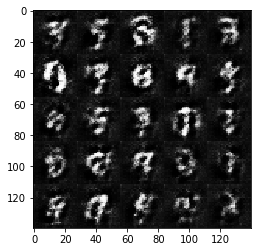
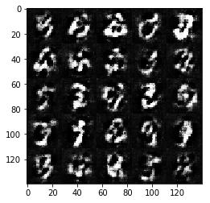
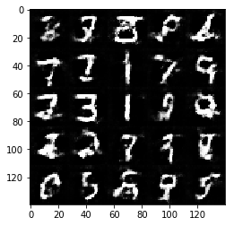
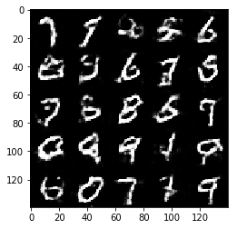
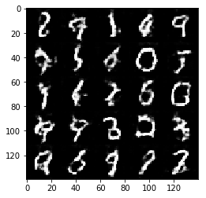

# Face Generation
In this project, you'll use generative adversarial networks to generate new images of faces.
### Get the Data
You'll be using two datasets in this project:
- MNIST
- CelebA

Since the celebA dataset is complex and you're doing GANs in a project for the first time, we want you to test your neural network on MNIST before CelebA.  Running the GANs on MNIST will allow you to see how well your model trains sooner.

If you're using [FloydHub](https://www.floydhub.com/), set `data_dir` to "/input" and use the [FloydHub data ID](http://docs.floydhub.com/home/using_datasets/) "R5KrjnANiKVhLWAkpXhNBe".


```python
data_dir = './data'

# FloydHub - Use with data ID "R5KrjnANiKVhLWAkpXhNBe"
#data_dir = '/input'


"""
DON'T MODIFY ANYTHING IN THIS CELL
"""
import helper

helper.download_extract('mnist', data_dir)
helper.download_extract('celeba', data_dir)
```

    Found mnist Data
    Found celeba Data
    

## Explore the Data
### MNIST
As you're aware, the [MNIST](http://yann.lecun.com/exdb/mnist/) dataset contains images of handwritten digits. You can view the first number of examples by changing `show_n_images`. 


```python
show_n_images = 25

"""
DON'T MODIFY ANYTHING IN THIS CELL
"""
%matplotlib inline
import os
from glob import glob
from matplotlib import pyplot

mnist_images = helper.get_batch(glob(os.path.join(data_dir, 'mnist/*.jpg'))[:show_n_images], 28, 28, 'L')
pyplot.imshow(helper.images_square_grid(mnist_images, 'L'), cmap='gray')
```


    <matplotlib.image.AxesImage at 0x1a0b8bf3358>


### CelebA
The [CelebFaces Attributes Dataset (CelebA)](http://mmlab.ie.cuhk.edu.hk/projects/CelebA.html) dataset contains over 200,000 celebrity images with annotations.  Since you're going to be generating faces, you won't need the annotations.  You can view the first number of examples by changing `show_n_images`.


```python
show_n_images = 25

"""
DON'T MODIFY ANYTHING IN THIS CELL
"""
mnist_images = helper.get_batch(glob(os.path.join(data_dir, 'img_align_celeba/*.jpg'))[:show_n_images], 28, 28, 'RGB')
pyplot.imshow(helper.images_square_grid(mnist_images, 'RGB'))
```


    <matplotlib.image.AxesImage at 0x1a0b8c5aac8>


## Preprocess the Data
Since the project's main focus is on building the GANs, we'll preprocess the data for you.  The values of the MNIST and CelebA dataset will be in the range of -0.5 to 0.5 of 28x28 dimensional images.  The CelebA images will be cropped to remove parts of the image that don't include a face, then resized down to 28x28.

The MNIST images are black and white images with a single [color channel](https://en.wikipedia.org/wiki/Channel_(digital_image%29) while the CelebA images have [3 color channels (RGB color channel)](https://en.wikipedia.org/wiki/Channel_(digital_image%29#RGB_Images).
## Build the Neural Network
You'll build the components necessary to build a GANs by implementing the following functions below:
- `model_inputs`
- `discriminator`
- `generator`
- `model_loss`
- `model_opt`
- `train`

### Check the Version of TensorFlow and Access to GPU
This will check to make sure you have the correct version of TensorFlow and access to a GPU


```python
"""
DON'T MODIFY ANYTHING IN THIS CELL
"""
from distutils.version import LooseVersion
import warnings
import tensorflow as tf

# Check TensorFlow Version
assert LooseVersion(tf.__version__) >= LooseVersion('1.0'), 'Please use TensorFlow version 1.0 or newer.  You are using {}'.format(tf.__version__)
print('TensorFlow Version: {}'.format(tf.__version__))

# Check for a GPU
if not tf.test.gpu_device_name():
    warnings.warn('No GPU found. Please use a GPU to train your neural network.')
else:
    print('Default GPU Device: {}'.format(tf.test.gpu_device_name()))
```

    TensorFlow Version: 1.1.0
    

    c:\users\dnastri\appdata\local\continuum\anaconda3\envs\tensorflow1_1\lib\site-packages\ipykernel_launcher.py:14: UserWarning: No GPU found. Please use a GPU to train your neural network.
      
    

### Input
Implement the `model_inputs` function to create TF Placeholders for the Neural Network. It should create the following placeholders:
- Real input images placeholder with rank 4 using `image_width`, `image_height`, and `image_channels`.
- Z input placeholder with rank 2 using `z_dim`.
- Learning rate placeholder with rank 0.

Return the placeholders in the following the tuple (tensor of real input images, tensor of z data)


```python
import problem_unittests as tests

def model_inputs(image_width, image_height, image_channels, z_dim):
    """
    Create the model inputs
    :param image_width: The input image width
    :param image_height: The input image height
    :param image_channels: The number of image channels
    :param z_dim: The dimension of Z
    :return: Tuple of (tensor of real input images, tensor of z data, learning rate)
    """
    input_real = tf.placeholder(tf.float32, shape=(None, image_height, image_width, image_channels))
    input_z = tf.placeholder(tf.float32, shape=(None, z_dim))
    learning_rate = tf.placeholder(tf.float32, shape=())

    return input_real, input_z, learning_rate

"""
DON'T MODIFY ANYTHING IN THIS CELL THAT IS BELOW THIS LINE
"""
tests.test_model_inputs(model_inputs)
```

    Tests Passed
    

### Discriminator
Implement `discriminator` to create a discriminator neural network that discriminates on `images`.  This function should be able to reuse the variables in the neural network.  Use [`tf.variable_scope`](https://www.tensorflow.org/api_docs/python/tf/variable_scope) with a scope name of "discriminator" to allow the variables to be reused.  The function should return a tuple of (tensor output of the discriminator, tensor logits of the discriminator).


```python
def discriminator(images, reuse=False):
    """
    Create the discriminator network
    :param images: Tensor of input image(s)
    :param reuse: Boolean if the weights should be reused
    :return: Tuple of (tensor output of the discriminator, tensor logits of the discriminator)
    """
    with tf.variable_scope('discriminator', reuse=reuse):
        alpha = 0.2
        x1 = tf.layers.conv2d(images, 128, 5, strides=2, padding='same',kernel_initializer =tf.random_normal_initializer(stddev=0.05))
        relu1 = tf.maximum(alpha * x1, x1)
        x2 = tf.layers.conv2d(relu1, 256, 5, strides=2, padding='same',kernel_initializer =tf.random_normal_initializer(stddev=0.05))
        bn2 = tf.layers.batch_normalization(x2, training=True)
        relu2 = tf.maximum(alpha * bn2, bn2)
        x3 = tf.layers.conv2d(relu2, 512, 5, strides=2, padding='same',kernel_initializer =tf.random_normal_initializer(stddev=0.05))
        bn3 = tf.layers.batch_normalization(x3, training=True)
        relu3 = tf.maximum(alpha * bn3, bn3)
        flat = tf.reshape(relu3, (-1, 4*4*256))
        logits = tf.layers.dense(flat, 1)
        out = tf.sigmoid(logits)
        return out, logits


"""
DON'T MODIFY ANYTHING IN THIS CELL THAT IS BELOW THIS LINE
"""
tests.test_discriminator(discriminator, tf)
```

    Tests Passed
    

### Generator
Implement `generator` to generate an image using `z`. This function should be able to reuse the variables in the neural network.  Use [`tf.variable_scope`](https://www.tensorflow.org/api_docs/python/tf/variable_scope) with a scope name of "generator" to allow the variables to be reused. The function should return the generated 28 x 28 x `out_channel_dim` images.


```python
def generator(z, out_channel_dim, is_train=True):
    """
    Create the generator network
    :param z: Input z
    :param out_channel_dim: The number of channels in the output image
    :param is_train: Boolean if generator is being used for training
    :return: The tensor output of the generator
    """
    with tf.variable_scope('generator', reuse= not is_train):
        alpha = 0.2
        strt = 7
        st_filt = 512 
        x1 = tf.layers.dense(z, strt*strt*st_filt)
        x1 = tf.reshape(x1, (-1, strt, strt, st_filt))
        x1 = tf.layers.batch_normalization(x1, training=is_train)
        x1 = tf.maximum(alpha * x1, x1)
        x2 = tf.layers.conv2d_transpose(x1, 256, 5, strides=2, padding='same',kernel_initializer =tf.random_normal_initializer(stddev=0.05))
        x2 = tf.layers.batch_normalization(x2, training=is_train)
        x2 = tf.maximum(alpha * x2, x2)        
        x3 = tf.layers.conv2d_transpose(x2, 128, 5, strides=2, padding='same',kernel_initializer =tf.random_normal_initializer(stddev=0.05))
        x3 = tf.layers.batch_normalization(x3, training=is_train)
        x3 = tf.maximum(alpha * x3, x3)
        logits = tf.layers.conv2d_transpose(x3, out_channel_dim, 3, strides=1, padding='same',kernel_initializer =tf.random_normal_initializer(stddev=0.05))
        out = tf.tanh(logits)
        return out


"""
DON'T MODIFY ANYTHING IN THIS CELL THAT IS BELOW THIS LINE
"""
tests.test_generator(generator, tf)
```

    Tests Passed
    

### Loss
Implement `model_loss` to build the GANs for training and calculate the loss.  The function should return a tuple of (discriminator loss, generator loss).  Use the following functions you implemented:
- `discriminator(images, reuse=False)`
- `generator(z, out_channel_dim, is_train=True)`


```python
def model_loss(input_real, input_z, out_channel_dim):
    """
    Get the loss for the discriminator and generator
    :param input_real: Images from the real dataset
    :param input_z: Z input
    :param out_channel_dim: The number of channels in the output image
    :return: A tuple of (discriminator loss, generator loss)
    """
    d_out_real,d_logits_real = discriminator(input_real, False)
    g_model = generator(input_z, out_channel_dim)
    d_out_fake,d_logits_fake = discriminator(g_model, True)
    smooth = 0.1
    d_loss_real = tf.reduce_mean(
                      tf.nn.sigmoid_cross_entropy_with_logits(logits=d_logits_real, 
                                                              labels=tf.ones_like(d_logits_real)*(1-smooth)))
    d_loss_fake = tf.reduce_mean(
                      tf.nn.sigmoid_cross_entropy_with_logits(logits=d_logits_fake, 
                                                              labels=tf.zeros_like(d_logits_real)))
    d_loss = d_loss_real + d_loss_fake
    g_loss = tf.reduce_mean(
                 tf.nn.sigmoid_cross_entropy_with_logits(logits=d_logits_fake,
                                                         labels=tf.ones_like(d_logits_fake)))    
    return d_loss, g_loss


"""
DON'T MODIFY ANYTHING IN THIS CELL THAT IS BELOW THIS LINE
"""
tests.test_model_loss(model_loss)
```

    Tests Passed
    

### Optimization
Implement `model_opt` to create the optimization operations for the GANs. Use [`tf.trainable_variables`](https://www.tensorflow.org/api_docs/python/tf/trainable_variables) to get all the trainable variables.  Filter the variables with names that are in the discriminator and generator scope names.  The function should return a tuple of (discriminator training operation, generator training operation).


```python
def model_opt(d_loss, g_loss, learning_rate, beta1):
    """
    Get optimization operations
    :param d_loss: Discriminator loss Tensor
    :param g_loss: Generator loss Tensor
    :param learning_rate: Learning Rate Placeholder
    :param beta1: The exponential decay rate for the 1st moment in the optimizer
    :return: A tuple of (discriminator training operation, generator training operation)
    """
    t_vars = tf.trainable_variables()
    g_vars = [var for var in t_vars if var.name.startswith('generator')]
    d_vars = [var for var in t_vars if var.name.startswith('discriminator')]
    d_train_opt = tf.train.AdamOptimizer(learning_rate,beta1).minimize(d_loss, var_list=d_vars)
    g_train_opt = tf.train.AdamOptimizer(learning_rate,beta1).minimize(g_loss, var_list=g_vars)
    return d_train_opt, g_train_opt


"""
DON'T MODIFY ANYTHING IN THIS CELL THAT IS BELOW THIS LINE
"""
tests.test_model_opt(model_opt, tf)
```

    Tests Passed
    

## Neural Network Training
### Show Output
Use this function to show the current output of the generator during training. It will help you determine how well the GANs is training.


```python
"""
DON'T MODIFY ANYTHING IN THIS CELL
"""
import numpy as np

def show_generator_output(sess, n_images, input_z, out_channel_dim, image_mode):
    """
    Show example output for the generator
    :param sess: TensorFlow session
    :param n_images: Number of Images to display
    :param input_z: Input Z Tensor
    :param out_channel_dim: The number of channels in the output image
    :param image_mode: The mode to use for images ("RGB" or "L")
    """
    cmap = None if image_mode == 'RGB' else 'gray'
    z_dim = input_z.get_shape().as_list()[-1]
    example_z = np.random.uniform(-1, 1, size=[n_images, z_dim])

    samples = sess.run(
        generator(input_z, out_channel_dim, False),
        feed_dict={input_z: example_z})

    images_grid = helper.images_square_grid(samples, image_mode)
    pyplot.imshow(images_grid, cmap=cmap)
    pyplot.show()
```

### Train
Implement `train` to build and train the GANs.  Use the following functions you implemented:
- `model_inputs(image_width, image_height, image_channels, z_dim)`
- `model_loss(input_real, input_z, out_channel_dim)`
- `model_opt(d_loss, g_loss, learning_rate, beta1)`

Use the `show_generator_output` to show `generator` output while you train. Running `show_generator_output` for every batch will drastically increase training time and increase the size of the notebook.  It's recommended to print the `generator` output every 100 batches.


```python
def train(epoch_count, batch_size, z_dim, learning_rate, beta1, get_batches, data_shape, data_image_mode):
    """
    Train the GAN
    :param epoch_count: Number of epochs
    :param batch_size: Batch Size
    :param z_dim: Z dimension
    :param learning_rate: Learning Rate
    :param beta1: The exponential decay rate for the 1st moment in the optimizer
    :param get_batches: Function to get batches
    :param data_shape: Shape of the data
    :param data_image_mode: The image mode to use for images ("RGB" or "L")
    """
    b,x,y,c=data_shape
    input_real, input_z, _ = model_inputs(x, y, c, z_dim)
    d_loss, g_loss = model_loss(input_real, input_z, c)
    d_train_opt , g_train_opt = model_opt(d_loss, g_loss, learning_rate, beta1)
    with tf.Session() as sess:
        sess.run(tf.global_variables_initializer())
        for epoch_i in range(epoch_count):
            ii = 0
            for batch_images in get_batches(batch_size):
                ii = ii+1
                batch_images = batch_images*2
                batch_z = np.random.uniform(-1, 1, size=(batch_size, z_dim))
                _ = sess.run(d_train_opt, feed_dict={input_real: batch_images, input_z: batch_z})
                _ = sess.run(g_train_opt, feed_dict={input_z: batch_z})
                if ii % 10 == 0 : 
                    train_loss_d = sess.run(d_loss, {input_z: batch_z, input_real: batch_images})
                    train_loss_g = g_loss.eval({input_z: batch_z})
                    print("Epoch {}/{}...".format(epoch_i+1, epoch_count),
                          "Discriminator Loss: {:.4f}...".format(train_loss_d),
                          "Generator Loss: {:.4f}".format(train_loss_g))    
                if ii % 100 == 0 : 
                    show_generator_output(sess, 25, input_z, c, data_image_mode)
                
                
```

### MNIST
Test your GANs architecture on MNIST.  After 2 epochs, the GANs should be able to generate images that look like handwritten digits.  Make sure the loss of the generator is lower than the loss of the discriminator or close to 0.


```python
batch_size = 64
z_dim = 128
learning_rate = 0.0005
beta1 = 0.5


"""
DON'T MODIFY ANYTHING IN THIS CELL THAT IS BELOW THIS LINE
"""
epochs = 2

mnist_dataset = helper.Dataset('mnist', glob(os.path.join(data_dir, 'mnist/*.jpg')))
with tf.Graph().as_default():
    train(epochs, batch_size, z_dim, learning_rate, beta1, mnist_dataset.get_batches,
          mnist_dataset.shape, mnist_dataset.image_mode)
```

    Epoch 1/2... Discriminator Loss: 0.3794... Generator Loss: 3.8062
    Epoch 1/2... Discriminator Loss: 0.4225... Generator Loss: 5.1774
    Epoch 1/2... Discriminator Loss: 0.3538... Generator Loss: 4.9783
    Epoch 1/2... Discriminator Loss: 0.3547... Generator Loss: 5.0093
    Epoch 1/2... Discriminator Loss: 0.3392... Generator Loss: 5.5445
    Epoch 1/2... Discriminator Loss: 0.3378... Generator Loss: 5.4139
    Epoch 1/2... Discriminator Loss: 0.3373... Generator Loss: 5.8893
    Epoch 1/2... Discriminator Loss: 0.5400... Generator Loss: 3.3346
    Epoch 1/2... Discriminator Loss: 2.2048... Generator Loss: 16.6353
    Epoch 1/2... Discriminator Loss: 1.5913... Generator Loss: 0.9129
    


    Epoch 1/2... Discriminator Loss: 0.9166... Generator Loss: 1.2343
    Epoch 1/2... Discriminator Loss: 1.2151... Generator Loss: 1.8296
    Epoch 1/2... Discriminator Loss: 0.8417... Generator Loss: 1.6972
    Epoch 1/2... Discriminator Loss: 1.0831... Generator Loss: 1.7990
    Epoch 1/2... Discriminator Loss: 1.5237... Generator Loss: 0.4769
    Epoch 1/2... Discriminator Loss: 1.0697... Generator Loss: 1.3306
    Epoch 1/2... Discriminator Loss: 1.2644... Generator Loss: 0.6491
    Epoch 1/2... Discriminator Loss: 1.2577... Generator Loss: 1.8204
    Epoch 1/2... Discriminator Loss: 1.2669... Generator Loss: 1.8900
    Epoch 1/2... Discriminator Loss: 1.0889... Generator Loss: 1.1494
    


    Epoch 1/2... Discriminator Loss: 1.7198... Generator Loss: 3.9337
    Epoch 1/2... Discriminator Loss: 0.8904... Generator Loss: 1.3959
    Epoch 1/2... Discriminator Loss: 1.0666... Generator Loss: 0.7796
    Epoch 1/2... Discriminator Loss: 1.0609... Generator Loss: 0.9335
    Epoch 1/2... Discriminator Loss: 1.1434... Generator Loss: 1.2496
    Epoch 1/2... Discriminator Loss: 1.2841... Generator Loss: 0.7522
    Epoch 1/2... Discriminator Loss: 1.0157... Generator Loss: 0.9613
    Epoch 1/2... Discriminator Loss: 1.2369... Generator Loss: 0.7201
    Epoch 1/2... Discriminator Loss: 1.1321... Generator Loss: 1.0919
    Epoch 1/2... Discriminator Loss: 0.9855... Generator Loss: 1.0658
    





    Epoch 1/2... Discriminator Loss: 0.9873... Generator Loss: 1.7575
    Epoch 1/2... Discriminator Loss: 1.1450... Generator Loss: 0.7987
    Epoch 1/2... Discriminator Loss: 0.9139... Generator Loss: 1.2627
    Epoch 1/2... Discriminator Loss: 0.8842... Generator Loss: 1.1683
    Epoch 1/2... Discriminator Loss: 0.9745... Generator Loss: 1.5685
    Epoch 1/2... Discriminator Loss: 1.1416... Generator Loss: 0.7402
    Epoch 1/2... Discriminator Loss: 1.5172... Generator Loss: 0.4874
    Epoch 1/2... Discriminator Loss: 0.9758... Generator Loss: 1.0332
    Epoch 1/2... Discriminator Loss: 1.1961... Generator Loss: 0.7814
    Epoch 1/2... Discriminator Loss: 1.2105... Generator Loss: 0.9351
    





    Epoch 1/2... Discriminator Loss: 0.9731... Generator Loss: 1.4597
    Epoch 1/2... Discriminator Loss: 1.1328... Generator Loss: 1.1601
    Epoch 1/2... Discriminator Loss: 1.2542... Generator Loss: 1.2449
    Epoch 1/2... Discriminator Loss: 1.1046... Generator Loss: 1.1484
    Epoch 1/2... Discriminator Loss: 0.9752... Generator Loss: 1.1580
    Epoch 1/2... Discriminator Loss: 1.1343... Generator Loss: 0.9446
    Epoch 1/2... Discriminator Loss: 1.1805... Generator Loss: 0.7482
    Epoch 1/2... Discriminator Loss: 1.2133... Generator Loss: 0.7299
    Epoch 1/2... Discriminator Loss: 1.2342... Generator Loss: 1.1900
    Epoch 1/2... Discriminator Loss: 1.1533... Generator Loss: 0.8038
    


    Epoch 1/2... Discriminator Loss: 1.3682... Generator Loss: 0.6391
    Epoch 1/2... Discriminator Loss: 1.2946... Generator Loss: 0.5843
    Epoch 1/2... Discriminator Loss: 1.3121... Generator Loss: 1.5932
    Epoch 1/2... Discriminator Loss: 1.1607... Generator Loss: 0.9011
    Epoch 1/2... Discriminator Loss: 1.6893... Generator Loss: 0.4183
    Epoch 1/2... Discriminator Loss: 1.2731... Generator Loss: 0.6655
    Epoch 1/2... Discriminator Loss: 1.3008... Generator Loss: 0.6702
    Epoch 1/2... Discriminator Loss: 1.1147... Generator Loss: 0.8215
    Epoch 1/2... Discriminator Loss: 1.1036... Generator Loss: 1.0464
    Epoch 1/2... Discriminator Loss: 1.1515... Generator Loss: 0.7802
    


    Epoch 1/2... Discriminator Loss: 1.0950... Generator Loss: 1.4846
    Epoch 1/2... Discriminator Loss: 1.0464... Generator Loss: 1.0817
    Epoch 1/2... Discriminator Loss: 1.1793... Generator Loss: 0.8679
    Epoch 1/2... Discriminator Loss: 1.0384... Generator Loss: 1.1252
    Epoch 1/2... Discriminator Loss: 1.3690... Generator Loss: 1.9589
    Epoch 1/2... Discriminator Loss: 1.2372... Generator Loss: 0.7382
    Epoch 1/2... Discriminator Loss: 1.0413... Generator Loss: 1.2282
    Epoch 1/2... Discriminator Loss: 1.6035... Generator Loss: 0.4322
    Epoch 1/2... Discriminator Loss: 1.1543... Generator Loss: 0.7563
    Epoch 1/2... Discriminator Loss: 1.1876... Generator Loss: 1.3321
    


    Epoch 1/2... Discriminator Loss: 1.2752... Generator Loss: 0.7263
    Epoch 1/2... Discriminator Loss: 1.2214... Generator Loss: 0.9364
    Epoch 1/2... Discriminator Loss: 1.2639... Generator Loss: 1.8817
    Epoch 1/2... Discriminator Loss: 0.9846... Generator Loss: 1.5675
    Epoch 1/2... Discriminator Loss: 1.0944... Generator Loss: 0.9469
    Epoch 1/2... Discriminator Loss: 1.2072... Generator Loss: 0.6767
    Epoch 1/2... Discriminator Loss: 1.2104... Generator Loss: 0.7510
    Epoch 1/2... Discriminator Loss: 1.1002... Generator Loss: 0.9956
    Epoch 1/2... Discriminator Loss: 1.1913... Generator Loss: 1.0015
    Epoch 1/2... Discriminator Loss: 1.4708... Generator Loss: 0.5005
    





    Epoch 1/2... Discriminator Loss: 1.0317... Generator Loss: 1.2377
    Epoch 1/2... Discriminator Loss: 1.0930... Generator Loss: 0.8492
    Epoch 1/2... Discriminator Loss: 1.1508... Generator Loss: 0.7911
    Epoch 1/2... Discriminator Loss: 0.8993... Generator Loss: 2.1258
    Epoch 1/2... Discriminator Loss: 0.9024... Generator Loss: 1.2402
    Epoch 1/2... Discriminator Loss: 2.0053... Generator Loss: 0.3154
    Epoch 1/2... Discriminator Loss: 1.1823... Generator Loss: 1.0106
    Epoch 1/2... Discriminator Loss: 0.9832... Generator Loss: 1.2923
    Epoch 1/2... Discriminator Loss: 1.0020... Generator Loss: 1.1790
    Epoch 1/2... Discriminator Loss: 1.0398... Generator Loss: 0.9578
    


    Epoch 1/2... Discriminator Loss: 1.1738... Generator Loss: 0.7569
    Epoch 1/2... Discriminator Loss: 0.9915... Generator Loss: 1.0361
    Epoch 1/2... Discriminator Loss: 1.0381... Generator Loss: 1.0623
    Epoch 2/2... Discriminator Loss: 1.1672... Generator Loss: 0.7078
    Epoch 2/2... Discriminator Loss: 1.1822... Generator Loss: 0.7473
    Epoch 2/2... Discriminator Loss: 1.1406... Generator Loss: 1.0217
    Epoch 2/2... Discriminator Loss: 3.4719... Generator Loss: 4.4684
    Epoch 2/2... Discriminator Loss: 1.2019... Generator Loss: 0.8895
    Epoch 2/2... Discriminator Loss: 1.2221... Generator Loss: 0.6785
    Epoch 2/2... Discriminator Loss: 1.0157... Generator Loss: 0.9918
    Epoch 2/2... Discriminator Loss: 1.1337... Generator Loss: 0.7803
    Epoch 2/2... Discriminator Loss: 0.9206... Generator Loss: 1.4298
    Epoch 2/2... Discriminator Loss: 1.2773... Generator Loss: 0.6377
    


    Epoch 2/2... Discriminator Loss: 1.0443... Generator Loss: 0.9093
    Epoch 2/2... Discriminator Loss: 2.1193... Generator Loss: 0.2745
    Epoch 2/2... Discriminator Loss: 0.9721... Generator Loss: 1.1431
    Epoch 2/2... Discriminator Loss: 0.9764... Generator Loss: 1.0522
    Epoch 2/2... Discriminator Loss: 1.4412... Generator Loss: 0.4961
    Epoch 2/2... Discriminator Loss: 1.0881... Generator Loss: 0.7793
    Epoch 2/2... Discriminator Loss: 1.5091... Generator Loss: 2.1283
    Epoch 2/2... Discriminator Loss: 1.0808... Generator Loss: 1.0465
    Epoch 2/2... Discriminator Loss: 1.0339... Generator Loss: 0.8711
    Epoch 2/2... Discriminator Loss: 1.1463... Generator Loss: 2.5946
    


    Epoch 2/2... Discriminator Loss: 0.9460... Generator Loss: 1.0939
    Epoch 2/2... Discriminator Loss: 0.9919... Generator Loss: 1.5497
    Epoch 2/2... Discriminator Loss: 1.1811... Generator Loss: 0.7359
    Epoch 2/2... Discriminator Loss: 1.3960... Generator Loss: 0.5232
    Epoch 2/2... Discriminator Loss: 0.8830... Generator Loss: 1.0555
    Epoch 2/2... Discriminator Loss: 1.3354... Generator Loss: 0.6524
    Epoch 2/2... Discriminator Loss: 1.3004... Generator Loss: 1.5048
    Epoch 2/2... Discriminator Loss: 1.3151... Generator Loss: 0.6135
    Epoch 2/2... Discriminator Loss: 1.0756... Generator Loss: 1.0832
    Epoch 2/2... Discriminator Loss: 1.0987... Generator Loss: 0.9884
    





    Epoch 2/2... Discriminator Loss: 1.1227... Generator Loss: 1.7490
    Epoch 2/2... Discriminator Loss: 1.3759... Generator Loss: 0.5794
    Epoch 2/2... Discriminator Loss: 0.9132... Generator Loss: 1.5174
    Epoch 2/2... Discriminator Loss: 1.0548... Generator Loss: 1.4025
    Epoch 2/2... Discriminator Loss: 0.9420... Generator Loss: 2.0065
    Epoch 2/2... Discriminator Loss: 1.0571... Generator Loss: 0.9234
    Epoch 2/2... Discriminator Loss: 1.1921... Generator Loss: 0.6776
    Epoch 2/2... Discriminator Loss: 0.8455... Generator Loss: 1.3393
    Epoch 2/2... Discriminator Loss: 0.9693... Generator Loss: 1.1567
    Epoch 2/2... Discriminator Loss: 0.9631... Generator Loss: 0.9837
    


    Epoch 2/2... Discriminator Loss: 1.0185... Generator Loss: 2.3126
    Epoch 2/2... Discriminator Loss: 1.2139... Generator Loss: 0.8381
    Epoch 2/2... Discriminator Loss: 1.2382... Generator Loss: 0.7501
    Epoch 2/2... Discriminator Loss: 0.8731... Generator Loss: 1.3941
    Epoch 2/2... Discriminator Loss: 1.0233... Generator Loss: 1.8981
    Epoch 2/2... Discriminator Loss: 1.1175... Generator Loss: 0.7546
    Epoch 2/2... Discriminator Loss: 1.3264... Generator Loss: 0.6309
    Epoch 2/2... Discriminator Loss: 1.0038... Generator Loss: 1.1899
    Epoch 2/2... Discriminator Loss: 1.1861... Generator Loss: 1.8445
    Epoch 2/2... Discriminator Loss: 0.9025... Generator Loss: 1.1365
    





    Epoch 2/2... Discriminator Loss: 1.3048... Generator Loss: 1.4540
    Epoch 2/2... Discriminator Loss: 0.9819... Generator Loss: 1.3140
    Epoch 2/2... Discriminator Loss: 0.9414... Generator Loss: 1.7151
    Epoch 2/2... Discriminator Loss: 1.0882... Generator Loss: 0.9397
    Epoch 2/2... Discriminator Loss: 0.8256... Generator Loss: 1.3735
    Epoch 2/2... Discriminator Loss: 1.1144... Generator Loss: 0.7988
    Epoch 2/2... Discriminator Loss: 1.5177... Generator Loss: 0.4981
    Epoch 2/2... Discriminator Loss: 1.1668... Generator Loss: 0.7909
    Epoch 2/2... Discriminator Loss: 1.3770... Generator Loss: 0.5284
    Epoch 2/2... Discriminator Loss: 1.0898... Generator Loss: 0.7394
    


    Epoch 2/2... Discriminator Loss: 1.4733... Generator Loss: 0.4806
    Epoch 2/2... Discriminator Loss: 1.0753... Generator Loss: 1.2189
    Epoch 2/2... Discriminator Loss: 1.2030... Generator Loss: 0.7764
    Epoch 2/2... Discriminator Loss: 0.8796... Generator Loss: 1.5265
    

### CelebA
Run your GANs on CelebA.  It will take around 20 minutes on the average GPU to run one epoch.  You can run the whole epoch or stop when it starts to generate realistic faces.


```python
batch_size = 64
z_dim = 100
learning_rate = 0.0005
beta1 = 0.5


"""
DON'T MODIFY ANYTHING IN THIS CELL THAT IS BELOW THIS LINE
"""
epochs = 1

celeba_dataset = helper.Dataset('celeba', glob(os.path.join(data_dir, 'img_align_celeba/*.jpg')))
with tf.Graph().as_default():
    train(epochs, batch_size, z_dim, learning_rate, beta1, celeba_dataset.get_batches,
          celeba_dataset.shape, celeba_dataset.image_mode)
```

### Submitting This Project
When submitting this project, make sure to run all the cells before saving the notebook. Save the notebook file as "dlnd_face_generation.ipynb" and save it as a HTML file under "File" -> "Download as". Include the "helper.py" and "problem_unittests.py" files in your submission.
